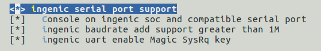

# UART 串口

## 模块功能介绍

通用异步接收器/发送器（UART）串行端口。 共有十个UART：所有UART使用相同的编程模型。 每个串行端口都可以在基于中断的模式或基于DMA的模式下运行。通用异步接收器/发送器（UART）与16550行业标准兼容，可以用作符合红外数据协会（IrDA）串行红外规范1.1的慢速红外异步接口。

## 驱动位置

驱动源码位置：

module_drivers/drivers/tty/serial/ingenic_uart.h  
module_drivers/drivers/tty/serial/ingenic_uart.c

## 设备树配置

设备树所在位置：

module_drivers/dts/x2500.dtsi

UART控制器描述：

uart0: serial@0x10030000 {

 compatible = "ingenic,8250-uart";

 reg = <0x10030000 0x1000>;

 reg-shift = <2>;

 interrupt-parent = <&core_intc>;

 interrupts = <IRQ_UART0>;

 pinctrl-names = "default";

 pinctrl-0 = <&uart0_pc>;

 status = "disabled";

};

uart1: serial@0x10031000 {

 ……

};

……

uart3: serial@0x10039000 {

 ……

};

### 设备树默认配置

在板级设备树hippo_v12.dts中，默认配置，描述如下：

&uart0 {

 status = "okay";

 pinctrl-names = "default","default";

 pinctrl-0 = <&uart0_pc1>;

 pinctrl-1 = <&uart0_pc1_1>;

};

&uart1 {

 status = "okay";

 pinctrl-names = "default";

 pinctrl-0 = <&uart1_pb>;

};

&uart2 {

 status = "disable";

};

&uart3 {

 status = "okay";

 pinctrl-names = "default";

 pinctrl-0 = <&uart3_pd>;

};

### 设备树自定义配置

用户可根据实际需求打开或关闭某个串口设备。

## 内核编译配置

内核配置SERIAL_INGENIC_UART，配置说明如下：

CONFIG_SERIAL_INGENIC_UART: 

 

 If you have a machine based on a xbrust mips soc you can 

 enable its onboard serial port by enabling this option. 

 

 Symbol: SERIAL_INGENIC_UART [=y] 

 Type : tristate 

 Defined at module_drivers/drivers/tty/serial/Kconfig 

 Prompt: ingenic serial port support 

 Location: 

 -> Ingenic device-drivers Configurations 

 -> [UART] Drivers 

 Selects: SERIAL_CORE [=y] 

### 内核默认编译配置

内核默认配置UART驱动，配置界面如下：

### 内核自定义编译配置

用户可根据实际需求去掉该驱动的配置。

## 模块内核差异

无

## 设备节点生成

驱动加载成功后生成相应的设备节点

\# ls /dev/ttyS  
ttyS1 ttyS2 ttyS3

