**君正®**

Copyright © Ingenic Semiconductor Co. Ltd 2023. All rights reserved.

**Release history**

| Date     | Revision | Change        |
| -------- | -------- | ------------- |
| Feb.2023 | 1.00     | First release |

# ISP-TUNING简介

ISP-TUNING的主要功能是提供调节图像的亮度，锐度，饱和度，对比度，增益，曝光，宽动态等功能的API接口，便于用户自定义图像效果。

# v4l2-isp-tuning参数说明

## v4l2-isp-tuning --help

-w --width [image width]

-h --height [image height]

-i --video-id [/dev/videox]

-n --count [out put frame_count]

-H --hflip [0:disable 1:enable]

-V --vflip [0:disable 1:enable]

-s --sharpness range[0-255]

-c --contrast range[0-255]

-S --saturation range[0-255]

-b --brightness range[0-255]

-u --hue range[0-255]

-W --wdr wide dynamic range [0:disable 1:enable]

-f --antiflicker [0:disable 1:50Hz 2:60Hz]

-m --module isp module bypass control

-d --day-or-night [0:day_mode 1:night_mode]

-e --exposure [0:auto, others manual exposure]

-g --gain [0:auto, others manual gain]

--roi_ae enable=<enable>,top=<top>,bottom=<bottom>,left=<left>,right=<right>

--defog enable=<enable>[0:disable1:enable],dark=<dark>,middark=<middark>,midbright=<midbright>,morebright=<morebright>,bright=<bright>[0-255]

--def-bin-path <bin path> eg. /etc/sensor/sc230ai-ir.bin

## 设置wdr

【功能描述】

宽动态使能。

【命令参数说明】

v4l2-isp-tuning -W

0 dibable 1 enable

【效果展示】

v4l2-isp-tuning -i 4 -W 1

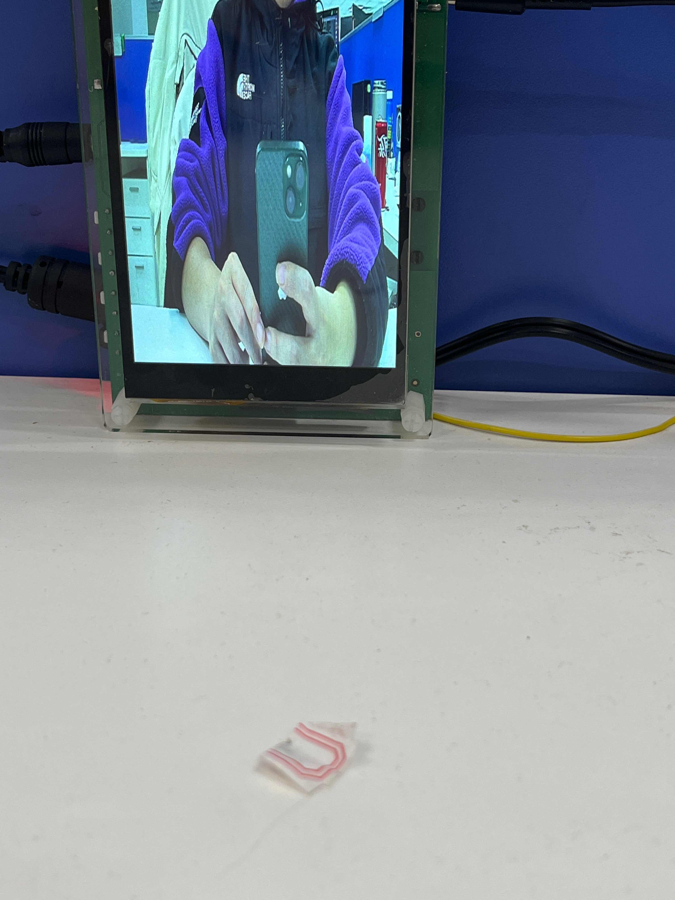

v4l2-isp-tuning -i 4 -W 0

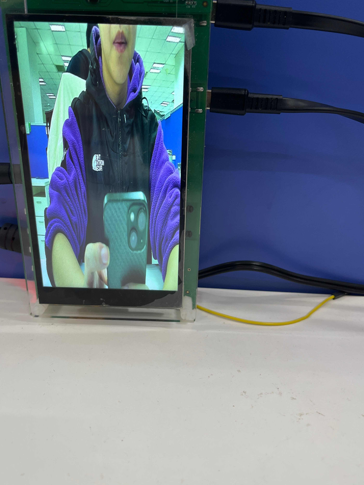

【注意事项】

该函数必须在Camera开流之前进行调用。

## 设置bin文件路径

【功能描述】

指定Camera加载bin文件的路径（64byte）。

【命令参数说明】

v4l2-isp-tuning --def-bin-path

如：v4l2-isp-tuning -i 4 --def-bin-path /etc/sensor/sc230ai-ir.bin

bin文件路径为绝对路径

【注意事项】

该函数必须在Camera开流之前进行调用。

## 设置水平翻转

【功能描述】

将图像水平翻转。

【命令参数说明】

 v4l2-isp-tuning -H

（0 dibable 1 enable）

【效果展示】

v4l2-isp-tuning -i 5 -H 0

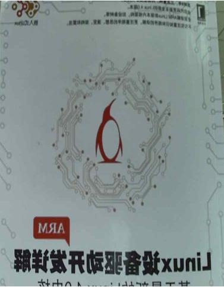

v4l2-isp-tuning -i 5 -H 1

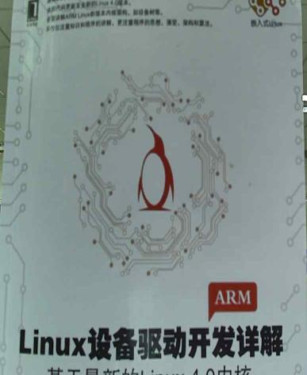

【注意事项】

该函数必须在Camera开流之后进行调用。

## 设置垂直翻转

【功能描述】

 将图像垂直翻转。

【命令参数说明】

 v4l2-isp-tuning -V

0 dibable 1 enable

【效果展示】

v4l2-isp-tuning -i 5 -V 0

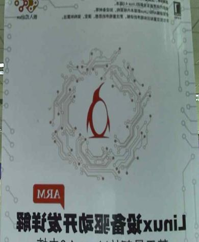

v4l2-isp-tuning -i 5 -V 1

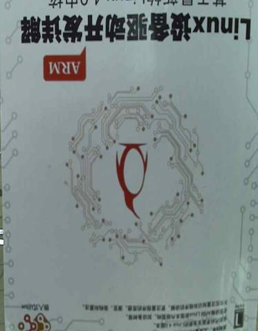

【注意事项】

该函数必须在Camera开流之后进行调用。

##  设置锐度

【功能描述】

 自定义锐度。

【参数说明】

v4l2-isp-tuning -s

range[0-255]

【效果展示】

v4l2-isp-tuning -i 5 -s 0

v4l2-isp-tuning -i 5 -s 255

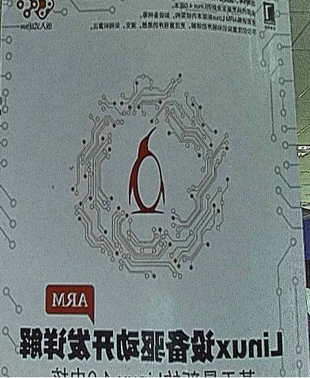

v4l2-isp-tuning -i 5 -s 140

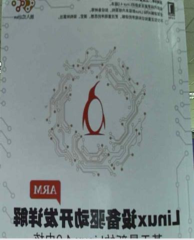

【注意事项】

该函数必须在Camera开流之后进行调用。用户可根据效果需求调节该参数。

## 设置对比度

【功能描述】

 自定义对比度。

【参数说明】

 v4l2-isp-tuning -c

range[0-255]

【效果展示】

v4l2-isp-tuning -i 5 -c 0

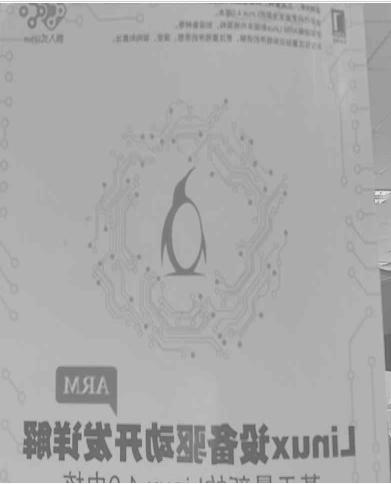

v4l2-isp-tuning -i 5 -c 255

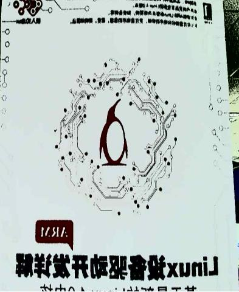

v4l2-isp-tuning -i 5 -c 140

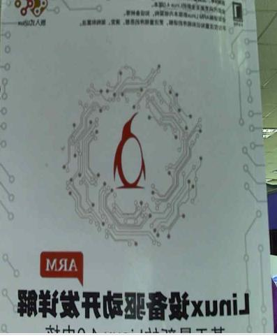

【注意事项】

该函数必须在Camera开流之后进行调用。用户可根据效果需求调节该参数。

## 获取饱和度

【功能描述】

 自定义饱和度。

【参数说明】

 v4l2-isp-tuning -S

range[0-255]

【效果展示】

v4l2-isp-tuning -i 5 -S 0

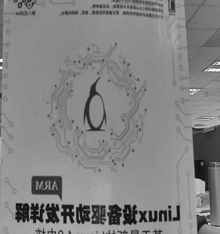

v4l2-isp-tuning -i 5 -S 255

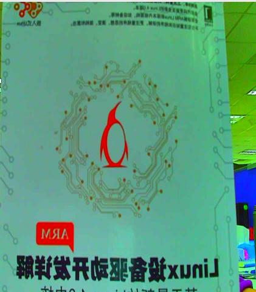

v4l2-isp-tuning -i 5 -S 140

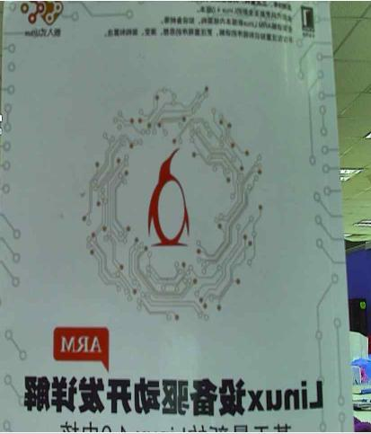

【注意事项】

该函数必须在Camera开流之后进行调用。用户可根据效果需求调节该参数。

## 设置亮度

【功能描述】

 自定义亮度值。

【参数说明】

v4l2-isp-tuning -b

range[0-255]

【效果展示】

v4l2-isp-tuning -i 5 -b 0

v4l2-isp-tuning -i 5 -b 255

v4l2-isp-tuning -i 5 -b 140

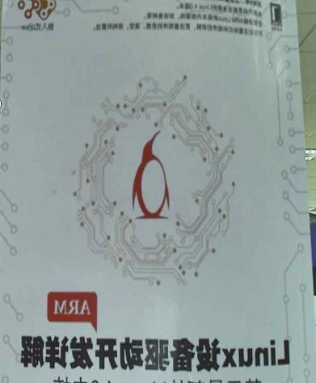

【注意事项】

该函数必须在Camera开流之后进行调用。用户可根据效果需求调节该参数。

## 设置hue

【功能描述】

 获取当前亮度、对比度、饱和度以及色调的综合值。

【参数说明】

v4l2-isp-tuning -u

 range[0-255]

【效果展示】

v4l2-isp-tuning -i 5 -u 0

v4l2-isp-tuning -i 5 -u 255

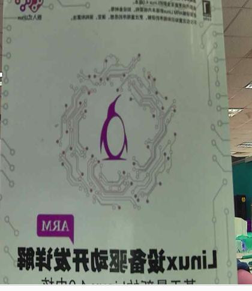

v4l2-isp-tuning -i 5 -u 140

【注意事项】

该函数必须在Camera开流之后进行调用。用户可根据效果需求调节该参数。

## 设置antiflicker

【功能描述】

 消除灯光频闪。

【参数说明】

v4l2-isp-tuning -i 5 -f

0:disable 1:50Hz 2:60Hz

【注意事项】

该函数必须在Camera开流之后进行调用。用户可根据效果需求调节该参数。

## 切换day or night

【功能描述】

设置Camera为day mode或者night mode。

【参数说明】

v4l2-isp-tuning -d

0:day_mode 1:night_mode

【效果展示】

v4l2-isp-tuning -i 5 -d 0

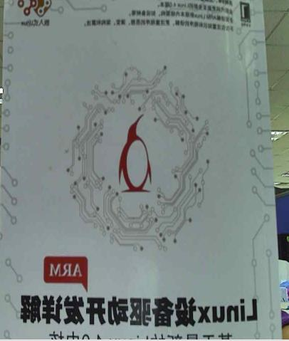

v4l2-isp-tuning -i 5 -d 1

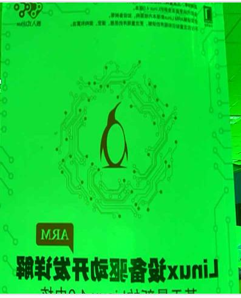

## 设置bypass模块

【功能描述】

通过改写寄存器的值自定义对图像效果进行处理的模块。

【register说明】

| Bits  | Module Name | Description            |
| ----- | ----------- | ---------------------- |
| 31:22 | Reserved    | Writing has no effect. |
| 21    | LCE         | 0:enable 1: disable    |
| 20    | HLDC        | 0:enable 1: disable    |
| 19    | CDNS        | 0:enable 1: disable    |
| 18    | SDNS        | 0:enable 1: disable    |
| 17    | YSP         | 0:enable 1: disable    |
| 16    | CLM         | 0:enable 1: disable    |
| 15    | BCSH        | 0:enable 1: disable    |
| 14    | YDNS        | 0:enable 1: disable    |
| 13    | MDNS        | 0:enable 1: disable    |
| 12    | CSC         | 0:enable 1: disable    |
| 11    | DEFOG       | 0:enable 1: disable    |
| 10    | GAMMA       | 0:enable 1: disable    |
| 9     | CCM         | 0:enable 1: disable    |
| 8     | DMSC        | 0:enable 1: disable    |
| 7     | ADR         | 0:enable 1: disable    |
| 6     | AWB1        | 0:enable 1: disable    |
| 5     | GIB         | 0:enable 1: disable    |
| 4     | DPC         | 0:enable 1: disable    |
| 3     | WDR         | 0:enable 1: disable    |
| 2     | AWB0        | 0:enable 1: disable    |
| 1     | LSC         | 0:enable 1: disable    |
| 0     | BLC         | 0:enable 1: disables   |

【参数说明】

v4l2-isp-tuning -m 

【注意事项】

该函数必须在Camera开流之后进行调用。用户可根据效果需求bypass某些模块。

## 设置曝光值

【功能描述】

自定义Camera曝光。

【参数说明】

v4l2-isp-tuning -e

0:auto, others manual exposure

【效果展示】

v4l2-isp-tuning -i 5 -e 0

v4l2-isp-tuning -i 5 -e 500

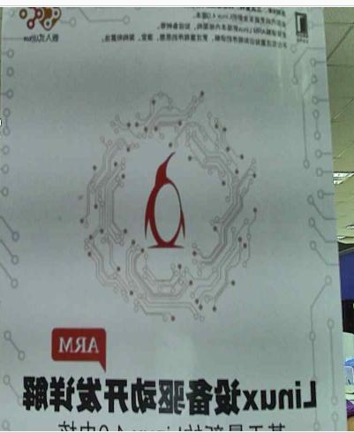

v4l2-isp-tuning -i 5 -e 1800

【注意事项】

该函数必须在Camera开流之后进行调用。用户可根据效果需求调节该参数。

## 设置增益值

【功能描述】

自定义Camera增益。

【参数说明】

v4l2-isp-tuning -g

0: auto other: 手动设置增益值(1024=1x,2048=2x……) 

【效果展示】

v4l2-isp-tuning -i 5 -g 0

v4l2-isp-tuning -i 5 -g 100

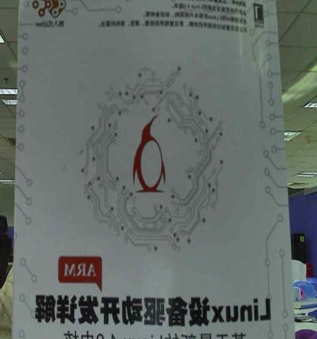

v4l2-isp-tuning -i 5 -g 8192

【注意事项】

该函数必须在Camera开流之后进行调用。用户可根据效果需求调节该参数。

## 提升局部亮度

【功能描述】

对指定区域提亮。

【参数说明】

v4l2-isp-tuning --roi_ae

enable=<enable>,top=<top>,bottom=<bottom>,left=<left>,right=<right>

|        |                                  |
| ------ | -------------------------------- |
| top    | 指定区域的上边界（大于0）        |
| bottom | 指定区域的下边界（小于图像高度） |
| left   | 指定区域的左边界（大于0）        |
| right  | 指定区域的右边界（小于图像宽度） |

【注意事项】

该函数必须在Camera开流之后进行调用。用户可根据效果需求调节该参数。

## 设置去雾强度

【功能描述】

自定义去雾强度。

【参数说明】

v4l2-isp-tuning --defog

enable=<enable>[0:disable1:enable],dark=<dark>,middark=<middark>,midbright=<midbright>,morebright=<morebright>,bright=<bright>[0-255]

|            |                             |
| ---------- | --------------------------- |
| enable     | 0: disable1:enable          |
| dark       | 暗区去雾强度 range[0-255]   |
| middark    | 中暗区去雾强度 range[0-255] |
| midbright  | 中亮区去雾强度 range[0-255] |
| morebright | 高亮区去雾强度 range[0-255] |
| bright     | 亮区去雾强度 range[0-255]   |

【效果展示】

v4l2-isp-tuning -i 5 --defog enable=1,dark=0,middark=0,midbright=0,morebright=0,bright=0

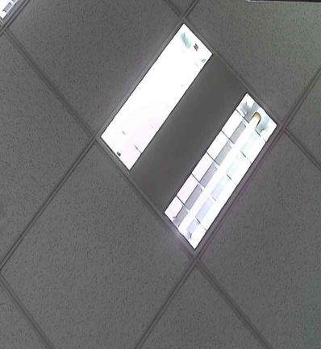

v4l2-isp-tuning -i 5 --defog enable=1,dark=0,middark=0,midbright=0,morebright =200,bright=200

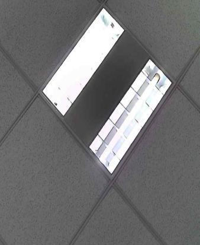

 v4l2-isp-tuning --defog -i 5 enable=1,dark=140,middark=140,midbright=140,morebright=140,bright=140

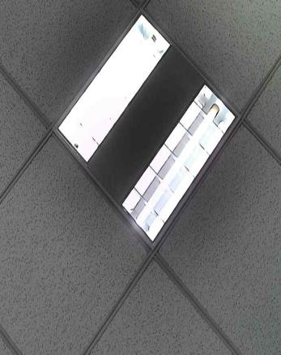

【注意事项】

该函数必须在Camera开流之后进行调用。用户可根据效果需求调节该参数。

## 设置CSC转化时输出UV分量阈值

【功能描述】

自定义CSC转化时输出UV分量阈值

【参数说明】

v4l2-isp-tuning -C 

min=<min>,max=<max> range[0-256]

|     |                    |
| --- | ------------------ |
| min | 输出uv分量的最小值 |
| max | 输出uv分量的最大值 |

【效果展示】

v4l2-isp-tuning i - 9 -C min=0 ,max=256

在此场景下ir摄像头可能在强光等某些场景下出现发紫的现象，如：

此时可以抑制UV分量的输出

v4l2-isp-tuning -i 9 -C min=128,max=128

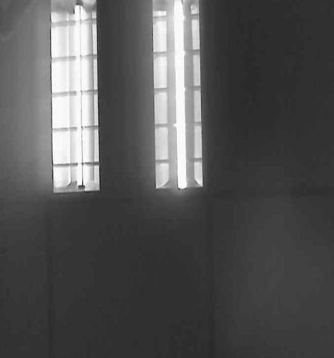

【注意事项】

该函数必须在Camera开流之后进行调用。仅建议以上场景下使用，设置参数也与上述相同。

