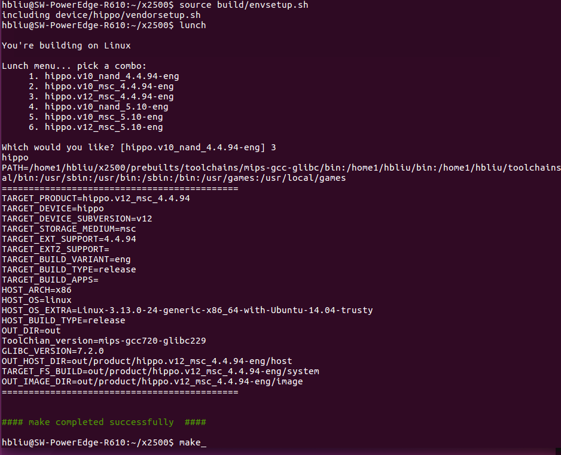
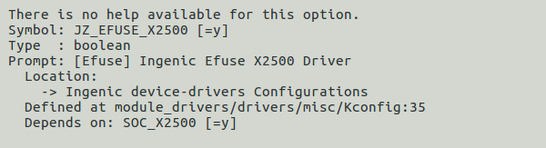
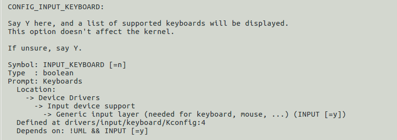
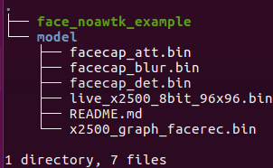
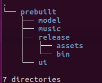
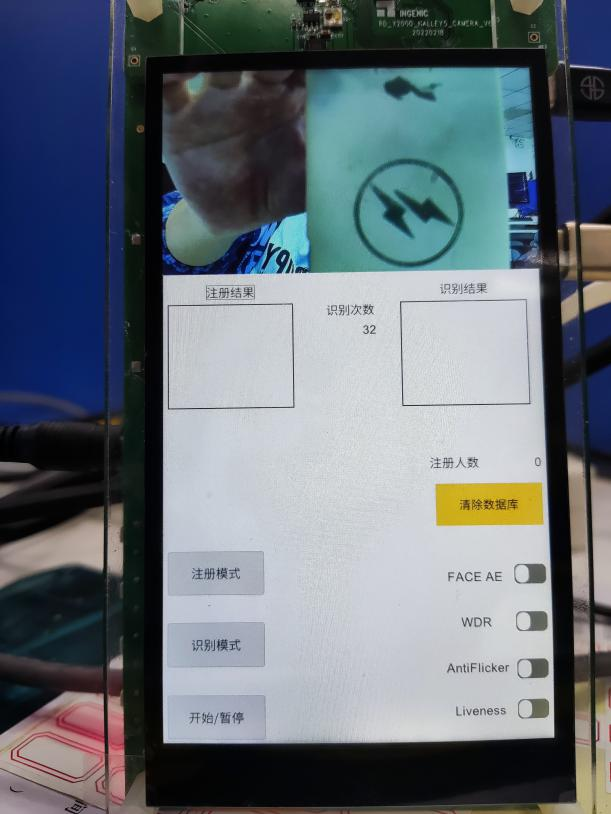
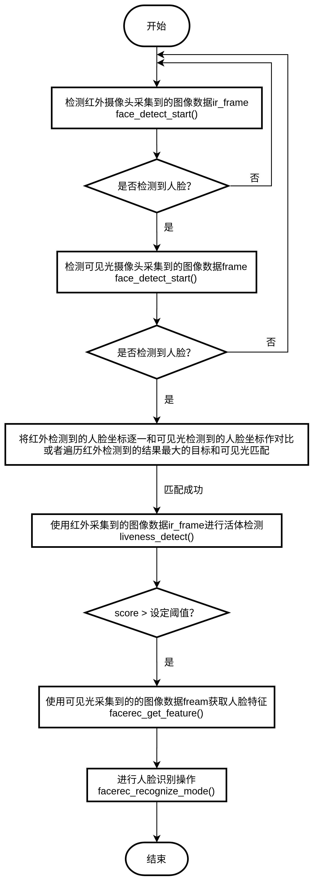

**FaceApp使用说明文档V1.0**

## 一、应用说明

### Faceapp应用获取

下载x2500-sdk,更新至最新代码

注意：1.faceapp目前可直接支持x2500-hippo_v12平台使用

 2.faceapp需要有君正提供的串号进行联网授权，否则没办法运行

### faceapp 应用存放目录:

x2500/packages/example/App/faceapp

.

├── faceapp_awtk

└── faceapp_noawtk

### Faceapp目前分为两个版本：

#### 1.不带有界面版本： faceapp_noawtk

.

├── include

│   └── impp

├── lib

├── model

└── sample

#### 2.带有界面版本: faceapp_awtk

.

├── dumy_lib

├── include

│   └── libyuv

├── lib

├── prebuilt

│   ├── model

│   ├── music

│   ├── release

│   └── ui

└── src

 ├── display

 ├── encode

 ├── face_core

 ├── facedata

 └── inputstream

## 二、faceapp使用介绍

### 应用运行环境搭建

#### 编译整个sdk（参考下图）

注意：如果使用kernel 5.10请选择编译6

#### 重新编译适用faceapp运行的kernel

（1）配置efuse驱动

（2）取消keyboard驱动配置（只运行faceapp_noawtk可以不进行该步骤操作）

 

make kernel

#### 在Manhanttan顶层目录编译faceapp应用

make face_noawtk_example 或者 make face_awtk_example

#### 将faceapp应用打包进文件系统镜像中

make post-image

#### 烧录镜像

（1）系统启动后faceapp_noawtk的应用的所在目录：

/testsuite/faceapp_test/faceapp_noawtk

（2）系统启动后faceapp_awtk的应用的所在目录：

/testsuite/faceapp_test/faceapp_awtk

 

### 应用使用步骤说明

#### Faceapp_noawtk应用使用步骤说明

##### （1）配置网络

系统启动后，首先执行wifi_up.sh（联网，进行授权验证）

##### （2）运行应用

进入到faceapp_noawtk目录下执行./face_noawtk_example，成功运行应用

#### Faceapp_awtk应用使用步骤说明

##### （1）配置网络

系统启动后，首先执行wifi_up.sh（联网，进行授权验证）

##### （2）配置运行环境

进入到faceapp_awtk目录下执行

./prebuilt/face_awtk_env

##### 运行应用

进入到faceapp_awtk目录下执行

./face_awtk_example -x1920 -y1080 -s0 -v4 -L1 -P1 -B1 -C16 -A0 -m1 -w0

注：更多参数配置细节 ./face_awtk_example --help查看

##### 界面操作介绍

 

1. 界面说明

界面上半部分显示实时图像画面，下半部分（白底部分）是操作界面。

1. 显示界面说明

实时画面中在人脸周围显示绿色边框是人脸被捕获，在摄像头范围内出现符合要求人脸时，绿框一致存在，并能够同时捕获多个人脸目标。

实时画面中在人脸周围显示红框，表示正在注册人脸，注册完成，红框消失。

1. 操作界面说明

*注册 ： 点击“注册模式”按钮，实时画面出现红框，此时将要注册人脸置于红框范围内，等待注册成功，注册成功后，该人脸数据会被存放到本地数据库中，“注册人数”会增加1，“注册结果”窗口会出现注册成功的人脸图片。

*识别 ： 点击“识别模式”按钮，根据摄像头捕获到的人脸和数据库中已注册人脸进行识别匹配，如果识别成功，“识别次数”会增加，“识别结果”窗口会显示被成功识别已注册的图片。

*开关 ： 该应用通过“开始/暂停”按钮进行开关控制。

*功能选项 ：

“FACE AE” 开关

“WDR”开关

“AntiFlicker”开关

“Liveness”活体检测开关 

# 三、人脸识别算法流程

​	下图对应faceapp_noawtk：

