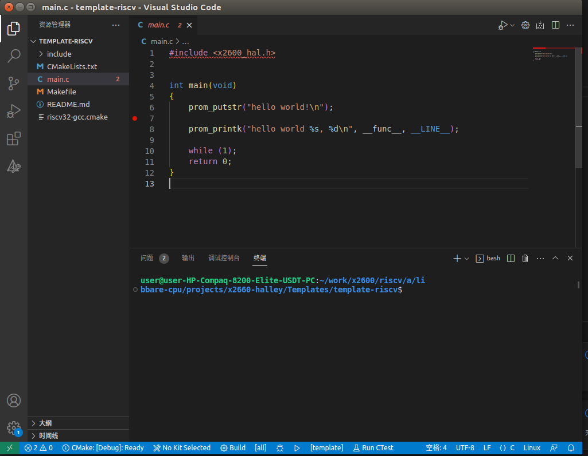

# 工具链和SDK下载

## SDK

https://gitee.com/ingenic-dev/libbare-cpu.git

branch: develop/master

SDK 下载

```
git clone https://gitee.com/ingenic-dev/libbare-cpu.git -b develop/master
```

## 工具链

***ftp账号: ingenic_public 密码: BFdg2f9B12***

适用于x86_64（64位）Linux host PC：

ftp://ftp.ingenic.com.cn/Ingenic-RISCV-Toolchain/Victory0-Series/releases/riscv-ingenic-victory0-series-toolchain-r1.0.0/riscv-ingenic-victory0-series-toolchain-r1.0.0.tar.bz2 

适用于x86_64（64位）Win10/Win11host PC：

ftp://ftp.ingenic.com.cn/Ingenic-RISCV-Toolchain/Victory0-Series/releases/riscv-ingenic-victory0-series-toolchain-r1.0.0/riscv-ingenic-victory0-series-toolchain-win64-r1.0.0.tar.bz2 

# VSCode 开发环境搭建

安装vscode，需保证安装的vscode版本在1.67及以上，过低的版本可能会导致出现一些不可预见的错误．安装vscode Cmake Tools扩展．用vscode以打开文件夹方式打开工程文件夹。

# 创建工程

复制template-riscv文件夹，该文件夹位于libbare-cpu/projects/x2660-halley/Templates/template-riscv，该文件夹下是x2600-riscv的示例代码，可以直接拷贝一个文件夹，然后再添加自己想要实现的功能进行快速开发。

1.修改CMakelists.txt 工程名称 例如:

Project(my_template) # Modified

2. 根据工程实际情况，添加需要编译的源文件

```c
set(sources_SRCS # Modified
 ${SDK_PATH}/cpu/core-riscv/spinlock.c
 ${SDK_PATH}/cpu/core-riscv/start.S
 ${SDK_PATH}/cpu/core-riscv/genex.S
 ${SDK_PATH}/cpu/core-riscv/traps.c
 ${SDK_PATH}/cpu/soc-x2600/src/interrupt.c
 ${SDK_PATH}/cpu/soc-x2600/src/serial.c
 ${SDK_PATH}/cpu/soc-x2600/src/startup.c
 ${SDK_PATH}/drivers/drivers-x2600/src/x2600_hal_def.c
 ${SDK_PATH}/lib/libc/minimal/ctype.c
 ${SDK_PATH}/lib/libc/minimal/div64.c
 ${SDK_PATH}/lib/libc/minimal/string.c
 ${SDK_PATH}/lib/libc/minimal/vsprintf.c
 main.c
)
```

1. 根据实际情况，添加需要包含的路径
```c
include_directories(
 ${PROJ_PATH}/include 
 ${SDK_PATH}/lib/libc/minimal/include
 ${SDK_PATH}/drivers/drivers-x2600/include
 ${SDK_PATH}/cpu/core-riscv/include
 ${SDK_PATH}/cpu/soc-x2600/include
)
```
4. 添加库路径
```c
link_directories(
#path/to/lib
)
```

5. 添加链接的库选项 确保要链接的库在link_directories中定义
```c
set(CMAKE_LD_FLAGS "${CPU_PARAMETERS}") 
```
6. 工程创建成功后，读者可以根据实际需求选择进行在线调试（第4章），或直接编译（第5章）．

# 调试工程

## JTAG硬件调试环境搭建

使用JDI调试器连接到要调试的目标板上的RISCV调试接口上，JDI另一端使用USB连接调试电脑，等到JDI状态指示灯（绿色）常亮，说明JDI状态正常。此时可以检测到有ADB设备接入（首次使用时，需安装ADB驱动，可根据电脑系统自行安装）。说明JDI设备检测正常。可以进行调试了。

## 软件调试流程

使用vscode配合JTAG进行在线调试，调试流程如下：

1. 在开发板上运行以下脚本以使能JTAG调试：
```c
# PB 0~3  
devmem 0x13602018 32 0xf  
devmem 0x13602028 32 0xf  
devmem 0x13602034 32 0xf  
devmem 0x13602048 32 0xf

# release riscv soft reset.  
devmem 0x12200fe0 32 0
```
2. vscode 本地打开创建好的工程文件夹（请勿服务器远程打开），例如 ibbare-cpu/projects/x2660-halley/Templates/template-riscv文件夹．

3. 配置交叉编译工具链到环境变量

4. 确认cmake 版本 cmake-v3.23.1 ，可以使用最新的cmake版本。 注意：不要使用工具链的cmake。否则vscode 会报错。

5. 点击Kit Select，根据开发环境选择cmake kits：cmake-kits "RISCV GCC for ingenic cross compile on Linux" 或"RISCV GCC for ingenic cross compile on Windows"



Kit select

6. lunch(F5) 运行编译、调试 

# 工程编译

以template-riscv为例，提供以下三种编译方式，首先配置交叉编译工具链到环境变量，然后进行编译．

## 基于Makefile编译
```c
$ make
```
会在build目录生成template.elf, template.bin文件.

## 基于cmake构建
```c
$ mkdir build
$ cd build
$ cmake -DCMAKE_TOOLCHAIN_FILE=../riscv32-gcc.cmake ..
$ make
```
会在build目录下生成template.elf，template.bin文件.

## 基于vscode集成开发环境

1. vscode 打开工程

2. 确认cmake 版本 cmake-v3.23.1 ，可以使用最新的cmake版本。 注意：不要使用工具链的cmake。否则vscode 会报错。

3. 根据开发环境选择cmake kits：cmake-kits "RISCV GCC for ingenic cross compile on Linux" 或"RISCV GCC for ingenic cross compile on Windows"

4. 选择状态栏,build， 进行代码编译. 

# 加载和运行程序

程序的加载和运行可使用remoteproc实现

## 使用remoteproc加载运行程序

操作流程如下：


1. kernel config：REMOTEPROC=y, INGENIC_RISCV_RPROC=y
```c
Symbol: REMOTEPROC [=y] 
Type : bool 
Defined at drivers/remoteproc/Kconfig:4 
Prompt: Support for Remote Processor subsystem 
Depends on: HAS_DMA [=y] 
Location: 
 -> Device Drivers 
(1) -> Remoteproc drivers 
Selects: CRC32 [=y] && FW_LOADER [=y] && VIRTIO [=y] && WANT_DEV_COREDUMP [=y] 
Selected by [n]: 
 - INGENIC_RPROC [=n] && HAS_DMA [=y] 
 - INGENIC_MCU_RPROC [=n] && HAS_DMA [=y] 

Symbol: INGENIC_RISCV_RPROC [=y] 
type : tristate 
Defined at module_drivers/drivers/remoteproc/Kconfig:22 
Prompt: ingenic riscv remoteproc support 
Depends on: SOC_X2500 [=n] || SOC_X2600 [=y] 
Location: 
 -> Ingenic device-drivers Configurations 
 (1) -> [Remoteproc] drivers
```
2. dts配置:以x2660_evb_board.dts为例，配置预留内存及riscv load-addr，其中riscv_mcu_ram为riscv代码的运行空间，load-addr为riscv镜像的加载地址，上述两个地址应与libbare-cpu/cpu/core-riscv/ld.lds中的链接地址一致．

```c
/ {

 compatible = "img,x2660-evb-board", "ingenic,x2660";
 reserved-memory {
 #address-cells = <1>;
 #size-cells = <1>;
 ranges =<>;
#if 1
 ……
 riscv_mcu_ram: riscv_mcu_ram@0x07F00000{
 compatible = "shared-dma-pool";
 reg = <0x07F00000 0x50000>;
 };
#endif

 };
};

#if 1

&riscv {
 status = "okay";
 memory-region=<&vdev0buffer &vdev0vring0 &vdev0vring1>;
 load-addr=<0x07f00000>;
};

#endif
```
操作流程：

1. 根据上文介绍的编译方法，编译生成elf文件;

2. 将elf文件或bin文件放置在开发板/lib/firmware目录下(该目录需要手动创建);

3. echo template.elf 或　template.bin> /sys/class/remoteproc/remoteproc0/firmware

4. echo start > /sys/class/remoteproc/remoteproc0/state，程序正常运行;

5. echo stop > /sys/class/remoteproc/remoteproc0/state，程序终止;

