**核间通信API的介绍和使用**

# RPMSG简介

## Linux中的RPMSG

在linux中，rpmsg的驱动位于/drivers/rpmsg目录下，其中实现了基于virtio实现的virtio_rpmsg_bus，这是一个可平台通用的数据传输总线的实现。应用程序可通过对rpmsg驱动的操作，来实现数据的收发。

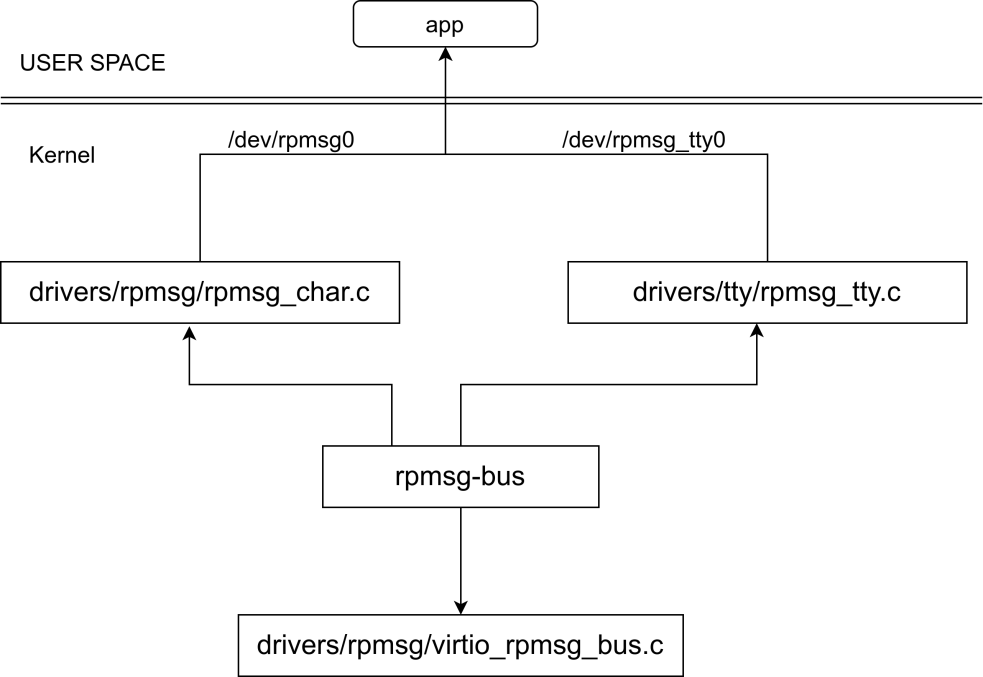

## RPMSG协议

 RPMSG作为一种信息交换的协议，也对应的有相应的层级模型，参考TCP/IP可定义为传输层、网络层和物理层。

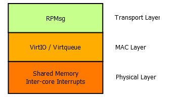

各层级在驱动代码的体现为：

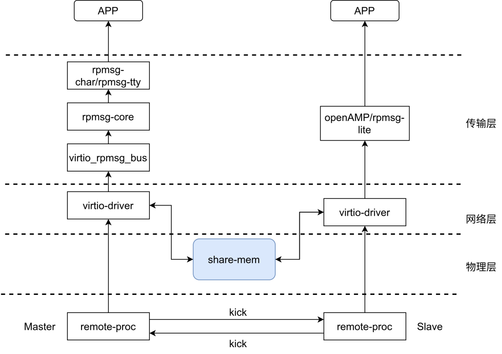

RPMSG在消息格式上，与网络协议类似的，也有固定的格式。通常由两部分组成，包头和数据部分，其中包头的长度固定为16字节，数据通常是496字节(包头+数据段要128对齐)。

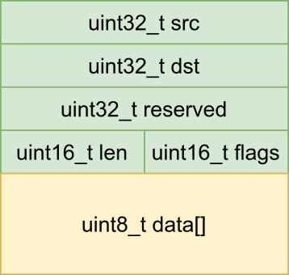

## RPMSG的通信流程

当需要进行消息的发送时，首先需要从共享buffer队列中获取一个可用的buffer，然后进行数据的填充并将buffer加入到发送的buffer队列，最后利用remoteproc提供的通知机制，通知远端处理器，远端处理器在产生mailbox中断后会进行消息的读取和处理。

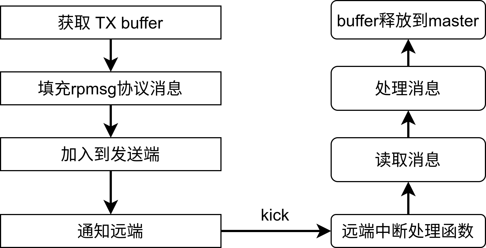

# ingenic_rpmsg实现原理
ingenic_rpmsg通信原理下图所示．

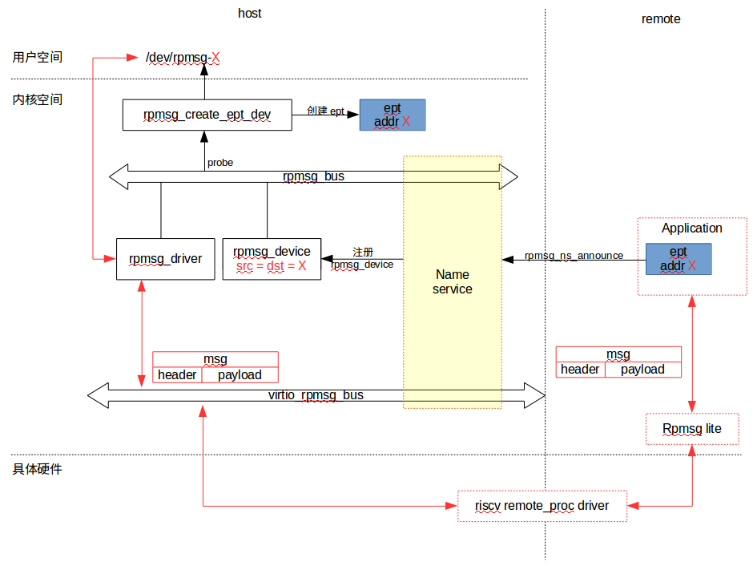

 remote端在主程序中调用rpmsg_create_ept函数创建通信端点，传入三个参数，其一是rpmsg_device名称，其二该端点的通信地址，其三是该端点的接收回调函数，该函数使用第二三个参数创建remote端通信端点，然后使用该端点向host端提供的name service发布公告，发布的内容包括参数一（rpmsg_device名称），以及参数二（remote端通信端点的地址）．

host端在收到该公告后，会在rpmsg_bus上注册一个rpmsg_device，其id.name即为remote端发布的rpmsg_device名称．该名称与host端在rpmsg_bus上注册ingenic_rpmsg_driver相匹配，调用ingenic_rpmsg_probe函数，该函数中创建了host端的通信端点，并指定该端点的地址为公告中携带的remote端端点地址，至此host端和remote端的一对通信端点创建完成，一对端点使用相同的通信地址．ingenic_rpmsg_probe函数还完成了一个字符设备节点的注册，该节点的名称为rpmsg-X（X为通信端点的地址），供用户层操作通信端点使用，host端通信API即是对该节点的系统调用的二次封装．

消息的传递路径由图中红色箭头表示．host端用户层操作/dev/rpmsg-X节点，调用rpmsg_driver中的发送函数，进而由virtio_rpmsg_bus将消息组织成由header和payload组成的消息结构体并发送，header中包含消息来源地址目标地址等信息．消息发送后由riscv_remote_proc_driver通过mailbox中断通知到remote端，remote端使用Rpmsg_lite解析消息结构体，并将消息分发到header中消息目标地址对应的通信端点，调用该端点的接收回调函数．至此host端向remote端的消息发送完成．

remote端向host端发送消息是一个相反的过程，remote端应用使用某端点向host端对应的端点发送信息时，调用Rpmsg_lite提供的消息发送接口，由Rpmsg_lite将消息组织成由header和payload组成的消息结构体并发送，header中包含消息来源地址目标地址等信息．消息发送后由riscv_remote_proc_driver通过mailbox中断通知到host端，host端使用virtio_rpmsg_bus解析消息结构体，并将消息分发到header中消息目标地址对应的通信端点，此时host端用户层可以通过/dev/rpmsg-X节点读取消息．至此host端向remote端的消息发送完成．

综上所述，remote端与host端需要协议好通信端点的地址，remote端使用某一地址X创建的端点，对应到host端即为/dev/rpmsg-X节点对应的通信端点．双方通过这一地址实现端点间的一对一通信．host端需要与remote端地址为x的端点通信时，读写/dev/rpmsg-X即可，remote端需要与host端地址为x的端点通信时，使用本地地址为X的端点发送消息到地址X即可，接收的消息在该端点对应的接收回调函数中．

# 通信API介绍

## host端通信API

host端(xburst2)API是基于ingenic_rpmsg驱动程序创建的cdev节点进行的系统调用的二次封装．

ingenic_prmsg设备从remote端通过virtio_rpmsg_bus驱动框架注册，与驱动匹配成功后会在文件系统/dev目录下生成rpmsg_x节点(X为通信端点地址)，用户层可通过操作该节点进行host端通信端点的管理，实现核间通信数据的收发．host端通信API是对该节点的系统调用的二次封装，详细介绍如下：

### 创建通信节点

【函数原型】int rpmsg_ept_create(unsigned int addr)

【功能描述】打开host端通信地址为addr的通信端点对应的字符设备节点

【参数说明】


|  |  |
| --- | --- |
| 参数 | 描述 |
| addr | 通信节点的地址 |

【返回值】 非０：创建通信端点成功，返回对应字符设备节点对应的文件描述符

 <0：打开通信端点失败

### 销毁通信节点

【函数原型】int rpmsg_ept_destory(int fd)

【功能描述】关闭预销毁的通信端点对应的字符设备的文件描述符

【参数说明】


|  |  |
| --- | --- |
| 参数 | 描述 |
| fd | 预销毁的通信端点对应的字符设备的文件描述符 |

【返回值】 ０：销毁成功

 -1：销毁失败

### 发送数据

【函数原型】int rpmsg_msg_send(int fd, void *msg, size_t size)

【功能描述】使用fd对应的通信端点向remote端发送数据

【参数说明】


|  |  |
| --- | --- |
| 参数 | 描述 |
| fd | host端通信端点fd |
| msg | 发送数据的首地址 |
| size | 发送数据的大小 |

【返回值】 非0：成功发送数据的大下

 -1：发送失败

### 接收数据

【函数原型】int rpmsg_msg_recv(int fd, void *msg, size_t size, int block)

【功能描述】从fd对应的通信端点接收数据

【参数说明】


|  |  |
| --- | --- |
| 参数 | 描述 |
| fd | host端通信端点fd |
| msg | 接收buffer首地址 |
| size | 接收数据大小 |
| block | 是否阻塞接收 |

【返回值】 非0：成功接收消息

 -1：接收失败

## remote端通信API

remote端(riscv-core)rpmsg API 基于第三方库rpmsg-lite进行二次封装，主要接口介绍如下：

### rpmsg remote端初始化

【函数原型】int rpmsg_remote_init(void *shrmem_addr)

【功能描述】rpmsg remote端初始化，初始化vring和virtqueue等资源

【参数说明】


|  |  |
| --- | --- |
| 参数 | 描述 |
| shmem_addr | RX vring地址 |

【返回值】 0：初始化成功

 -1：初始化失败

### rpmsg remote端反初始化

【函数原型】int rpmsg_remote_deinit(void)

【功能描述】rpmsg remote资源反初始化

【参数说明】


|  |  |
| --- | --- |
| 参数 | 描述 |

【返回值】 0：反初始化成功

 非0：反初始化失败

### rpmsg remote端创建通信端点

【函数原型】void *rpmsg_create_ept(const char *ept_name, int addr, int32_t (*rx_cb) (void *payload, uint32_t payload_len, uint32_t src, void *priv))

【功能描述】创建通信端点

【参数说明】


|  |  |
| --- | --- |
| 参数 | 描述 |
| ept_name | 端点名称 |
| addr | 端点地址 |
| rx_cb | 该端点接收数据时的回调函数 |

【返回值】 非空：创建端点成功，返回通信端点指针

 空：创建通信端点失败

【说明】１．端点名称最终会在大核端注册成rpmsg设备,需要与host端注册的rpmsg驱动相匹配，使用时应填写＂ingenic_rpmsg＂．

 ２．端点地址为通信时的重要标识，remote端的每一个端点都应该有自己唯一的地址，并且其对应的host端端点也使用该地址，因此两端需要协议好通信端点的地址，以此来实现端点间的一对一通信．

 3．接收回调函数调用时传入四个参数，分别是接收消息的buffer首地址，消息的长度，消息的来源地址与私有参数．私有参数在创建通信端点时被指定为通信端点的指针．

### rpmsg remote端销毁通信端点

【函数原型】int rpmsg_destroy_ept(void *ept)

【功能描述】销毁通信端点

【参数说明】


|  |  |
| --- | --- |
| 参数 | 描述 |
| ept | 预销毁的通信端点指针 |

【返回值】 0：通信端点销毁成功

 非０：通信端点销毁失败

### 发送消息

【函数原型】int rpmsg_msg_send(void *ept_p, uint32_t dst, char *data, uint32_t size, uint32_t timeout) 

【功能描述】发送消息

【参数说明】


|  |  |
| --- | --- |
| 参数 | 描述 |
| ept | 发送消息的端点指针 |
| dst | 发送消息的目标地址 |
| data | 发送数据的地址 |
| size | 发送数据的大小 |
| timeout | 超时时间 |

【返回值】 0：发送成功

 非０：发送失败

# RPMSG应用实例

## host端软件实现

### 设备树

设备树主要需要配置三部分预留内存，分别是两个vring所需要的内存和用于数据交互的共享内存以及小核代码运行的内存空间．

１．将Riscv的8K Shared SRAM用于vring的存储空间，大小分别为4KB。

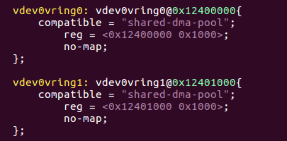
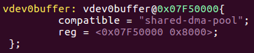

２．用于大小核数据交互的共享内存，预留32KB大小，默认RPMSG_BUF的大小为512字节，则每个vring将会有32个buffer用于数据的传输。

３．小核代码运行的内存空间默认为0x07f00000，可根据实际需求进行修改，修改时注意应与小核代码中链接脚本的地址和设备数中riscv <load-addr>一致

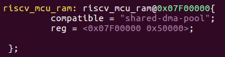

### menuconfig

```c
CONFIG_VIRTIO=y
CONFIG_REMOTEPROC=y
CONFIG_RPMSG=y
CONFIG_INGENIC_RPMSG=y
CONFIG_RPMSG_VIRTIO=y
CONFIG_INGENIC_RISCV_RPROC=y 
```

### host端测试用例实现

host端测试用例代码源码位置：

```c
 libbare-cpu/projects/x2660-halley/Examples/ingenic-rpmsg/xburst2_app
```

该测试用例模拟了printer和scanner两个通信节点同时进行通信的情况，首先创建两个通信端点，分别使用两个通信端点进行收发，最后销毁通信端点．

## remote端软件实现

### 工程路径

```markdown
libbare-cpu/projects/x2660-halley/Examples/ingenic-rpmsg
```

### 工程目录结构

```c
├── CMakeLists.txt
├── include
│ ├── board_eth_phy_conf.h
│ ├── remoteproc_rsc_table.h //resource table
│ ├── rpmsg_config.h //rpmsg_lite config
│ ├── rpmsg_ept_config.h //remote/host端通信地址协议
│ ├── x2600_hal_conf.h
│ └── x2600_sysclk_conf.h
├── main.c //riscv核间通信代码示例
├── Makefile
├── README.md
├── riscv32-gcc.cmake
└── xburst2_app //xburst2核间通信app示例
 ├── include
 │ ├── rpmsg_api.h
 │ └── rpmsg_ept_config.h //remote/host端通信地址协议
 ├── main.c
 ├── Makefile
 └── rpmsg_api.c //host端通信API
```

### remote端测试用例实现

1. remoteproc_rsc_table.h

 riscv-core代码中#include <remoteproc_rsc_table.h>，该文件描述了Remoteproc的resource table，Remoteproc框架需要解析resource_table的内容，因此这里将resource_table加入到链接脚本，单独成为一个字段。

 这里的rsc_table包含一个VDEV设备，设备ID为VIRTIO_ID_RPMSG(7)是由Virtio驱动定义的，Remoteproc框架会解析该内容，完成VDEV设备的注册;有2个vring，分别用于RX和TX。其中VRING_RX_ADDRESS和VRING_TX_ADDRESS的起始地址和设备树预留的vdev0vring0和vdev0vring1的起始地址一致。

2. rpmsg_config.h

rpmsg_lite的配置文件，工程必须定义该文件，根据实际情况进行如下配置
```c
 #define RL_USE_STATIC_API 1 //采用静态分配内存的方式

 #define RL_USE_ENVIRONMENT_CONTEXT 0 //不使用环境上下文

 #define RL_ALLOW_CUSTOM_SHMEM_CONFIG 0 //不使用自定义共享内存配置

 #define RL_BUFFER_COUNT 32 //共享内存配置：buffer数量，值为2的n次方

 #define VRING_ALIGN 16 //共享内存配置：vring对齐
 ```


3. rpmsg_ept_config.h

 rpmsg通信端点的配置文件，remote端使用rpmsg_api时，必须定义该文件，其中包括通信端点的数量，通信端点的地址．同时该文件需要复制到host端测试用例，用于协议通信地址．

4. main.c

 小核运行的主程序，关键代码释义如下

 a. 调用rpmsg的remote端初始化API，需要传入接收队列的共享内存首地址．

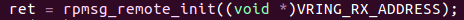 

 b. 申请mailbox中断，并在中断处理函数中调用rpmsg_handler，该函数为rpmsg_lite的中断处理函数，作用是分析接收到的信息并调用相应的callback函数．注意mailbox中断要在rpmsg remote端初始化完成之后进行，防止过早接收到大核的通知导致连接状态异常．

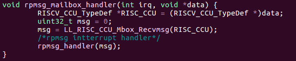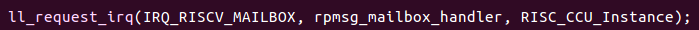 

 c.创建通信端点，创建通信端点时传入的三个参数都非常重要．

 ept_name:该名称最终会在大核端注册成rpmsg设备，因此该名称应与大核端注册的ingenic_rpmsg驱动相匹配，在大核端使用本文中所述的API时应填＂ingenic_rpmsg＂

 addr:该端点的地址，remote端创建的每一个端点都有一个唯一的地址，同时，host端会在/dev目录下生成一个rpmsg-x字符设备节点，x即为该地址．

 rx_cb:通信端点对应的接收回调函数，在该端点接收到数据时被调用．

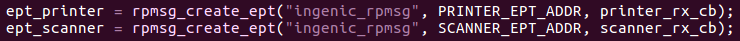

 d. 通信端点的接收回调函数，被调用时传入的参数依次为数据的地址，长度，数据发送端点的地址，以及私有参数，私有参数在创建通信端点时被指定为该通信端点的指针．由于两边的端点使用相同的地址进行一对一通信，所以该函数被调用时传入的消息来源地址（src）应与该reomete端端点的创建时的地址相同．

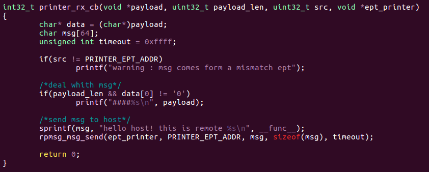

 e. 向host端发送数据，使用remote端的ept向host端相同地址的ept发送数据．由于一对通信端点使用同一个地址，因此使用一个端点向host端对应的端点发送消息时，发送地址填写端点本身地址即可．

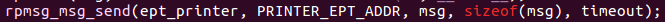 

## 实验步骤

1.编译riscv工程生成ingenic_rpmsg.elf 和　ingenic_rpmsg.bin

2.大核通过remoteproc配置小核固件名称

```console
 echo ingenic_rpmsg.elf > /sys/class/remoteproc/remoteproc0/firmware
```
或
```console
 echo ingenic_rpmsg.bin > /sys/class/remoteproc/remoteproc0/firmware
```

3.大核通过remoteproc状态控制启动小核

```console
 echo start > /sys/class/remoteproc/remoteproc0/state
```

４.启动小核后出现如下打印，下图中１为小核代码中printf打印的内容，证明小核正常启动，２为ingenic_rpmsg通信端点注册成功打印，rpmsg_ept_config.h中指定的地址．

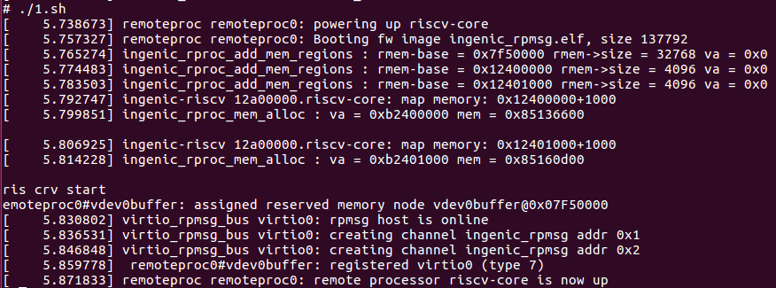

1

此时会在/dev目录下生成rpmsg-1和rpmsg-2节点，表明已建立两对通信端点地址分别为１和２，可根据需求增加通信端点．

2

５.编译工程中的xburst2_app测试用例，执行进行测试

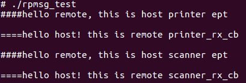

大核首先给小核发送信息，小核将该信息打印，然后回消息给大核，大核将该消息打印，两对通信端点一对一收发互不干扰．

 

