# 1.简介

休眠唤醒功能用于嵌入式设备在待机情况下降低系统功耗,在进入低功耗模式后，部分或整个处理器会暂停工作.君正X26xx系列芯片低功耗模式一共有两种,一种是IDLE模式,一种是SLEEP模式.

# 2.休眠唤醒操作方法

以下操作以x2600 halley7 v1.0开发板为例

## 2.1查看当前芯片支持的休眠模式

若要查看当前芯片支持的休眠模式,可在开发板终端进入文件系统shell命令行之后执行如下指令:

```
cat /sys/power/state
```


从图片中可以看到支持freeze,standby,mem几种休眠模式,简单介绍下这几种休眠模式

    1.freeze 冻结I/O设备,device进入低功耗状态，cpu进入空闲状态
    2.standby 冻结I/O设备,暂停系统，cpu进入idle状态
    3.mem 将运行态数据存到内存，关闭外设，cpu进入sleep状态

## 2.2进入休眠模式

x2600芯片主要使用的是idle模式和sleep模式:
I
### 2.2.1进入sleep模式

在开发板终端执行如下指令:

```
echo mem > /sys/power/state
```

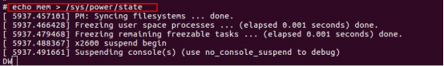

### 2.2.2进入idle模式

在开发板终端执行如下指令:

```
echo standby > /sys/power/state
```

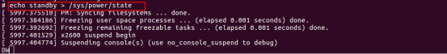

## 2.3唤醒方式

### 2.3.1按键唤醒

具体的按键需要去查看当前使用板级的设备树,设备树所在的文件目录是kernel/arch/mips/boot/dts/ingenic/xxx.dts,需要在对应板级中搜索的关键词为gpio-key,wakeup.这里以君正x2600_halley7开发板为例进行描述,如下图

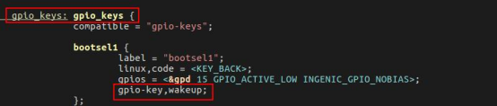

从图中可以看到用于唤醒的GPIO管教为GPIO D组的第15个pin,查看电路图可以得知GPIOD 15管教实际连接的x2600_halley7开发板上的boot按键,所以boot按键具有唤醒功能,具体的电路图如下


注意:此处只是用来举例,具体的唤醒按键需要结合设备树和开发板电路连接.

### 2.3.2外部RTC中断唤醒

#### 2.3.2.1配置外部rtc中断

以pcf8563(pcf8563为RTC芯片型号)为例,

注意:君正X26xx系列开发板的内核配置默认编译了pcf8563的驱动程序,如果您使用的是pcf8563使用默认配置即可,如不是可以参考下面步骤进行配置

1.将对应型号的外部RTC驱动编译进内核的驱动程序

内核配置文件所在的文件目录是arch/mips/configs/xxx_deconfig,在kernel的顶层目录下编译内核配置,操作如下:

kernel顶层目录下查看内核配置文件,执行如下命令

```
ls arch/mips/configs
```

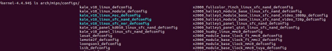

编译对应的内核配置文件,这里以x2600_halley7开发板为例,执行如下指令

```
make x2600_halley_v1.0_defconfig
```


执行如下命令进入linux内核的图形化界面

```
make menuconfig
```
进入图形化界面之后出现如下界面,进入Device Drivers  --->

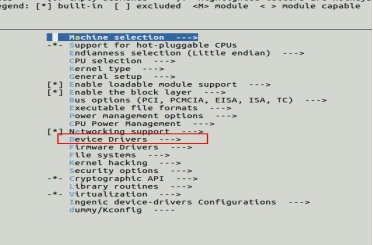

进入之后出现出现以下界面,进入[*] Real Time Clock  --->

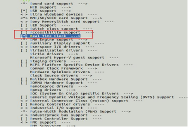

勾选相对应的RTC芯片的型号,这里使用的pcf8563的RTC芯片,所以勾选pcf8563,

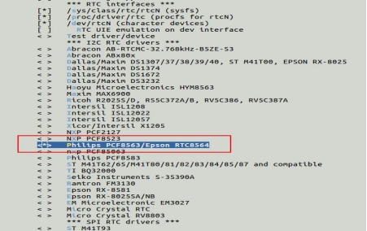

2.查看对应芯片的设备树当中的RTC芯片状态是否为0K

pcf8563的设备树所在的文件目录是kernel/arch/mips/boot/dts/ingenic/xxx.dts.打开对应的设备树文件,查看RTC芯片状态(设备树当中pcf8563芯片状态默认是OK)

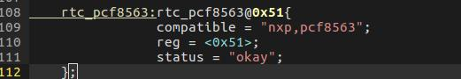

3.确认RTC芯片是否被编译进内核

将编译好的内核使用君正的烧录工具烧录到开发板,进入开发板终端,执行如下命令

```
cat sys/class/rtc/rtc0/name
```


出现rtc-pcf8563就已经正确的将pcf8563的驱动程序编译进内核

4.在开发板文件系统命令行执行

```
echo +5 > /sys/class/rtc/rtc0/wakealarm
```


5.执行休眠

在开发板终端执行如下指令进入休眠:

```
echo mem > /sys/power/state
```
6.一定时间后rtc发出中断唤醒芯片

唤醒打印

```
N
???
R
61t234S
??
[   67.963075] PM: suspend of devices complete after 11.984 msecs
[   67.963498] PM: late suspend of devices complete after 0.414 msecs
[   67.963950] PM: noirq suspend of devices complete after 0.445 msecs
[   67.963953] Disabling non-boot CPUs ...
[   68.010079] SMP: CPU1 is offline
[   68.010268] SMP[1] is disabled
……
……
……
[   68.040571] x2600 pm enter!!
[   68.040571] tcsm addr = b2400000 80012e50 size = 256
[   68.040571] tcsm addr = b2400100 80012e84 size = 2596
[   68.040571] tcsm addr = b2400b24 80013294 size = 3072
[   68.040571] LCR: 00001f01
[   68.040571] OPCR: 41801530
[   68.040571] post wakeup!
[   68.040621] Enabling non-boot CPUs ...
[   68.090526] [SMP] Booting CPU1 ...
[   68.090543] Primary instruction cache 32kB, VIPT, 8-way, linesize 32 bytes.
[   68.090548] Primary data cache 32kB, 8-way, VIPT, no aliases, linesize 32 bytes
[   68.090552] =======found ...... ingenic sc cache ops ...!, found: 1
[   68.090552]
[   68.090556] Unified secondary cache 256kB 8-way, linesize 64 bytes.
[   68.090608] #### now starting init for cpu : 1
[   68.090614] percpu irq inited.
[   68.090618] percpu cpu_num:1 timerevent init
[   68.090632] clockevents_config_and_register success.
[   68.090638] CPU1 revision is: 00132000 (Ingenic XBurst@II.V1)
[   68.090641] FPU revision is: 00f32000
[   68.090643] MSA revision is: 00002000
[   68.090771] [SMP] slave cpu1 start up finished.
[   68.090892] CPU1 is up
[   68.091159] PM: noirq resume of devices complete after 0.256 msecs
[   68.091621] PM: early resume of devices complete after 0.321 msecs
[   68.091725] i2c i2c-0: set:374  hold:375 dev=150000000 h=750 l=750
[   68.091746] i2c i2c-1: set:374  hold:375 dev=150000000 h=750 l=750
[   68.091765] i2c i2c-3: set:374  hold:375 dev=150000000 h=750 l=750
[   68.092077] create CDT index: 0 ~ 22,  index number:23.
[   68.093447] @@ rtc.pcf8563 rtc32k_enable @@
[   68.094237] restore_pin_status is not defined
[   68.497786] PM: resume of devices complete after 406.151 msecs
[   69.305505] x2600 pm end!
[   69.308205] Restarting tasks ... done.
```

注意事项:

1.如果出现下图错误需要在开发板终端执行如下指令

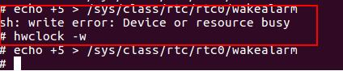

```
hwclock -w
```
2.RTC无法正确唤醒

(1)查看电路连接是否正常,RTC_INT管教是否连接,I2C通信是否正常,下图电路图中绿色标记部分为需要重点关注的硬件连接

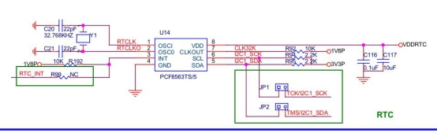

(2)设备树中断唤醒管脚是否配置并且配置是否正确

查看实际RTC中断管脚的电路连接,从上图可以知道RTC_INT是RTC的中断管脚,电路图连接如下图


需要在设备树文件当中加入中断唤醒的配置代码,注意需要加在gpio-keys的节点下(这里在休眠的时候存在中断屏蔽,具体不做过多阐述),下图只是一个例子,一般RTC的中断唤醒都是将RTC_INT连接的GPIO的管教状态设置为低电平,如图中将GPIOE_04设置为低电平有效

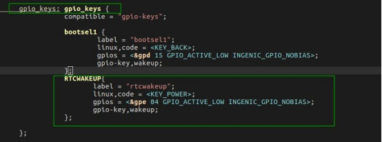

# 3.休眠唤醒内部流程

## 3.1休眠

### 3.1.1idle 模式

PM手册中给出的操作步骤:

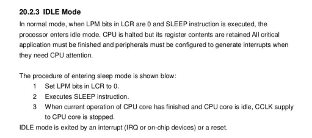


第一步设置LPM bits in LCR to 0(主要作用是设置CPU的低功耗模式,根据下图中PM手册的描述设置0就是进入IDLE模式)

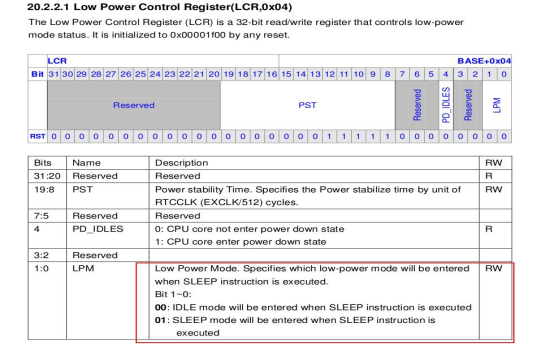


第二步执行SLEEP指令,当第一步寄存器设置完成之后,CPU执行SLEEP指令,开始进入IDLE模式

第三步当CPU进入IDLE模式之后CPU CLOCK停止并且关闭中断屏蔽

### 3.1.2sleep模式

PM手册中给出的操作步骤:

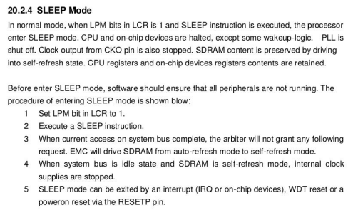

第一步设置LPM bits in LCR to 1(主要作用是设置CPU的低功耗模式,根据下图中PM手册的描述设置1就是进入SLEEP模式)

第二步执行SLEEP指令,当第一步寄存器设置完成之后,CPU开始执行SLEEP指令,开始进入SLEEP模式

第三步DDR由auto-refresh进入到self-refresh

第四步当DDR进入SELF REFRESH之后,DDR需要关闭内部时钟 (DDR的时钟主要分为两部分,一部分是控制器上的,一部分是PHY的PLL,这里的内部时钟主要指的就是DDR PHY的PLL时钟)

第五步SLEEP模式退出方式: 可以通过中断（IRQ或片上设备）、WDT重置或通过RESETP引脚上电重置退出

## 3.2唤醒

通过中断（IRQ或片上设备）、WDT重置或通过RESETP引脚上电重置进行唤醒

# 4.低功耗调试方案

功耗的计算方式,功耗=电流 * 电压,所以一般的低功耗就是想办法去降低电流和电压,当前降低功耗的方式主要是通过降低电流,下面讲述如何通过降低电流进而降低芯片功耗的思路(IDLE模式),x26xx系列芯片功耗主要集中在VDD_MEM,VDD_CORE,PLL_VCCA这三路电,所有的测试数据主要也是以这三路为主

## 4.1IDLE模式下的芯片低功耗调试方案

IDLE模式下降低芯片功耗的思路,也就是前面代码分析中LOW_POWER_IDLE这个宏所包含代码段,内容如下

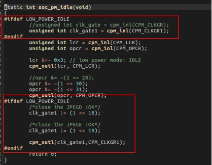

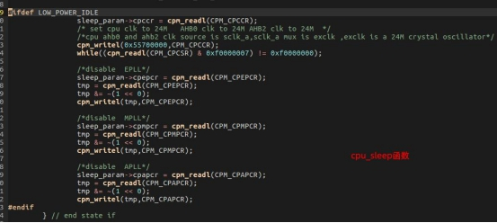

首先看下未调试之前君正的芯片在IDLE模式下的功耗表现,基本的功耗在130mw
左右,主要的功耗产生还是在VDD_CORE这一路


### 4.1.1DDR由auto-refresh进入self-refresh

在休眠的时候通过关闭DDR控制器和DDR PHY的PLL这部分的逻辑来降低功耗,关闭之后比正常的IDLE的功耗降低了30mw左右, 进行上述操作后的功耗在100mw左右,附上测试数据图


### 4.1.2关闭不使用模块的电源和时钟

由于X26xx系列芯片寄存器不支持单独关闭硬件模块的电源,所以尝试关闭硬件模块的时钟,关闭方法为将模块时钟对应的CLKGR和CLKGR1寄存器位置1
目前在代码中关闭时钟为JPEGE和JPEGD模块

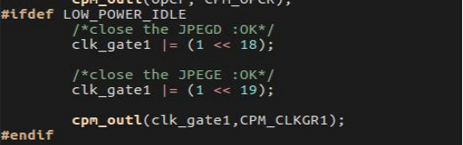

具体的可以查看CLKGR和CLKGR1这两个寄存器的描述

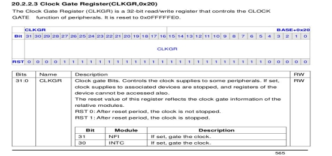


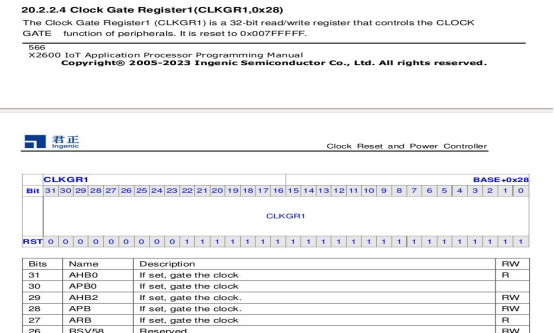

注意:如果关闭一些模块的gate,可能会导致无法正常的休眠唤醒,请打开这个模块的gate,否则将影响正常的休眠唤醒功能

这里附上一组当时调试这两个寄存器的功耗数据图,可以看到关闭JPEGE和JIPEDG对IDLE模式下功耗有一定影响,其他模块基本没有影响,降低功耗基本在10mw左右,关闭JPEGD和JPEGE+DDR进入自刷新一共降低40mw左右,至此,实际的功耗在90mw左右

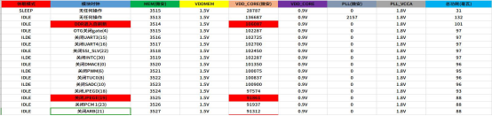

### 4.1.3降低CPU,AHB0,AHB2频率

降低CPU,AHB0和AHB2的频率至24Mhz可降低芯片内部这部分逻辑的电流,实际也可以降低功耗,实际测试降低了20mw左右

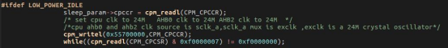

在设置DDR进入self-refresh+关闭JPEGD和JPEGE的gate+降低CPU,AHB0,AHB2频率至24Mhz的情况下,经测试实际功耗在70mw左右,功耗数据图如下

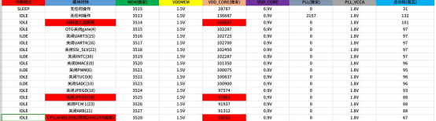

### 4.1.4关闭APLL,MPLL,EPLL

以外部24M晶振作为输入时钟,经过分频倍频之后会输出稳定的三组PLL,分别为APLL,MPLL,EPLL,关于这三组PLL的详细描述请查看芯片手册

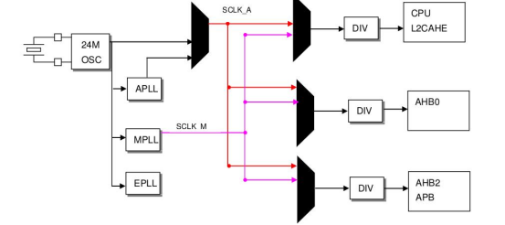

在24M晶振生成PLL的过程中,芯片内部的晶体管在不断的开关,关闭这三路PLL主要就是减少晶体管开关产生的功耗

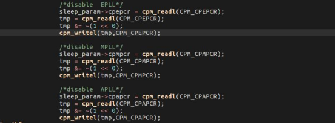

经测试功耗实际降低了35mw左右,
在设置DDR进入self-refresh+关闭JPEGD和JPEGE的gate+降低CPU,AHB0,AHB2频率至24Mhz+关闭APLL,MPLL,EPLL的情况下,经测试实际功耗在30mw左右,功耗数据图如下

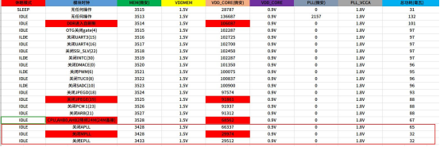

## 4.2SLEEP/IDLE模式下的整机低功耗调试方案

SLEEP/IDLE模式下降低整机功耗的思路主要是根据开发板GPIO的配置,在系统休眠时,对GPIO进行输入上下拉或者输出高低电平等配置来降低系统休眠功耗

### 4.2.1配置设备树中休眠时GPIO属性

休眠时的GPIO属性在当前开发板的板级设备树下进行配置,设备树文件所在的目录是kernel/arch/mips/boot/dts/ingenic/板级.dts,这里以君正x2600_halley7开发板为例进行描述,如下图

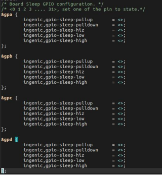


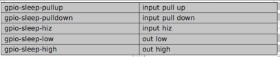

这里举一个例子讲述如何配置GPIO属性
例如:配置PA组(0-10)的pin为输入上拉状态,(11-15)为输出高电平,如下图

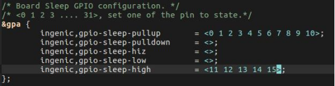

### 4.2.2休眠时如何配置GPIO属性降低功耗

对于外接上拉电阻或下拉电阻,电源或接地的GPIO ,若直接设置成高电平或低电平可能会导致GPIO输出的电平与外接的电平不相等,进而产生功耗增加的情况,所以将这些GPIO设置为输入并且状态设置为 NO PULL

注意:操作前建议先咨询硬件工程师关于开发板的硬件设计及外设关电调试思路，比如GPIO应该设置成output , input， 还是hiz(高阻态)，这需要根据开发板的状态进行配置，防止漏电.

上述方法可在板级设备树进行如下配置:
在对应的板级设备树当中找到gpio-sleep-hiz,在<>里面加入需要设置的GPIO编号

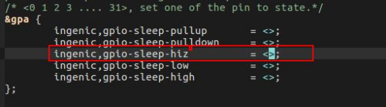
