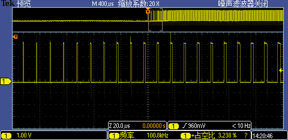
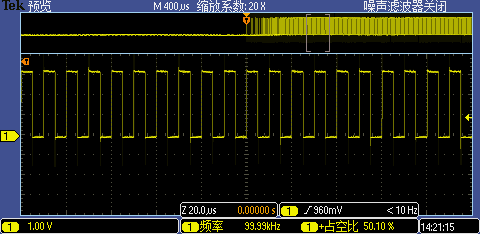

# PWM_SMC模块开发手册

## 模块功能介绍

    1. 支持设置加速表步数，匀速表步数
    2. 支持选择pwm通道 init电平以及idel电平
    3. 支持缓停和急停，并且停止时返回当前步数

## 驱动源码位置

驱动源码所在位置：

***module_drivers/drivers/char/ingenic_pwm_smc.c***

## 设备树配置

```
&pwm {

    pinctrl-names = "default";

    pinctrl-0 = <&pwm1_pb>; //根据需求配置需要的pwm

    status = "okay";

};

&pdma1 {
        status = "okay";
};

/ {
	pwm_smc {
    status = "okay";
    compatible = "ingenic,x2660-pwm-step-motor";
    pwms = <&pwm 1 0>;                         
	};
};
```

## 内核编译配置

```c
Symbol: INGENIC_PWM_SMC [=y]
Type  : bool
Defined at module_drivers/drivers/char/Kconfig:23
  Prompt: [PWM-SMC] Ingenic Pwm SMC Driver
  Depends on: PWM_INGENIC_V3 [=y]
  Location:
    -> Ingenic device-drivers Configurations

```
设备树和内核编译配置选上后 在/dev下会有ingenic_pwm_smc节点
## 频率计算
```c
/* 211hz计算方法
 * 原时钟为400Mhz
 *
 * period_ns= 1000000000 / 211 / 2 ≈ 2369669
 *
 * 要分出211hz,400000000 / 211 ≈ 1895734
 * 高和低最大都为65536
 * 1895734 / (65536*2) = 14.42,因此需要15分频
 *
 * 经过15分频后，频率变为26.666Mhz
 * 400000000 / 15 / 211 = 126382 50%占空比高低各为63191
 *
 * pwm_form_high[i].High = 63191;
 * pwm_form_high[i].Low = 63191;
 *
 * 56k计算方法同上
 * pwm_form_high[i].High = 238;
 * pwm_form_high[i].Low = 238;
 */
```
## 封装接口 smc API 介绍
demo位于packages/example/Sample/pwm_step_motor/ 下
```c
struct smc_context用于用户配置信息
struct smc_context {
    int dev_fd;         //设备id
    int pwm_chan;       //使用的pwm通道
    int pwm_idel_level; //idel状态的电平
    int init_level;     //初始电平状态
    int up;             //加速表的步数
    int run;            //匀速的步数
    int period_ns;      //周期时间
};
```
### 接口介绍
```c
1.smc_init
/**
  * @brief  初始化pwm_scan设备
  * @param  指向smc_context结构的smc指针，该结构包含选择的pwm通道，idel电平状态，加速步数以及匀速步数 的配置信息.
  * @retval 0 成功 非0 失败
  */
int smc_init(struct smc_context *smc);

2.smc_setup_table
/**
  * @brief  设置加速表，将加速表写入
  * @param  指向smc_context结构的smc指针，该结构包含选择的pwm通道，idel电平状态，加速步数以及匀速步数 的配置信息.
  * @param  需要写入的加速表
  * @retval 0 成功 非0 失败
  */
int smc_setup_table(struct smc_context *smc, tbl_t *up);

3.smc_start_run
/**
  * @brief  启动pwm和dma
  * @param  指向smc_context结构的smc指针，该结构包含选择的pwm通道，idel电平状态，加速步数以及匀速步数 的配置信息.
  * @retval 0 成功 非0 失败
  */
int smc_start_run(struct smc_context *smc);

4.smc_stop_normal
/**
  * @brief  停止数据传输并进行减速
  * @param  指向smc_context结构的smc指针，该结构包含选择的pwm通道，idel电平状态，加速步数以及匀速步数 的配置信息.
  * @retval 返回当前步数
  */
int smc_stop_normal(struct smc_context *smc);

5.smc_stop_force
/**
  * @brief  立即停止数据传输
  * @param  指向smc_context结构的smc指针，该结构包含选择的pwm通道，idel电平状态，加速步数以及匀速步数 的配置信息.
  * @retval 返回当前步数
  */
int smc_stop_force(struct smc_context *smc);

6.smc_get_run_step
/**
  * @brief  获取当前步数
  * @param  指向smc_context结构的smc指针，该结构包含选择的pwm通道，idel电平状态，加速步数以及匀速步数 的配置信息.
  * @retval 返回当前步数
  */
int smc_run_step(struct smc_context *smc);
```
### 5.设备驱动接口介绍
```c
1.struct pwm_cfg_info用于应用层和驱动层联系
struct pwm_cfg_info {
    int mode;           //pwm的模式，当前配置为DMA_MODE_SMC
    int init_level;     //初始电平
    int finish_level;   //idel电平
    int period_ns;      //频率
    int duty_ns;        //占空比
    int channel;        //使用的pwm通道
    int clk_in;         //pwm时钟
    int step;           //匀速的步数
    int set_up_num;     //加速的步数
    int cur_pos;        //返回当前的步数
};
2.ioctl介绍
enum pwm_scan_ioctl_cmd {
    PWM_SCAN_GET_INFO,          //获取上面的结构体数据
    PWM_SCAN_SET_INFO,          //设置上面的结构体数据
    PWM_SCAN_CONFIG,            //初始化pwm和dma
    PWM_SCAN_START,             //启动pwm和dma
    PWM_SCAN_GEN_STOP,          //缓停，返回当前步数
    PWM_SCAN_QCK_STOP,          //急停，返回当前步数
    PWM_SCAN_GET_RUN_STEP_INFO, //获取当前步数
    PWM_SCAN_REQUEST_CHANNEL,   //申请pwm通道
};
```
### demo编译及使用
```c
1.编译 在顶层目录下执行make pwm_smc_example 或 到demo目录下执行mma
2.clean 在顶层目录下执行make pwm_smc_example-clean
3.编译出文件pwm_smc_example位于out/product/x2660halley.v10_nand_4.4.94-eng/obj/buildroot-intermediate/target/testsuite/pwm_smc_example/pwm_smc_example
4.使用时直接执行./pwm_smc_example即可
```
## 测试图例



