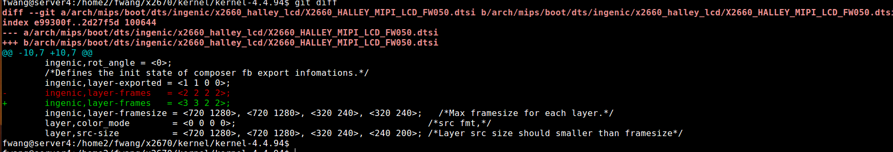
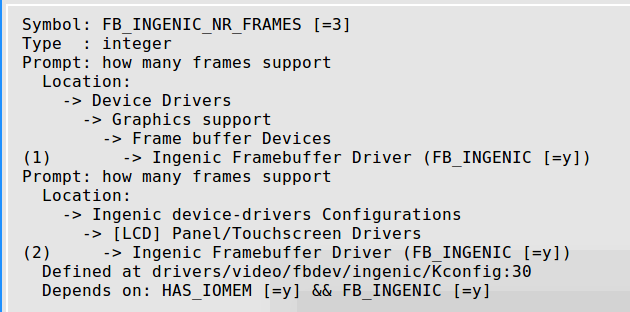
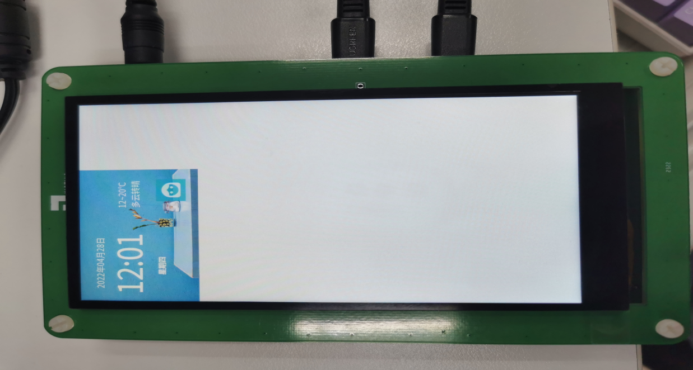
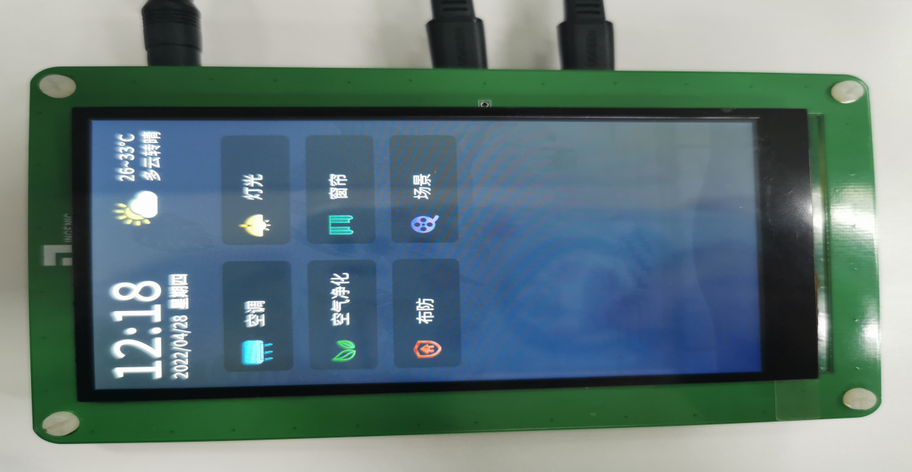
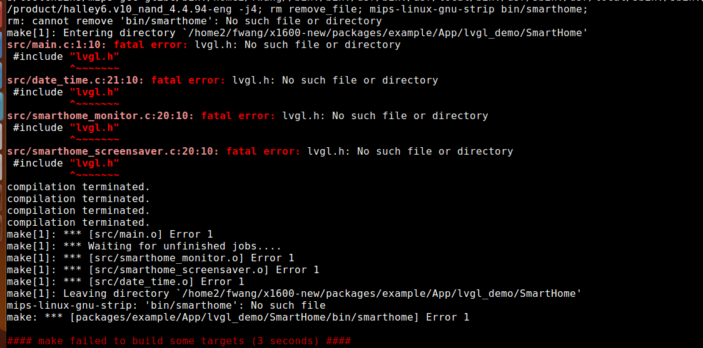
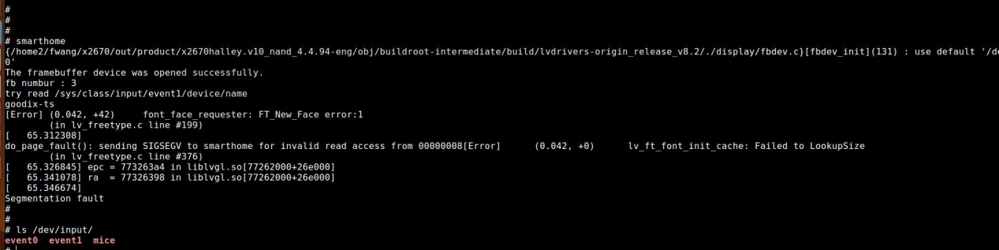
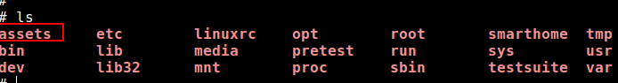
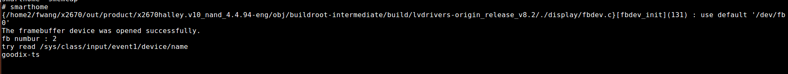
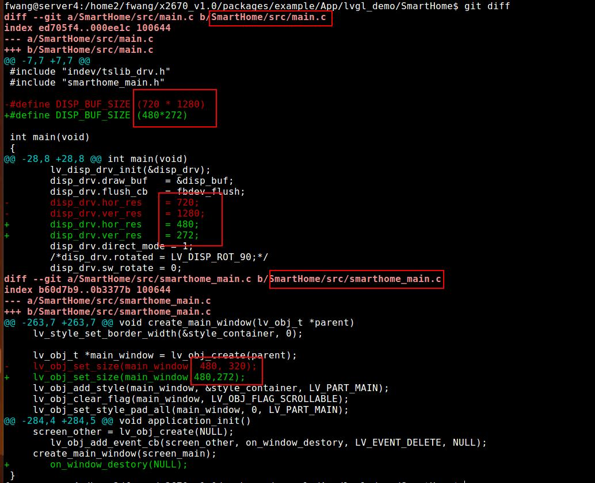
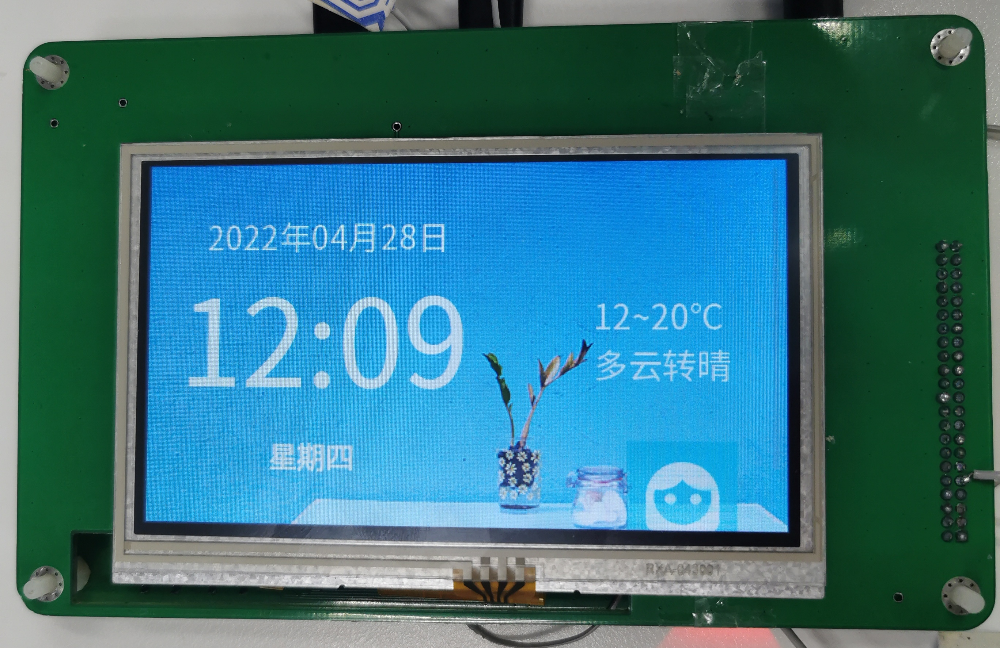

# lvgl_demo使用方法说明

## 1. 整体编译  

(1) source build/envsetup.sh

(2) lunch命令执行结束后会显示不同的配置方案，请根据开发板的配置输入编号进行选择。  

(3) make  -j8 (注意：由于机器性能的不同编译时长也会有差异，-j后面的数字可以根据机器性能做更改，通常数越大，同时开启的编译线程数也就越大)  

(4) 编译成功后，会在"out/..../image"目录下生成镜像文件，即可用于烧录。 （注：清空工程编译的中间文件使用命令 make clean）

## 2. lvgl模块编译

源码路径：sdk/packages/example/App/lvgl_demo/

在顶层目录 make buildroot-menuconfig  选中 BR2_PACKAGE_FREETYPE  、BR2_PACKAGE_TSLIB；

编译**SmartHome** 为例；

* 方法一、在工程顶层目录make LVGL_SmartHome_fs;

会在out/product/sdk /obj/DEPANNER/ 下生成LVGL_SmartHome-intermediate、LVGL_SmartHome_Release-intermediate、LVGL_SmartHome_fs-intermediate文件夹；以及 out/product/sdk/system/assets文件夹；

清除：make LVGL_SmartHome_fs-clean;

* 方法二、进入 cd sdk/packages/example/App/lvgl_demo/SmartHome/ ;mm 编译；生成可执行程序sdk/packages/example/App/lvgl_demo/SmartHome/bin/smarthome

单独有修改可以将smarthome adb push 到板子的/usr/bin下替换；

清除：make clean;

* 回到顶层目录make post-image;将编译生成的文件打包到文件系统中；
* 烧录最新的文件系统即可；

## 3. kernel 更改

dts：（例如x2670） ingenic,layer-frames 改为3

相对应的kernel-menuconfig中FB_INGENIC_NR_FRAMES [=3]也要写成3；

烧录镜像后，会开机自启动smarthome程序；触屏操作即可；

smarthome 效果图

Lifesmart效果图：

## 4. Q&A

（1) Q：make LVGL_SmartHome 时报错；

(1) A：整体编译后再make LVGL_SmartHome；

(2) Q：文件系统缺少assets库；

(2) A：在顶层目录make post-image 重新打包文件系统，烧录；直到有assets目录；

(3) Q：开机没有自启动成功，运行smarthome 出现白屏，串口打印如下：

(3) A：错误原因fb number 为2；检查’三、kernel’的更改；

(4) Q：没有报错；屏幕也能正常显示，不能点击；

(4) A：检查ls /dev/input ;看有无event1节点；若没有检查kernel 触屏相关配置；

## 5. 修改分辨率配置

    (例如当前屏幕分辨率为480 * RGB * 272)
修改lvgl_demo/SmartHome/src/main.c; lvgl_demo/SmartHome/src/smarthome_main.c

smarthome 效果图

