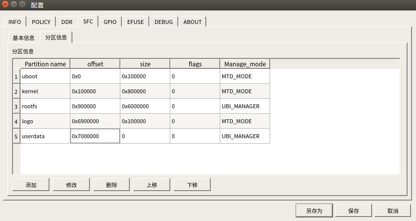
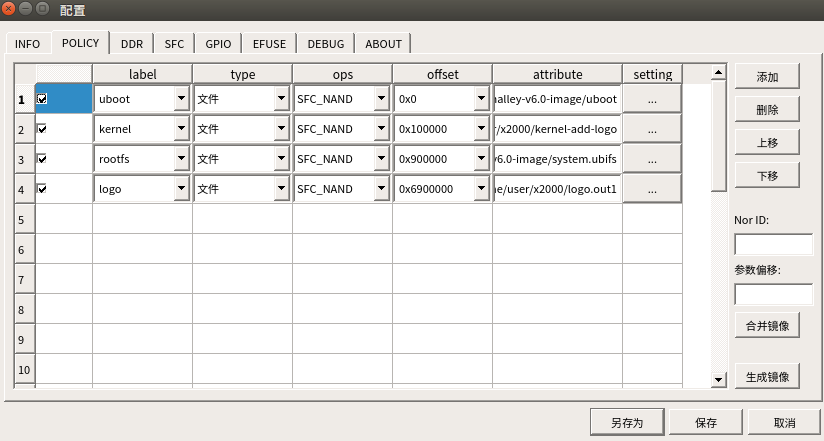
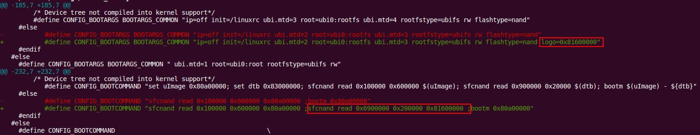

# LCD logo替换解决方案

## 1. 替换方案简介

本方案为内核启动logo替换方案，可通过两种方式选择logo进行替换显示，

第一种方案为修改内核配置，将要替换的logo编入内核；

第二种方案为根据不同的主存储介质，使用烧录工具从spi-flash 或者从eMMC空间中划分一段空间用来存储logo文件，将要替换的logo文件通过烧录写入主存储介质，并修改uboot启动参数，在启动阶段读取logo文件并显示；

用户可根据实际情况，选择您认为适合的方式进行使用。

## 2. 方案一配置流程

以x2670 halley v1.0为例，进入kernel4.4内核目录下。

### 2.1 编译内核默认配置

编译x2670 halley v1.0开发板的默认配置

```
make x2670_halley_v1.0_defconfig
```

### 2.2 修改内核配置

1. 将要替换的logo图片放入指定目录

```
mv my_logo.png module_drivers/drivers/video/logo-ingenic/
```

2. 修改配置以替换logo文件，执行命令

```
make menuconfig
```

找到并修改**TRUE_COLOR_LOGO_FILE**配置，并把该配置参数改为将要使用的my_logo.png文件路径。

```
CONFIG_TRUE_COLOR_LOGO_FILE:

set a picture file, support png, jpg, bmp.

Symbol: TRUE_COLOR_LOGO_FILE [=module_drivers/drivers/video/logo-ingenic/my_logo.png]
Type  : string
Prompt: Logo File
    Location:
      -> Ingenic device-drivers Configurations
	-> [LCD] Panel/Touchscreen Drivers
          -> True Color Logo for Ingenic (TRUE_COLOR_LOGO [=y])
    Defined at module_drivers/drivers/video/logo-ingenic/Kconfig:7
    Depends on: TRUE_COLOR_LOGO [=y]
```

3. 修改背景颜色

当LCD屏幕的分辨率大于my_logo.png分辨率时，大于的部分用背景色填充。

修改**TRUE_COLOR_LOGO_BACKGROUND**配置，设置为适当的背景像素颜色。

```
CONFIG_TRUE_COLOR_LOGO_BACKGROUND:

set default background color.

Symbol: TRUE_COLOR_LOGO_BACKGROUND [=0x00ffffff]
Type  : hex
Prompt: Background Color
  Location:
    -> Ingenic device-drivers Configurations
      -> [LCD] Panel/Touchscreen Drivers
        -> True Color Logo for Ingenic (TRUE_COLOR_LOGO [=y])
  Defined at module_drivers/drivers/video/logo-ingenic/Kconfig:14
  Depends on: TRUE_COLOR_LOGO [=y]
```

修改完毕后保存退出，编译内核镜像并烧录，启动后LCD上会显示所替换的logo图像。

## 3. 方案二配置流程

以x2670 halley v1.0为例

### 3.1 准备logo文件

1. 进入kernel4.4内核目录下,编译scripts/pic2logo.c

```
   gcc -lm scripts/pic2logo.c -o pic2logo
```

2. 生成将要烧录到存储介质中的logo文件，执行命令

```
./pic2logo my_logo.png 32 0xffffff0 logo.out
```

命令参数解析：***logo.png*** 是要替换的logo图片；***32*** 是logo.png的图像像素深度（32bpp）；
***0xffffff0***是背景色像素值，当LCD屏幕的分辨率大于my_logo.png分辨率时，大于的部分用背景色填充；
***logo.out*** 是最终要使用的文件

### 3.2 烧录logo

修改烧录工具，在烧录工具上添加一个logo分区；这里以linux烧录工具2.5.37版本为例，说明一下添加logo分区的流程：

1. 选择一个要烧录的配置，这里选择x2670_sfc_nand_ddr3_linux.cfg进行说明；

2. 选择 配置-->SFC-->分区信息；

3. 添加一个分区，将其放在rootfs之后，名称为logo，偏移为rootfs的大小加上其偏移，大小填0x100000（1M）一般就够用了，可以根据自己的需求添加，分区类型为MTD_MODE；如下图。

   

4. 切换到烧录工具POLICY界面，添加一个烧录选项；label为logo，type选择文件，ops选择SFC_NAND,offset为步骤3中计算出来的偏移。然后选择上面准备好的logo.out文件；如下图。

   

5. 将logo.out烧录到主存储介质中，第一次烧录logo时，需选择全擦烧录。之后正常烧录即可。

### 烧录logo文件

将上面步骤中制作好的logo.out通过烧录工具烧录到主存储介质中。

### uboot 启动命令修改

1. 修改bootcmd，添加读logo分区到内存

在bootcmd中添加指令，将logo.out文件读写到内存的指定位置。
如原来
```
bootcmd=bootcmd=sfcnand read 0x100000 0x600000 0x80a00000 ;bootm 0x80a00000
```
修改为
```
bootcmd=sfcnand read 0x100000 0x600000 0x80a00000 ;sfcnand read 0x6900000 0x100000 0x81600000 ;bootm 0x80a00000
```

即添加从地址0x6900000处读取0x100000的数据到内存的0x81600000处。其中地址0x6900000是烧录工具中设置的logo分区偏移地址。

2. 修改bootargs传参，指定logo读到的位置

在bootargs中添加

```
logo=0x81600000
```

其中0x81600000 是logo读到的位置。可以自行指定。但需要和bootcmd中设置的值保持一致。

也可在uboot目录下板级头文件中进行修改




烧录修改完成后重新编译生成的uboot镜像，效果与以上两步修改操作一致，在此不做过多介绍。

参数修改完毕后保存并继续启动内核，启动后LCD上会显示所替换的logo图像


