# KERNEL 中添加 LCD 屏幕的驱动

## 模块功能介绍

* 显示特性：

支持TFT（MIPI-DPI），SLCD（MIPI-DBI type A，B and C），MIPI-DSI；

## 驱动源码位置

```
module_drivers/drivers/video/fbdev/ingenic/fb_stage
```

## 设备树位置

```
arch/mips/boot/dts/ingenic/x2660_halley_lcd/
```

## 添加新屏幕型号

### 屏幕添加步骤：（以FW050为例）

* 在module_drivers/drivers/video/fbdev/ingenic/fb_stage/displays/下新建屏幕的驱动文件（panel-fw050.c)；
* 在module_drivers/drivers/video/fbdev/ingenic/fb_stage/displays/下添加屏幕驱动文件的编译配置Makefile；
* 在module_drivers/drivers/video/fbdev/ingenic/fb_stage/displays/下添加屏幕驱动文件的标志和依赖Kconfig；
* 在arch/mips/boot/dts/ingenic/下的x2660_halley_v1.0.dts或x2670_halley_v1.0.dts最下面添加dpu所用到的设备树路径；
* 在arch/mips/boot/dts/ingenic/x2660_halley_lcd/下新建设备树文件（X2660_HALLEY_MIPI_LCD_FW050.dtsi)；

| 屏幕型号参照列表     | 种类        | 分辨率                |
| -------------------- | ----------- | --------------------- |
| panel-ma0060         | MIPI SLCD   | 1080×1920；720×1280 |
| panel-kd035hvfbd037  | SLCD        | 320 × 480           |
| panel-fw050          | MIPI TFT    | 720 × 1280           |
| panel-y88249         | TFT（rgb)   | 640 × 480          |
| panel-st7701s-rgb666 | TFT  (spi) | 480 × 480           |

## MIPI TFT屏的添加

### 驱动添加

1. 以上表格列出了常见的几种屏幕接口类型，当拿到一个新的屏幕型号Spec（规格书)时；找到如下图所示有用信息：

**可知：该屏幕为MIPI TFT类型，查看上表可参考panel-fw050.c 驱动代码来添加新屏幕驱动；**

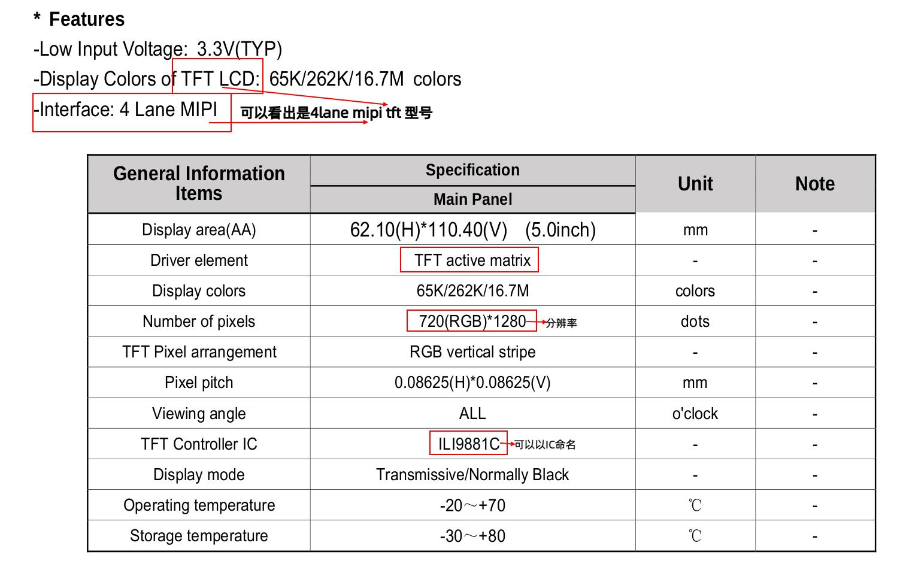

2. 新的屏幕驱动可以以Spec名字命名或以TFT Control IC型号来命名；
3. 除了Spec中有4lane描述，还需要对照原理图MIPI LCD部分：如下图所示 DATA有4组差分信号线所以是4lane；在初始化数组中也有体现；
   
   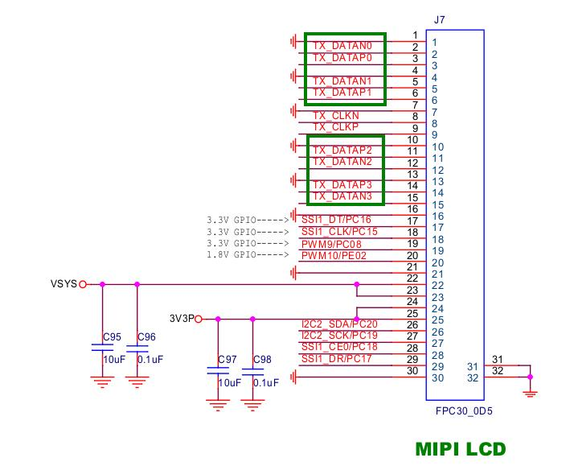
4. MIPI 屏一般都会有厂家给到的初始化参数列表；写在驱动的以下位置：
   
   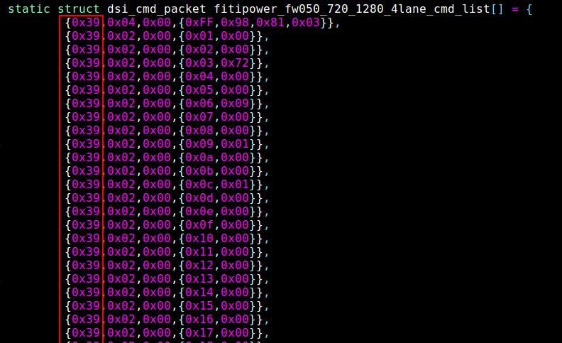
   
   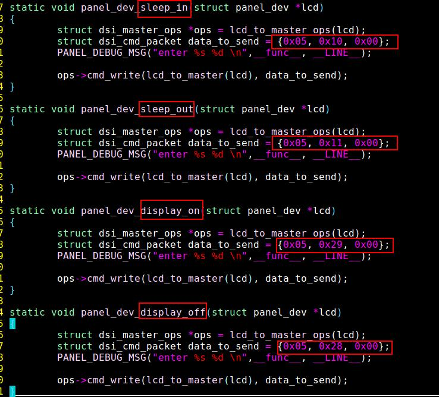

* 命令含义：

  **{0x39,0x04,0x00,{0xFF,0x98,0x81,0x03}}**
-   0x39 发送大于或等于两个参数；
-   0x04 参数个数（表示有四个参数）；
-   0x00 默认填充，无意义；
-   {}：大括号里代表具体的参数；
  
**{0x05, 0x10, 0x00}**
-   0x05 发送一个参数；
-   0x10 参数值；
-   0x00 默认填充，无意义；

   更多参数规则命令含义详见内核开发手册”Display Controller 显示处理单元“ 章节；
   https://gitee.com/ingenic-dev/ingenic-linux-docs/blob/ingenic-master/zh-cn/X26XX/x2670-halley/kernel/Display_Controller_显示处理单元.md
1. 屏幕参数配置

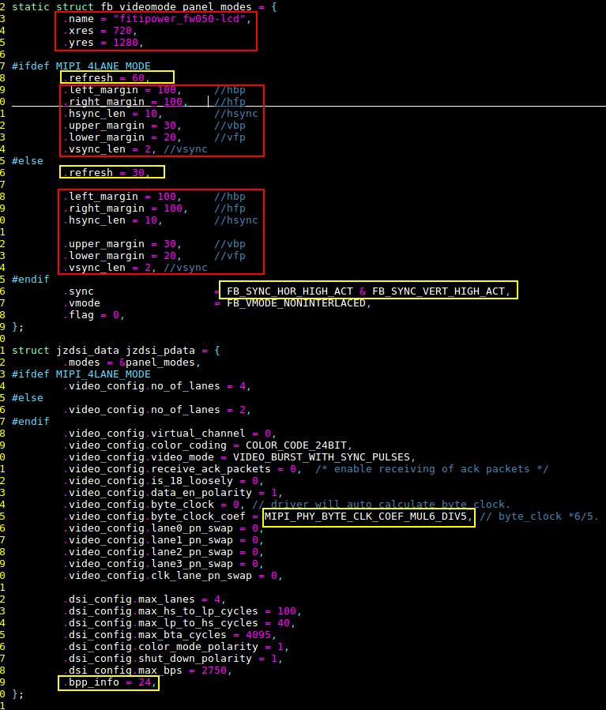

**红色方框部分对照Spec文档修改；黄色方框部分调试时可以适当修改；其余基本不改；**

   红色方框参数添加如下图：在Spec文档中找到下图参数；

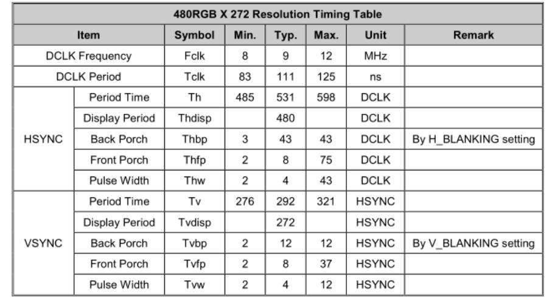
   对应方式：（一般取表格中的Typ值)

   | 前后左右间参数     | 表示各Spec表格中常见的三种别称；        |
   | ------------------ | --------------------------------------- |
   | .left_margin = 43  | hbp----------thb--------h-Back-Porch    |
   | .right_margin = 8  | hfp-----------thfp-------h-Front-Porch  |
   | .upper_margin = 12 | vbp----------tvb---------v-Back-Porch   |
   | .lower_margin = 8  | vfp-----------tvfp--------v-Front-Porch |
   | .hsync_len = 4     | hsync-------thpw-------h-Pulse-Width    |
   | .vsync_len = 4     | vsync-------tvpw-------v-Pulse-Width    |

   其他参数也可参考内核开发手册”Display Controller 显示处理单元“ 章节参数示例；
2. 配置gpio来控制vdd、reset、pwm-backlight等；

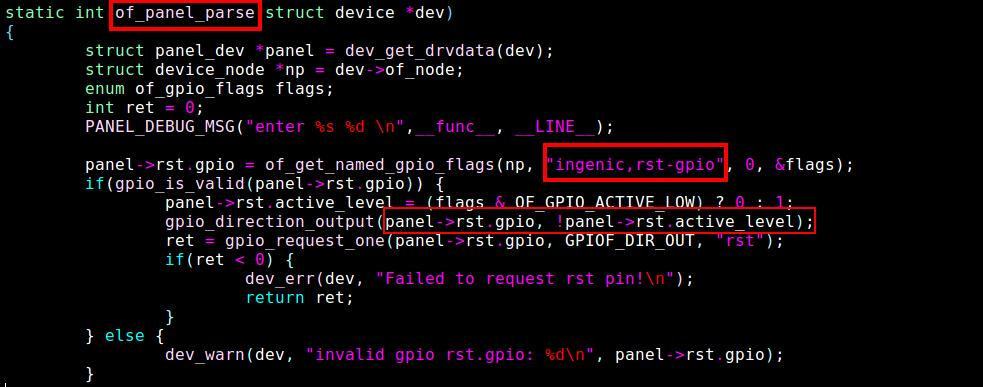

   在函数of_panel_parse()中获取设备树配置的gpio，使gpio输出与Spec中reset时序一致；
   其中“ingenic,rst-gpio”命名需要和设备树一致；设备树如下：
   
   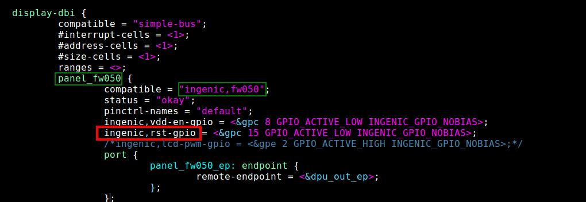

3. 把驱动代码中出现的所有fw050替换为新的驱动型号；
   以上LCD驱动代码基本上添加完成；

### 设备树添加

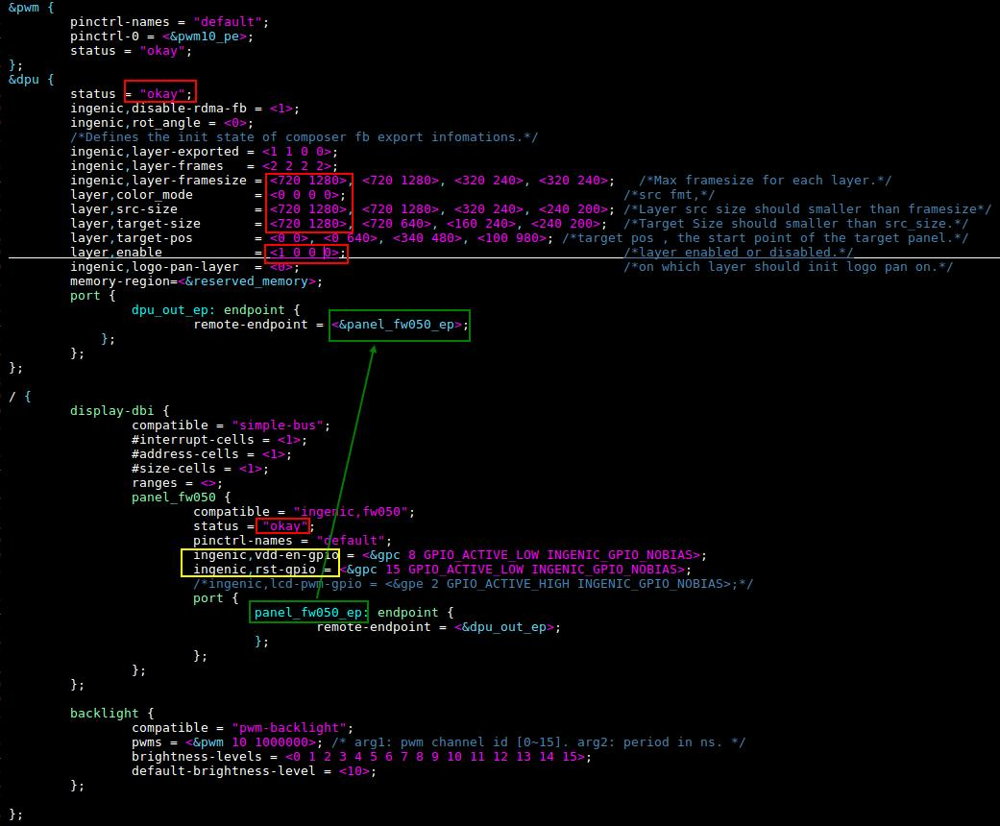

* 首先dpu 、display-dbi 状态是否打开；
* 修改layer分辨率；调试时可以把layer，enable =<1,0,0,0>只开一个；
* ingenic,vdd-en-gpio、ingenic,rst-gpio 检查与驱动中函数of_panel_parse()是否一致；
* 对应的gpio管脚查看原理图获得；
* 两种控制背光的方式：（选一种即可)
  1. pwm背光，配置pwm的func，用backlight来控制背光等级0~15；
  2. 作为普通gpio，配置lcd-pwm-gpio引脚，在驱动中控制；

### 调试要点

1. 调试时首先调背光；还可以使用read_id()函数来读id；
2. 调整power_on()函数；时序等；
3. 检查电压是否正常；

---

## TFT屏的添加

### 驱动添加

1. 首先看Spec（规格书)找到以下相关信息来判断该屏的接口类型：
   
   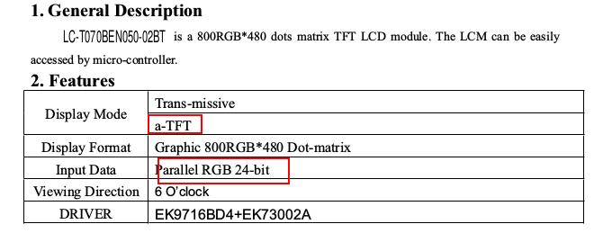
   
   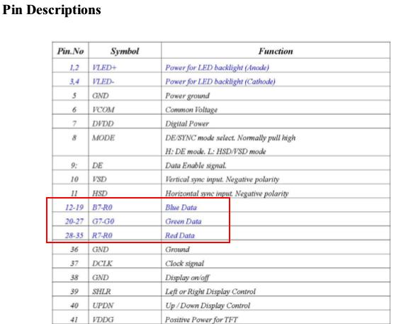
   
   由以上图可知该屏幕为TFT RGB类型,则在上方“屏幕型号参照列表"中参考panel-y88249.c 添加；
2. TFT RGB型号屏幕不需要初始化参数列表，有‘R’ ‘G’ ‘B’组的数据线；所以只需要根据RGB的bit位来配置pinctrl-0；
   
   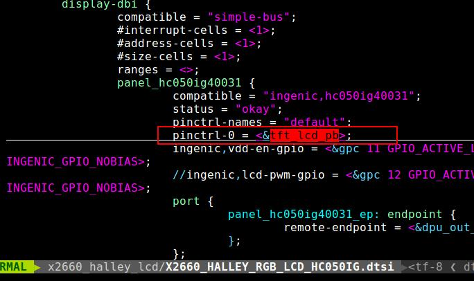
   
   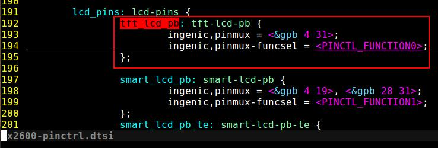

3. 屏幕参数配置
   
   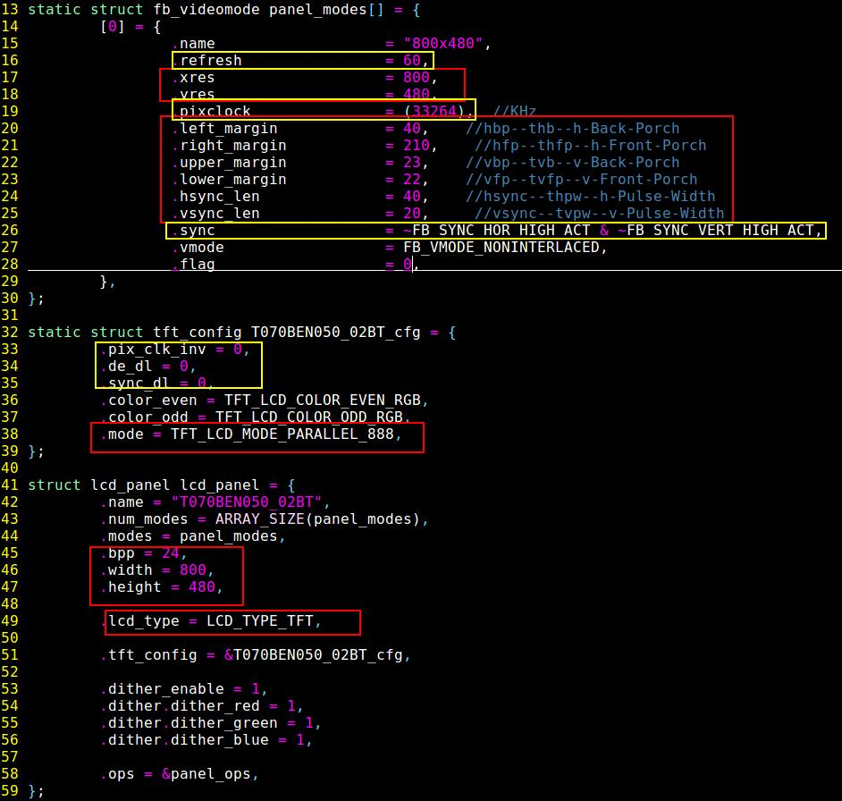
   
   **红色方框部分对照Spec文档修改；黄色方框部分调试时可以适当修改；其余基本不改；**
   红色方框参数添加如下图：在Spec文档中找到下图参数；
   
   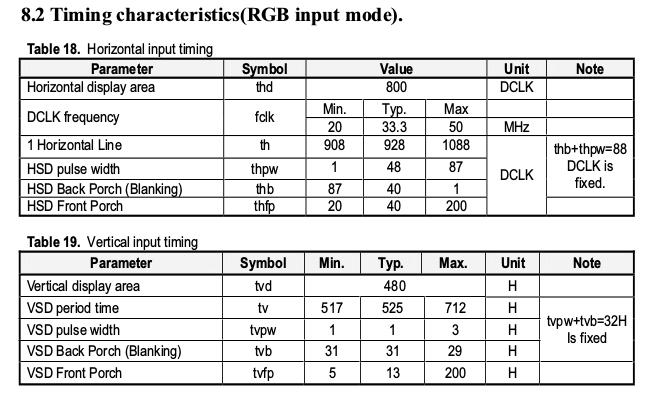

 对应方式：（一般取表格中的Typ值)

| 前后左右间参数     | 表示各Spec表格中常见的三种别称；        |
| ------------------ | --------------------------------------- |
| .left_margin = 40  | hbp----------thb--------h-Back-Porch    |
| .right_margin = 40 | hfp-----------thfp-------h-Front-Porch  |
| .upper_margin = 31 | vbp----------tvb---------v-Back-Porch   |
| .lower_margin = 13 | vfp-----------tvfp--------v-Front-Porch |
| .hsync_len = 48    | hsync-------thpw-------h-Pulse-Width    |
| .vsync_len = 1     | vsync-------tvpw-------v-Pulse-Width    |

   其他参数也可参考内核开发手册”Display Controller 显示处理单元“ 章节参数示例；

4. 配置gpio来控制vdd、reset、pwm-backlight等；
   
   
   
   在函数of_panel_parse()中获取设备树配置的gpio，使gpio输出与Spec中reset时序一致；
   其中“ingenic,rst-gpio”命名需要和设备树一致；设备树如下：
   
   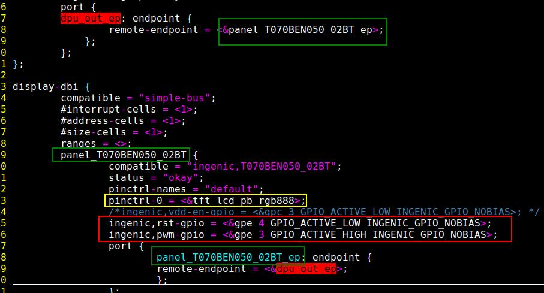
   
5. 把驱动代码中出现的所有T070BEN050_02BT替换为新的驱动型号；
   以上LCD驱动代码基本上添加完成；

### 设备树添加

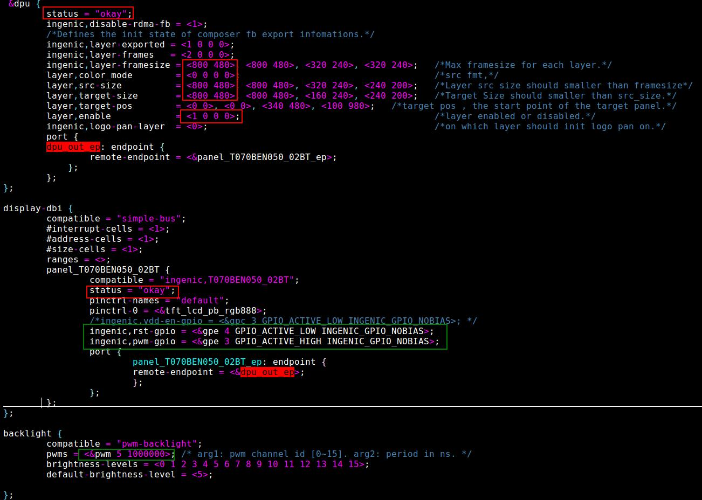

* 首先dpu 、display-dbi 状态是否打开；
* 修改layer分辨率；调试时可以把layer，enable =<1,0,0,0>只开一个；
* ingenic,pwm-gpio;ingenic,rst-gpio 检查与驱动中函数of_panel_parse()是否一致；
* 对应的gpio管脚查看原理图获得；
* 两种控制背光的方式：（选一种即可)
  1. pwm背光，配置pwm的func，用backlight来控制背光等级0~15；
  2. 作为普通gpio，配置lcd-pwm-gpio引脚，在驱动中控制；

### 调试要点

1. 调试时首先调背光；
2. 检查电压是否正常；
3. 检查参数配置包括初始化列表；
4. 加打印调试；

---
