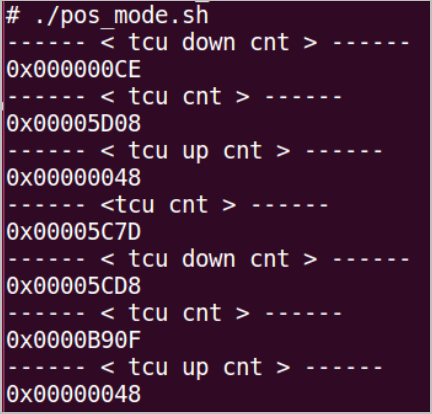
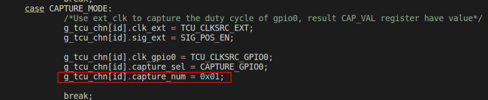
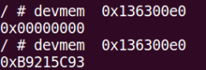
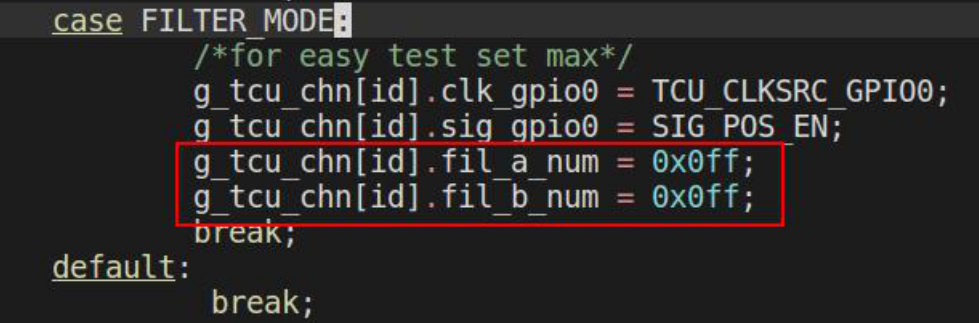
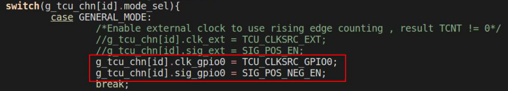
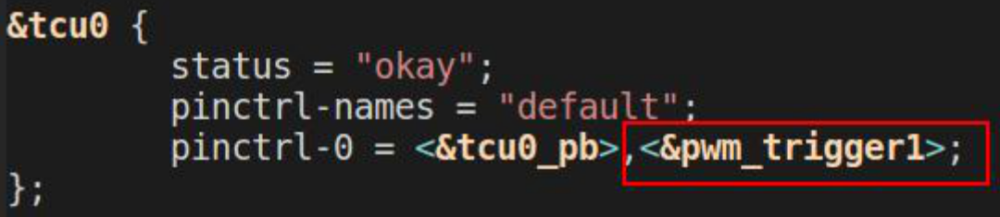

# TCU的7种模式

## 1. MODE 0: GENERAL_MODE

### 1.1 操作方法

1. 命令行运行：
```shell
echo  "0 0"  >  /sys/devices/platform/ahb_mcu/13630000.tcu0/enable
```

2. 读寄存器值：
```
devmem  0x13630048
```

## 2. MODE 1: GATE_MODE 

现象描述：tcu0_in0接收到高电平计数增加，接收到低电平计数不变

### 2.1 操作方法

1. tcu0_in0（PB20）接3.3V电源或接地

2. 命令行运行：
```shell
echo  "0 1" > /sys/devices/platform/ahb_mcu/13630000.tcu0/enable
```

3. 读寄存器值：
```
devmem  0x13630048
```

## 3. MODE 2: DIRECTION_MODE

现象描述：tcu0_in0接收到高电平计数减小，接收到低电平计数增加

### 3.1 操作方法

1. tcu0_in0（PB20）接3.3V电源或接地

2. 命令行运行：
```shell
echo  "0 2"  > /sys/devices/platform/ahb_mcu/13630000.tcu0/enable
```

3. 读寄存器值：
```
devmem  0x13630048
```

## 4. MODE 3: QUADRATURE_MODE

### 4.1 操作方法

1. tcu0_in0、tcu0_in1分别接一路gpio（pc07，pc08），根据PM手册时序图控制两路gpio拉出时序波形

2. 创建并执行测试脚本：

```
# ./quadrature_mode.sh
```
脚本内容，参考：
```shell
#!/bin/bash
# quadrature_mode.sh
cd /sys/class/gpio/
# pwm8 / gpio71(pc07) ---> tcu0_in0
echo 71 > export	
# pwm9 / gpio72(pc08) ---> tcu1_in1
echo 72 > export	
echo "out" > gpio71/direction
echo "out" > gpio72/direction

echo 1 > gpio71/value
echo  "0 3"  > /sys/devices/platform/ahb_mcu/13630000.tcu0/enable	
usleep 50000
echo 1 > gpio72/value
usleep 50000
echo 0 > gpio71/value
usleep 50000
echo 0 > gpio72/value
```

3. 读寄存器值：
```
# devmem  0x13630048
0x00000003
```

## 5. MODE 4: POS_MODE 

现象描述：tcu0_in0接收到高电平计数清零，重新开始计数

### 5.1 操作方法

1. tcu0_in0接到一路gpio（pc07），每隔一定时间切换一次gpio电平状态并读取寄存器值

2. 创建并执行测试脚本：
```
# ./pos_mode.sh
```

脚本内容，参考：
```shell
#!/bin/bash
cd  /sys/class/gpio/
# pwm8 / gpio71(pc07) ---> tcu0_in0
echo 71 > export	
echo "out" > gpio71/direction
echo  "0 4"  > /sys/devices/platform/ahb_mcu/13630000.tcu0/enable

while true
do
	echo 0 > gpio71/value
	echo "------ < tcu down cnt > ------"
	devmem  0x13630048

	sleep 1
	echo "------ < tcu cnt > ------"
	devmem  0x13630048

	echo 1 > gpio71/value
	echo "------ < tcu up cnt > ------"
	devmem  0x13630048

	sleep 1
	echo "------ <tcu cnt > ------"
	devmem  0x13630048
done
```
测试现象：



## 6. MODE 5: CAPTURE_MODE

现象描述：tcu0_in0接收到高电平，CAPCR0的CAPTURE_NUM字段中的值会减小，减到0时会切换为POS_MODE，CAPVR0寄存器会记录最后一次计数的值和高电平持续时间的计数值。

### 6.1 操作方法

1. 修改tcu驱动代码, 将CAPTURE_NUM字段中的初始值设置为1，则接收到一次高电平就会切换为POS_MODE。



2. 设置并保持gpio（pc07）为低电平输出，将gpio与tcu0_in0（PB20）连接，隔一段时间将gpio电平状态切换为高，再隔一段时间将gpio电平状态切换为低并读取寄存器值。

3. 创建并执行测试脚本（测试脚本可参考上文脚本进行编写）：
```
# ./capture_mode.sh
```

4. 最后读寄存器值：
```shell
devmem  0x13630048	#(同pos mode)
devmem  0x136300e0
```

测试现象：



## 7. MODE 6: FILTER_MODE

### 7.1 操作方法

1. 修改tcu驱动代码



2. tcu0_in0（PB20）接到一路PWM，设备树添加PWM8，修改PWM8（pc07）的周期和占空比并使能PWM8，当pwm频率大于0xff时增加计数，当pwm频率小于0xff时计数不变（PWM配置不在此展示，有疑问请阅读内核开发手册）

3. 命令行运行：
```
echo  "0 5"  > /sys/devices/platform/ahb_mcu/13630000.tcu0/enable
```

4. 读寄存器值，计数增加：
```
devmem  0x13630048 
```

5. 当pwm频率小于0xff时计数会被过滤掉，读寄存器值不变：
```
devmem  0x13630048 
```

## 8. TCU Gpio trigger

### 8.1 操作方法

1. 修改tcu驱动代码



2. 修改设备树



3. 命令行执行
```
echo  "0 0 1"  > /sys/devices/platform/ahb_mcu/13630000.tcu0/enable
```

Gpio trigger接收到电平切换会触发中断，并输出串口打印

```
[  307.056821] 529 0 60625	
```
打印参数含义：
参数1：打印代码行数
参数2：tcu0 
参数3：触发中断时计数值，会存入TSVR0（0x13630220）的STR_VALUE字段

4. 命令行执行：
```
# devmem  0x13630220
0x0000ECD1	
```
0x0000ECD1 转十进制：60625

