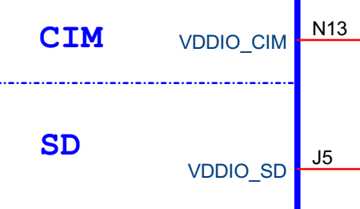
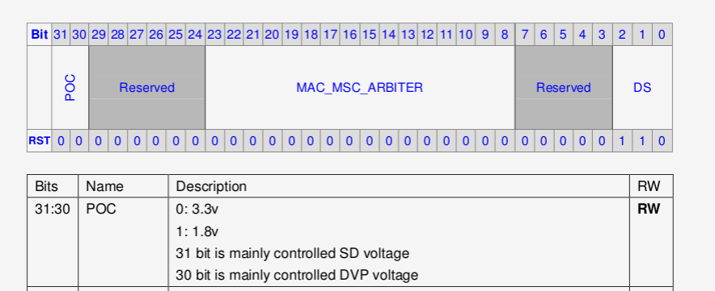

# X2600使用特别注意

## 硬件

X2600的PD00 - PD05的供电管脚VDDIO_SD可接3.3V或1.8V。

X2600的PA00 - PA11的供电管脚VDDIO_CIM可接3.3V或1.8V，如下图所示。




## 软件
<span style="color:red;">特别注意：</span>硬件在接相对应的电压的时候，软件必须根据具体的硬件设计进行寄存器的配置，下面是软件配置说明。

 **代码路径：** 

```
kernel-4.4.94/arch/mips/boot/dts/ingenic/<board_version>.dts
kernel-5.10/module_drivers/dts/<board_version>.dts
```


<span style="color:red;"> **文件<board_version>.dts 特别说明：** </span>

1.board :Ingenic 板级名称或芯片名称与板级名称组合名。

2.version :Ingenic 板级硬件版本号(通常指底板版本号)。

 **示例:** 

x2600E halley 开发套件(RD_X2600_HALLEY_BASEBOARD_V1.0)对应设备树名称为: <span style="color:green;">x2600e_halley_v1.0.dts</span>

 **配置依据：** 





例如：如果VDDIO33_CIM和VDDIO33_SD外接供电3.3V，则上述代码必须设置3.3V。反之亦然。

如软件设置的电压和硬件接的电压不一致，可能会有启动问题，长时间会有芯片漏电或烧坏的问题发生。