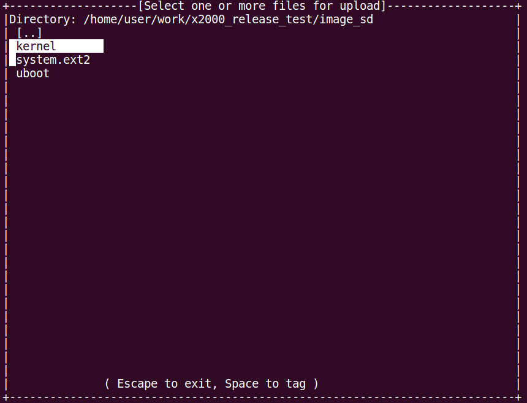
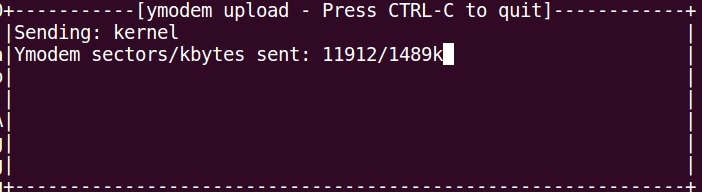

# 1. u-boot简介

##  1.1 u-boot功能

U-Boot 是为嵌入式平台提供的开放源代码的引导程序，可引导包括linux内核在内的多种嵌入式操作系统，支持诸如mips、arm、powerpc等多种处理器架构，它提供串行口、以太网等多种下载方式，提供 NOR 和 NAND 闪存和环境变量管理等功能，支持网络协议栈、JFFS2/EXT2/FAT文件系统，同时还支持多种设备驱动如MMC/SD 卡、USB 设备、LCD 驱动等。

**注意**:文中所提的Nor没有特殊说明，均指SPI Nor Flash；Nand 没有特殊说明，均指SPI Nand Flash。

##  1.2 u-boot引导流程

X26xx Halley平台u-boot引导流程如下图所示：

从上图可看到，分为两种引导方式：

1. bootrom ---> spl ---> u-boot ---> kernel ---> rootfs，该方式需要u-boot引导kernel
2. bootrom ---> spl ---> kernel ---> rootfs，该方式不需要u-boot，由spl直接引导kernel

##  1.3 u-boot源码目录介绍

|  |  |
| --- | --- |
| api | 存放uboot提供的接口函数 |
| arch | 体系结构相关文件 |
| board | 板级相关文件 |
| common | 通用的代码，以各种命令为主 |
| disk | 磁盘分区相关代码 |
| doc | 介绍文档 |
| drivers | 驱动程序相关代码 |
| examples | 示例程序 |
| fs | 文件系统代码，支持常见的嵌入式文件系统 |
| include | 头文件 |
| lib | 通用库文件 |
| nand_spl | nand flash启动相关代码 |
| net | 网络相关代码 |
| post | Power On Self Test，上电自检程序 |
| spl | spl相关代码 |
| test | 测试代码 |
| tools | 辅助工具，用于编译和检查uboot目标文件 |

# 2. u-boot配置

当前X26XX平台，决定u-boot配置的文件主要有：

1. **u-boot/boards.cfg**
2. **u-boot/include/configs/x2600_halley7.h**
3. **u-boot/include/configs/x2670_hare.h**

两项文件共同作用决定最终生成的烧录镜像的配置。

## 2.1 boards.cfg文件说明

boards.cfg是u-boot中最基础的配置文件，用于区分不同厂家的不同板级的配置。该文件中每一行表示一个具体的板级配置，格式均相同，具体如下表所示：

|  |  |  |  |  |  |  |
| --- | --- | --- | --- | --- | --- | --- |
| Target | ARCH | CPU | Board name | Vendor | SoC | Options |
| 目标名称 | 架构名称 | 处理器名称 | 板级名称 | 厂商名称 | Soc名称 | 附加选项 |

其中每一个配置项说明如下：

1. Target：作为该种配置的一个标志；
2. ARCH、CPU、Board name、Vendor、SoC：主要用于Makefile编译时选择代码目录，比如u-boot/include/configs目录下有许多配置文件，选择x26xx_halley.h便是通过Board name确定的；
3. Options：每一种配置之间的主要区别，u-boot会为附加选项中的每个字段前面加上“CONFIG_”前缀并导出为全局可用的宏定义，这些宏定义会进一步决定其他的配置，目前主要是x26xx_halley.h中的配置。

### 2.1.1 默认配置

|                                   |                                                              |
| --------------------------------- | ------------------------------------------------------------ |
| x2600_halley7_uImage_sfc_nand     | **该配置支持从nand flash启动linux内核镜像uImage**CONFIG_SPL_SFC_NAND：sfc nand flash相关配置CONFIG_MTD_SFCNAND：sfc nand flash驱动编译配置CONFIG_SPL_PARAMS_FIXER: 改变CPM频率 |
| x2600_halley7_uImage_sfc_nor      | **该配置支持从nor flash启动linux内核镜像uImage**CONFIG_SPL_SFC_NOR：sfc nor flash相关配置CONFIG_ENV_IS_IN_SFC：环境变量存储相关配置CONFIG_MTD_SFCNOR：sfc nor flash驱动编译相关配置CONFIG_SPL_PARAMS_FIXER: 改变CPM频率 |
| x2600_halley7_uImage_msc0         | **该配置支持从emmc启动linux内核镜像uImage**CONFIG_SPL_JZMMC_SUPPORT：spl中的mmc相关配置CONFIG_ENV_IS_IN_MMC：环境变量存储相关配置CONFIG_GPT_CREATOR：分区相关配置CONFIG_JZ_MMC_MSC0：msc控制器相关配置CONFIG_SPL_PARAMS_FIXER: 改变CPM频率 |
| x2600_halley7_xImage_sfc_nand_ota | **该配置支持从nand flash启动linux内核镜像xImage**CONFIG_SPL_SFC_NAND：sfc nand flash相关配置CONFIG_MTD_SFCNAND：sfc nand flash驱动编译相关配置CONFIG_SPL_OS_BOOT：spl直接启动linux内核镜像相关配置CONFIG_OTA_VERSION30：ota升级相关配置 |
| x2600_halley7_xImage_sfc_nand     | **该配置支持从nand flash启动linux内核镜像xImage**CONFIG_SPL_SFC_NAND：sfc nand flash相关配置CONFIG_MTD_SFCNAND：sfc nand flash驱动编译相关配置CONFIG_SPL_OS_BOOT：spl直接启动linux内核镜像相关配置CONFIG_SPL_PARAMS_FIXER: 改变CPM频率 |
| x2600_halley7_xImage_sfc_nor      | **该配置支持从nor flash启动linux内核镜像xImage**CONFIG_SPL_SFC_NOR：sfc nor flash相关配置CONFIG_MTD_SFCNOR：sfc nor flash驱动编译相关配置CONFIG_SPL_OS_BOOT：spl直接启动linux内核镜像相关配置CONFIG_ENV_IS_IN_SFC：环境变量存储相关配置CONFIG_SPL_PARAMS_FIXER:改变CPM频率 |
| x2600_halley7_xImage_msc0         | **该配置支持从emmc启动linux内核镜像xImage**CONFIG_SPL_JZMMC_SUPPORT：spl中的mmc相关配置CONFIG_ENV_IS_IN_MMC：环境变量存储相关配置CONFIG_GPT_CREATOR：分区相关配置CONFIG_JZ_MMC_MSC0：msc控制器相关配置CONFIG_SPL_PARAMS_FIXER: 改变CPM频率CONFIG_SPL_OS_BOOT：spl直接启动 |
| x2670_hare_uImage_sfc_nand        | **该配置支持从nand flash启动linux内核镜像uImage**CONFIG_SPL_SFC_NAND：sfc nand flash相关配置CONFIG_MTD_SFCNAND：sfc nand flash驱动编译配置CONFIG_SPL_PARAMS_FIXER: 改变CPM频率 |
| x2670_hare_uImage_sfc_nor         | **该配置支持从nor flash启动linux内核镜像uImage**CONFIG_SPL_SFC_NOR：sfc nor flash相关配置CONFIG_ENV_IS_IN_SFC：环境变量存储相关配置CONFIG_MTD_SFCNOR：sfc nor flash驱动编译相关配置CONFIG_SPL_PARAMS_FIXER: 改变CPM频率 |
| x2670_hare_xImage_sfc_nand_ota    | **该配置支持从nand flash启动linux内核镜像xImage**CONFIG_SPL_SFC_NAND：sfc nand flash相关配置CONFIG_MTD_SFCNAND：sfc nand flash驱动编译相关配置CONFIG_SPL_OS_BOOT：spl直接启动linux内核镜像相关配置CONFIG_OTA_VERSION30：ota升级相关配置 |
| x2670_hare_xImage_sfc_nand        | **该配置支持从nand flash启动linux内核镜像xImage**CONFIG_SPL_SFC_NAND：sfc nand flash相关配置CONFIG_MTD_SFCNAND：sfc nand flash驱动编译相关配置CONFIG_SPL_OS_BOOT：spl直接启动linux内核镜像相关配置CONFIG_SPL_PARAMS_FIXER: 改变CPM频率 |
| x2670_hare_xImage_sfc_nor         | **该配置支持从nor flash启动linux内核镜像xImage**CONFIG_SPL_SFC_NOR：sfc nor flash相关配置CONFIG_MTD_SFCNOR：sfc nor flash驱动编译相关配置CONFIG_SPL_OS_BOOT：spl直接启动linux内核镜像相关配置CONFIG_ENV_IS_IN_SFC：环境变量存储相关配置CONFIG_SPL_PARAMS_FIXER:改变CPM频率 |

### 2.1.2 自定义配置

可根据实际需要，在每种板级配置中增删相应的字段或者新添加一个新的板级配置。

下面以添加一个新的板级配置**X2660_halley_uImage_msc0**为例进行介绍：

1. 在boards.cfg文件中新起一行，按照该文件的格式要求，先确定第一个配置项为 X2660_halley_uImage_msc0，第二到第六个配置项可参考现存的板级配置，一般都是比较固定的；
2. 主要是附加选项的配置，如果对X26xx Halley平台的u-boot整体配置不是很了解的话，可以 先参考现存配置，比如这里可以参考halley5_uImage_msc2，将JZ_MMC_MSC2改为JZ_MMC_MSC0， 这样会选择MSC0相关的配置，其他的保持一致即可；
3. 如果想更加细致的修改附加选项，建议先整体阅读一遍该文档，尤其是第二章关于配置的介绍， 在了解了X26xx Halley平台的u-boot整体配置后，再进行修改会更加游刃有余。

## 2.2 x26xx_halley.h配置文件说明

x26xx_halley.h为u-boot中针对X26xx Halley平台核心的配置文件，该配置文件主要包含以下内容：

* 系统时钟配置
* Cache大小配置
* DDR 配置
* SFC/MSC/GMAC/LCD等驱动相关配置
* u-boot built-in 命令

### 2.2.1 系统时钟配置

#### 2.2.1.1 默认配置

当前系统时钟配置如下：
```c
#define CONFIG_SYS_APLL_FREQ 1200000000 /*If APLL not use mast be set 0*/
#define CONFIG_SYS_MPLL_FREQ 1800000000 /*If MPLL not use mast be set 0*/
#define CONFIG_SYS_EPLL_FREQ 300000000 /*If MPLL not use mast be set 0*/
#define CONFIG_CPU_SEL_PLL APLL
#define CONFIG_DDR_SEL_PLL MPLL
#define CONFIG_SYS_CPU_FREQ 1200000000
#define CONFIG_SYS_MEM_FREQ 900000000
#define CONFIG_SYS_AHB0_FREQ 300000000
#define CONFIG_SYS_AHB2_FREQ 300000000 /*APB = AHB2/2*/

```

#### 2.2.1.2 自定义配置

1. PLL锁相环频率配置，可根据需要进行配置
```c
#define CONFIG_SYS_APLL_FREQ 1200000000 /*If APLL not use mast be set 0*/
#define CONFIG_SYS_MPLL_FREQ 1800000000 /*If MPLL not use mast be set 0*/
#define CONFIG_SYS_EPLL_FREQ 300000000 /*If MPLL not use mast be set 0*/
```
1. CPU、DDR的PLL选择，建议使用默认配置
```c
#define CONFIG_CPU_SEL_PLL APLL
#define CONFIG_DDR_SEL_PLL MPLL
```

1. CPU、DDR频率配置，其中CPU的频率需要与选择的PLL频率成倍数关系，并且最高支持 1.5GHz, 同时DDR的频率也需要与选择的PLL频率成倍数关系

```c
#define CONFIG_SYS_CPU_FREQ 1200000000
#define CONFIG_SYS_MEM_FREQ 900000000
```

1. AHB总线频率配置
```c
#define CONFIG_SYS_AHB0_FREQ 300000000
#define CONFIG_SYS_AHB2_FREQ 300000000 /*APB = AHB2/2*/
```

1. 注意：修改完成之后，需要先清理uboot镜像，之后重新编译，清理操作可以参考3.1、3.2章节对应内容。

### *[2.2.2 DDR 配置](DDR配置.md)*

### 2.2.3 SFC 驱动配置

#### 2.2.3.1 spl阶段驱动

驱动文件位置：common/spl

```
├── spl_sfc_nand.c
├── spl_sfc_nand_v2.c
├── spl_sfc_nor.c
├── spl_sfc_nor_v2.c
```

#### 2.2.3.2 uboot阶段驱动文件

**位置： drivers/mtd/devices/jz_sfc_v2**

```
├── jz_sfc_common.c 
├── jz_sfc_common.h 
├── jz_sfc_nand.c
├── jz_sfc_nor.c
├── jz_sfc_ops.c
├── Makefile
└── nand_device
    ├── ato_nand.c
    ├── dosilicon_nand.c
    ├── foresee_nand.c
    ├── gd_nand.c
    ├── mxic_nand.c
    ├── nand_common.c
    ├── nand_common.h
    ├── xtx_mid0b_nand.c
    ├── xtx_nand.c
    └── zetta_nand.c
```

#### 2.2.3.3 配置说明

1. sfc控制器gpio引脚功能配置

```c
/* sfc gpio */
/* #define CONFIG_JZ_SFC_PD_4BIT */
/* #define CONFIG_JZ_SFC_PD_8BIT */
/* #define CONFIG_JZ_SFC_PD_8BIT_PULL */
#define CONFIG_JZ_SFC_PE
```

2. sfc nand flash配置，如果定义**CONFIG_SPL_SFC_NAND**，则nand相关的配置会被打开：

```c
#define CONFIG_SFC_NAND_RATE 200000000 /* value <= 400000000(sfc 100Mhz)*/
#define CONFIG_SFC_QUAD
#define CONFIG_SPI_SPL_CHECK
#define CONFIG_SPIFLASH_PART_OFFSET 0x5800
#define CONFIG_SPI_NAND_BPP (2048 +64) /*Bytes Per Page*/
#define CONFIG_SPI_NAND_PPB (64) /*Page Per Block*/
#define CONFIG_JZ_SFC
#define CONFIG_CMD_SFCNAND
#define CONFIG_CMD_NAND
#define CONFIG_SYS_MAX_NAND_DEVICE 1
#define CONFIG_SYS_NAND_BASE 0xb3441000
#define CONFIG_SYS_MAXARGS 16

/*#define CONFIG_NAND_BUILTIN_PARAMS*/

/* sfc nand env config */
#define CONFIG_MTD_DEVICE
#define CONFIG_CMD_SAVEENV /* saveenv */
#define CONFIG_CMD_UBI
#define CONFIG_CMD_UBIFS
#define CONFIG_CMD_MTDPARTS
#define CONFIG_MTD_PARTITIONS
#define MTDIDS_DEFAULT "nand0:nand"
#define MTDPARTS_DEFAULT "mtdparts=nand:1M(boot),8M(kernel),40M(rootfs),- (data)"
#define CONFIG_SYS_NAND_BLOCK_SIZE (128 * 1024)
```

3. sfc nor flash配置，如果定义**CONFIG_SPL_SFC_NOR**，则nor相关的配置会被打开：

```c
#ifdef CONFIG_SPL_SFC_NOR
#define CONFIG_JZ_SFC
#define CONFIG_CMD_SFC_NOR
#define CONFIG_JZ_SFC_NOR
#define CONFIG_SPI_SPL_CHECK
#define CONFIG_SFC_NOR_RATE 200000000 /* value <= 400000000(sfc 100Mhz)*/
#define CONFIG_SFC_QUAD
#define CONFIG_SPIFLASH_PART_OFFSET 0x5800
#define CONFIG_SPI_NORFLASH_PART_OFFSET 0x5874
#define CONFIG_NOR_MAJOR_VERSION_NUMBER 1
#define CONFIG_NOR_MINOR_VERSION_NUMBER 0
#define CONFIG_NOR_REVERSION_NUMBER 0
#define CONFIG_NOR_VERSION (CONFIG_NOR_MAJOR_VERSION_NUMBER | (CONFIG_NOR_MINOR_VERSION_NUMBER << 8) | (CONFIG_NOR_REVERSION_NUMBER <<16))

/*#define CONFIG_NOR_BUILTIN_PARAMS*/
#endif
```

#### 2.2.3.4 默认配置

1. 使用nand flash启动，在boards.cfg文件的下**X26xx_halley_uImage_sfc_nand**配置和 **X26xx_xImage_sfc_nand**配置中导出了**CONFIG_SPL_SFC_NAND。**
2. 使用nor flash启动，在boards.cfg文件的**X26xx_halley_uImage_sfc_nor**配置中导出了 **CONFIG_SPL_SFC_NOR。**

#### 2.2.3.5 自定义配置

**1. sfc控制器gpio引脚，可根据硬件连接情况进行选择**

```c
/* sfc gpio */
#define CONFIG_JZ_SFC_PD
```

**2. nand flash配置**

a.sfc控制器速率，注意最终的速率为该宏定义4分频之后的结果

```c
#define CONFIG_SFC_NAND_RATE 400000000 /* value <= 400000000(sfc 100Mhz)*/

```
b.数据传输线宽，定义该宏定义为4线，否则为1线

```c
#define CONFIG_SFC_QUAD
```

c.nand flash分区参数存储在nand flash中的偏移

```c
#define CONFIG_SPIFLASH_PART_OFFSET 0x5800
```

d.nand flash页大小和块大小，根据具体的nand flash型号确定

```c
#define CONFIG_SPI_NAND_BPP (2048 +64) /*Bytes Per Page*/
#define CONFIG_SPI_NAND_PPB (64) /*Page Per Block*/
```

e.是否使用内置分区参数，定义则使用，否则不使用

```c
/*#define CONFIG_NAND_BUILTIN_PARAMS*/
```

**3. nor flash配置**

a.SFC控制器时钟速率，注意最终的速率为该宏定义4分频之后的结果

```c
#define CONFIG_SFC_NOR_RATE 400000000 /* value <= 400000000(sfc 100Mhz)*/
```

b.数据传输线宽，定义该宏定义为4线，否则为1线

```c
#define CONFIG_SFC_QUAD
```

c.nor flash分区参数存储在nor flash中的偏移

```c
#define CONFIG_SPIFLASH_PART_OFFSET 0x5800
```

d.nor flash硬件参数存储在nor flash中的偏移

```c
#define CONFIG_SPI_NORFLASH_PART_OFFSET 0x5874
```

e.是否使用内置分区参数，定义则使用，否则不使用

```c
/*#define CONFIG_NOR_BUILTIN_PARAMS*/
```

**4. 注意：修改完成之后，需要清理uboot镜像，之后重新编译，清理操作可以参考3.1、3.2章节对应内容。**

### 2.2.4 串口配置

#### 2.2.4.1 Uboot串口配置

```c
#define CONFIG_SYS_UART_INDEX       0
#define CONFIG_BAUDRATE         115200
```

“**CONFIG_SYS_UART_INDEX**”对应的串口序号

“**CONFIG_BAUDRATE**”对应串口的波特率

#### 2.2.4.2 bootargs串口配置(kernel串口)

```c
#define BOOTARGS_COMMON "console=ttyS0,115200 mem=128M@0x0" 
```

“**BOOTARGS_COMMON**”宏定义的是通用的bootargs参数，其中“**console**”对应串口终端配置 的是kernel启动过程中的串口配置。

### 2.2.5 u-boot built-in命令配置

#### 2.2.5.1 默认配置

当前默认支持如下命令：

```c
/**
* Command configuration.
*/

#define CONFIG_CMD_BOOTD /* bootd */
#define CONFIG_CMD_CONSOLE /* coninfo */
#define CONFIG_CMD_DHCP /* DHCP support */
#define CONFIG_CMD_ECHO /* echo arguments */
#define CONFIG_CMD_EXT4 /* ext4 support */
#define CONFIG_CMD_FAT /* FAT support */
#define CONFIG_USE_XYZMODEM /* xyzModem */
#define CONFIG_CMD_LOAD /* serial load support */
#define CONFIG_CMD_LOADB /* loadb */
#define CONFIG_CMD_LOADS /* loads */
#define CONFIG_CMD_MEMORY /* md mm nm mw cp cmp crc base loop mtest */
#define CONFIG_CMD_MISC /* Misc functions like sleep etc*/
#define CONFIG_CMD_NET /* networking support */
#define CONFIG_CMD_PING
#define CONFIG_CMD_RUN /* run command in env variable */
#define CONFIG_CMD_SETGETDCR /* DCR support on 4xx */
#define CONFIG_CMD_SOURCE /* "source" command support */
#define CONFIG_CMD_GETTIME
#define CONFIG_CMD_GPIO
#define CONFIG_CMD_EXT2
#define CONFIG_CMD_EXT4
#define CONFIG_CMD_FAT
#define CONFIG_EFI_PARTITION
#define CONFIG_SOFT_BURNER
#define CONFIG_CMD_DDR_TEST /* DDR Test Command */
```

#### 2.2.5.2 自定义配置

下面以新建一个简单的hello命令为例介绍如何在u-boot中自定义命令。

1. 在common目录下，新建一个文件cmd_hello.c，输入如下代码：

```c
#include<command.h>
#include<common.h>

static int do_hello(cmd_tbl_t *cmdtp, int flag, int argc, char * const argv[])
{
printf(“hello world!n”);

return 0;
}

U_BOOT_CMD(
hello, 1, 0, do_hello,
"short description. This is a string.n",
"long description. This is a string.n"
);
```

上述代码中，U_BOOT_CMD为u-boot新建命令使用的宏定义，一共有6个参数，具体介绍如下：

a.第一个参数：该命令的名称
b.第二个参数：该命令的参数的个数
c.第三个参数：按下enter键后是否重复执行该命令
d.第四个参数：该命令对应的回调函数
e.第五个参数：该命令的短帮助信息
f.第六个参数：该命令的长帮助信息

2. 在common/Makefile中添加编译选项：

```c
COBJS-y += cmd_hello.o
```

3. 重新编译u-boot即可

### 2.2.6 内核传参说明

 参考[u-boot内核传参说明](#_u-boot内核传参说明)

# 3. u-boot编译

 u-boot的编译分为两种，两种的特点如下:

|  |  |
| --- | --- |
| **编译方式** | **特点** |
| **工程顶层目录编译** | 依赖配合君正SDK 板级配置。适合基于君正SDK的开发方式 |
| **u-boot源码目录编译** | 直接按照u-boot的标准编译方式进行，适合需要自定义u-boot的配置，脱离君正SDK的开发方式。 |

## 3.1 工程顶层目录编译

### 3.1.1 编译SFC Nand启动镜像

该启动镜像对应**X26xx_halley_uImage_sfc_nand**配置。

1. 在工程顶层目录下执行如下命令，导入编译X26xx Halley平台所需的环境变量：

```c
$ source build/envsetup.sh
```

2. 执行lunch命令选择需要编译镜像的类型：

```c
$ lunch
```

* **a. 如果是X2660 Halley v1.0开发板，根据需要在以下配置中进行选择：**

```
X2660halley.v10_nand_4.4.94-eng

X2660halley.v10_nand_4.4.94_ota-eng

X2660halley.v10_nand_5.10-eng
```

* **b. 如果是X2660 Halley v1.1开发板，根据需要在以下配置中进行选择：**

```
X2660halley.v11_nand_4.4.94-eng

X2660halley.v11_nand_4.4.94_ota-eng

X2660halley.v11_nand_5.10-eng
```

* **c.如果是X2670 Halley v1.0开发板，根据需要在以下配置中进行选择：**

```
X2670halley.v10_nand_4.4.94-eng

X2670halley.v10_nand_4.4.94_ota-eng

X2670halley.v10_nand_5.10-eng
```


* **d.如果是X2670M Hare v1.0开发板，根据需要在以下配置中进行选择：**

```
X2670Mhare.v10_nand_4.4.94-eng

X2670Mhare.v10_nand_4.4.94_ota-eng

X2670Mhare.v10_nand_5.10-eng
```

* **e.如果是X2600 Halley v1.0开发板，根据需要在以下配置中进行选择：**

```
X2600halley.v10_nand_4.4.94-eng

X2600halley.v10_nand_4.4.94_ota-eng

X2600halley.v10_nand_5.10-eng
```

* **f.如果是X2600E Halley v1.0开发板，根据需要在以下配置中进行选择：**

```
X2600Ehalley.v10_nand_4.4.94-eng

X2600Ehalley.v10_nand_4.4.94_ota-eng

X2600Ehalley.v10_nand_5.10-eng
```

3. 执行make uboot-clean清除上次编译产生的中间产物：

```c
$ make uboot-clean
```

4. 执行make uboot进行编译：

```c
$ make uboot
```

5. 等待编译完成，在工程out/product/X26xxhalley(或者hare).v10(或者v11)_nor_4.4.94(或者 5.10)-eng/image目录 下便会生成uboot镜像文件，该镜像即可直接进行烧录。

### 3.1.2 编译SFC Nor启动镜像

该启动镜像对应**X26xx_halley_uImage_sfc_nor**配置。

1. 在工程顶层目录下执行如下命令，导入编译X26xx_halley平台所需的环境变量：

```c
$ source build/envsetup.sh
```

2. 执行lunch命令选择需要编译镜像的类型：

```c
$ lunch
```

* **a.如果是X2660 Halley v1.0开发板，根据需要在以下配置中进行选择：**

```
X2660halley.v10_nor_4.4.94-eng

X2660halley.v10_nor_5.10-eng
```

* **b.如果是X2660 Halley v1.1开发板，根据需要在以下配置中进行选择：**

```
X2660halley.v11_nor_4.4.94-eng

X2660halley.v11_nor_5.10-eng
```

* **c.如果是X2670 Halley v1.0开发板，根据需要在以下配置中进行选择：**

```
X2670halley.v10_nor_4.4.94-eng

X2670halley.v10_nor_5.10-eng
```

* **d.如果是X2670M Hare v1.0开发板，根据需要在以下配置中进行选择：**

```
X2670Mhare.v10_nor_4.4.94-eng

X2670Mhare.v10_nor_5.10-eng
```

* **e.如果是X2600 Halley v1.0开发板，根据需要在以下配置中进行选择：**

```
X2600halley.v10_nor_4.4.94-eng

X2600halley.v10_nor_5.10-eng
```

* **f.如果是X2600E Halley v1.0开发板，根据需要在以下配置中进行选择：**

```
X2600Ehalley.v10_nor_4.4.94-eng

X2600Ehalley.v10_nor_5.10-eng
```

3. 执行make uboot-clean清除上次编译产生的中间产物：

```c
$ make uboot-clean
```

4. 执行make uboot进行编译：

```c
$ make uboot
```

5. 等待编译完成，在工程out/product/X26xxhalley(或者hare).v10(或者v11)_nand_4.4.94(或者 5.10)-eng/image目录下便会生成uboot镜像文件，该镜像即可直接进行烧录。

### 3.1.3 编译EMMC启动镜像

该启动镜像对应**X26xx_halley_uImage_msc0**配置。

1. 在工程顶层目录下执行如下命令，导入编译X26xx_halley平台所需的环境变量：

```c
$ source build/envsetup.sh
```

2. 执行lunch命令选择需要编译镜像的类型：

```c
$ lunch
```

* **a.如果是X2600 Halley v1.0开发板，根据需要在以下配置中进行选择：**

```
X2600halley.v10_msc_4.4.94-eng

X2600halley.v10_msc_5.10-eng
```

* **b.如果是X2600E Halley v1.0开发板，根据需要在以下配置中进行选择：**

```
X2600Ehalley.v10_msc_4.4.94-eng

X2600Ehalley.v10_msc_5.10-eng
```

3. 执行make uboot-clean清除上次编译产生的中间产物：

```c
$ make uboot-clean
```

4. 执行make uboot进行编译：

```c
$ make uboot
```

5. 等待编译完成，在工程out/product/X26xxhalley(h或者hare).v10(或者v11)_nand_4.4.94(或者 5.10)-eng/image目录下便会生成uboot镜像文件，该镜像即可直接进行烧录。

##  3.2 u-boot源码目录编译

1. 在工程顶层目录下执行如下命令，导入编译X26xx_halley平台所需的环境变量：

```c
$ source build/envsetup.sh
```

1. 执行lunch命令选择需要编译镜像的类型， 这里只是为了导入交叉编译工具环境，如果只编译u-boot可以随意选择：

```c
$ lunch
```

2. 之后进入u-boot目录，执行make distclean清除上次编译产生的中间产物：

```c
$ make distclean
```

执行make xxxxxx -jN命令进行编译，xxxxxx为具体的板级配置名称，需要根据编译的启动 镜像来决定，详细介绍请参考[2.1 boards.cfg文件说明](#_boards.cfg文件说明)。当前共支持4种板级配置，具体如下表 所示：

|  |  |
| --- | --- |
| x2660_halley_uImage_sfc_nor | 该配置支持从nor flash启动linux内核镜像uImage |
| X2660_halley_uImage_sfc_nand | 该配置支持从nand flash启动linux内核镜像uImage |
| x2660_halley_xImage_sfc_nor | 该配置支持从nor flash启动linux内核镜像xImage |
| x2660_halley_xImage_sfc_nand | 该配置支持从nand flash启动linux内核镜像xImage |
| x2670_halley_uImage_sfc_nor | 该配置支持从nor flash启动linux内核镜像uImage |
| X2670_halley_uImage_sfc_nand | 该配置支持从nand flash启动linux内核镜像uImage |
| x2670_halley_xImage_sfc_nor | 该配置支持从nor flash启动linux内核镜像xImage |
| x2670_halley_xImage_sfc_nand | 该配置支持从nand flash启动linux内核镜像xImage |
| x2670m_hare_uImage_sfc_nor | 该配置支持从nor flash启动linux内核镜像uImage |
| X2670m_hare_uImage_sfc_nand | 该配置支持从nand flash启动linux内核镜像uImage |
| x2670m_hare_xImage_sfc_nor | 该配置支持从nor flash启动linux内核镜像xImage |
| x2670m_hare_xImage_sfc_nand | 该配置支持从nand flash启动linux内核镜像xImage |
| x2600_halley_uImage_sfc_nor | 该配置支持从nor flash启动linux内核镜像uImage |
| X2600_halley_uImage_sfc_nand | 该配置支持从nand flash启动linux内核镜像uImage |
| x2600_halley_uImage_msc0 | 该配置支持从emmc启动linux内核镜像uImage |
| x2600_halley_xImage_sfc_nor | 该配置支持从nor flash启动linux内核镜像xImage |
| x2600_halley_xImage_sfc_nand | 该配置支持从nand flash启动linux内核镜像xImage |
| x2600_halley_xImage_msc0 | 该配置支持从emmc启动linux内核镜像xImage |
| x2600e_halley_uImage_sfc_nor | 该配置支持从nor flash启动linux内核镜像uImage |
| X2600e_halley_uImage_sfc_nand | 该配置支持从nand flash启动linux内核镜像uImage |
| x2600e_halley_uImage_msc0 | 该配置支持从emmc启动linux内核镜像uImage |
| x2600e_halley_xImage_sfc_nor | 该配置支持从nor flash启动linux内核镜像xImage |
| x2600e_halley_xImage_sfc_nand | 该配置支持从nand flash启动linux内核镜像xImage |
| x2600e_halley_xImage_msc0 | 该配置支持从emmc启动linux内核镜像xImage |

比如，编译从nand flash启动uImage的启动镜像，执行如下命令：

```c
$ make X26xx_halley_uImage_sfc_nand -jN
```

其中-jN为使用多线程编译，可以加快编译速度，具体的N值需要根据使用的PC决定。

3. 编译好之后，会在u-boot工程顶层目录下生成u-boot-with-spl.bin，该文件便是最终生成的镜像文件，可以直接进行烧录。

# 4. u-boot应用与内核接口

## 4.1 u-boot常用命令

进入 uboot 的命令行模式以后输入“help”或者“？”，然后按下回车即可查看当前 uboot 所支持的命令。

现以sfc nand flash启动为例，支持的命令如下所示：

```c
X26xx_halley# help 
? - alias for 'help' 
base - print or set address offset 
boot - boot default, i.e., run 'bootcmd' 
boota - boot android system 
bootd - boot default, i.e., run 'bootcmd' 
bootm - boot application image from memory 
bootp - boot image via network using BOOTP/TFTP protocol
chpart - change active partition 
cmp - memory compare 
coninfo - print console devices and information 
cp - memory copy 
crc32 - checksum calculation 
dhcp - boot image via network using DHCP/TFTP protocol 
echo - echo args to console 
env - environment handling commands
ext2load- load binary file from a Ext2 filesystem
ext2ls - list files in a directory (default /)
ext4load- load binary file from a Ext4 filesystem
ext4ls - list files in a directory (default /)
fatinfo - print information about filesystem
fatload - load binary file from a dos filesystem
fatls - list files in a directory (default /)
gettime - get timer val elapsed,
go - start application at address 'addr'
gpio - input/set/clear/toggle gpio pins
help - print command description/usage
loadb - load binary file over serial line (kermit mode)
loads - load S-Record file over serial line
loady - load binary file over serial line (ymodem mode)
loop - infinite loop on address range
md - memory display
mm - memory modify (auto-incrementing address)
mtdparts- define flash/nand partitions
mw - memory write (fill)
nand - NAND sub-system
nboot - boot from NAND device
nm - memory modify (constant address)
ping - send ICMP ECHO_REQUEST to network host
printenv- print environment variables
reset - Perform RESET of the CPU
run - run commands in an environment variable
saveenv - save environment variables to persistent storage
setenv - set environment variables
sfcnand - sfcnand - SFC_NAND sub-system
sleep - delay execution for some time
softburn- Ingenic usb soft burn
source - run script from memory
tftpboot- boot image via network using TFTP protocol
ubi - ubi commands
ubifsload- load file from an UBIFS filesystem
ubifsls - list files in a directory
ubifsmount- mount UBIFS volume
ubifsumount- unmount UBIFS volume
version - print monitor, compiler and linker version
```

对于每一个命令，还可以执行“help 命令名称”获取该命令具体的使用说明，如下所示：

```c
X26xx_halley# help bootm
bootm - boot application image from memory
Usage:
bootm [addr [arg ...]]
- boot application image stored in memory
passing arguments 'arg ...'; when booting a Linux kernel,
'arg' can be the address of an initrd image
Sub-commands to do part of the bootm sequence. The sub-commands must be
issued in the order below (it's ok to not issue all sub-commands):
start [addr [arg ...]]
loados - load OS image
cmdline - OS specific command line processing/setup
bdt - OS specific bd_t processing
prep - OS specific prep before relocation or go
go - start OS
```

**下面介绍一些常用的命令：**

|  |  |
| --- | --- |
| printenv | 打印当前环境变量 |
| setenv | 设置环境变量，格式：setenv name value …，表示将name 变量设置成value 值；如果没有这个参数，表示删除该变量 |
| saveenv | 保存环境变量到存储设备中 |
| sleep | 延迟执行，格式：sleep N，可以延迟N秒钟执行 |
| bootm | 从内存的指定地址处启动内核镜像。格式：bootm addr，参数是镜像在内存中的地址 |
| md | 读内存数据，格式：md [.b, .w, .l] address [# of objects]，第一个参数表示一次读取的数据单位（b:8位，w:16位，l:32位），第二个参数address表示要读取的内存起始地址，第三个参数表示从address开始读取的数据个数 |
| nand erase | 擦除nand flash，格式：nand erase addr1 count，第一个参数是offset，第二个参数是擦除字节数 |
| nand write | 将内存数据写入nand flash，格式：nand write addr offset count，第一个参数是写入基地址，第二个参数是偏移地址，第三个参数是写入字节数 |
| nand read | 将nand flash的数据读取到内存，格式：nand read addr offset count，第一个参数是读取的nand flash地址，第二个参数是内存位置偏移，第三个参数是读取字节数 |
| cp | 在内存中复制数据，格式：cp source target count，第一个参数是源地址，第二个参数是目的地址，第三个参数是复制数目 |
| cmp | 比较内存中的数据，格式：cmp addr1 addr2 count，第一个参数是内存地址一，第二个参数是内存地址二，第三个是比较长度（单位是字节数除以4，以WORDS为单位） |
| crc32 | 计算校验值，格式：crc32 address count [addr]，第一个参数是需校验的起始地址，第二个参数是校验的数据字节数，第三个参数是保存校验值的地址 |

##  4.2 u-boot内核传参说明

linux内核在启动之前，需要知道当前硬件的一些必要的参数，比如可使用的内存大小、使用的串口设备、根文件系统所在的设备及分区等。关于以上的启动参数，linux内核已经定义好了一系列规则，负责启动它的bootloader需要遵守这些规则来传递启动参数。方便的是，u-boot已经帮我们做好了大部分工作，它提供了一个环境变量bootargs，我们只需要按照规定的格式将必要的启动参数设置给bootargs即可。

具体的，我们可以通过在x26xx_halley.h中将启动参数设置给宏定义CONFIG_BOOTARGS。

在x26xx_halley.h中，根据加载内核时挂载的文件系统的不同均有对应的启动参数，它们有一些共有的内容，以x2660为例，在x2660_halley.h中定义如下：

#define BOOTARGS_COMMON "console=ttyS0,115200 mem=128M@0x0 "

具体说明如下：

1. console=ttyS0,115200表示串口使用/dev/ttyS0这个设备，波特率为115200
2. mem=128M@0x0表示可使用的内存总大小为128MB，起始地址为0x0

**启动参数中特有的部分请见下文。**

### 4.2.1 u-boot加载内核挂载jffs2文件系统

以x2660为例，该启动参数对应**x2660_halley_uImage_sfc_nor**配置，当前在x2660_halley.h中的启动参数如下：

```c
#define CONFIG_BOOTARGS 

BOOTARGS_COMMON "ip=off init=/linuxrc rootfstype=jffs2 root=/dev/mtdblock2 rw"
```

具体说明如下：

1. ip=off表示不使用网络文件系统
2. init=/linuxrc表示init进程使用的是根目录下的linuxrc
3. rootfstype=jffs2表示根文件系统格式为jffs2
4. root=/dev/mtdblock2表示存放根文件系统的设备为/dev/mtdblock2，对应着nor flash编号为2的分区
5. rw表示挂载的文件系统可读写

### 4.2.2 u-boot加载内核挂载ubifs文件系统

以x2660为例，该启动参数对应**x2660_halley_uImage_sfc_nand**配置，当前在x2660_halley.h中的启动参数如下：

```c
#define CONFIG_BOOTARGS 

BOOTARGS_COMMON "ip=off init=/linuxrc ubi.mtd=2 root=ubi0:rootfs ubi.mtd=3  rootfstype=ubifs rw"
```

具体说明如下：

1. ip=off表示不使用网络文件系统启动
2. init=/linuxrc表示init进程使用的是根目录下的linuxrc
3. ubi.mtd=2 root=ubi0:rootfs ubi.mtd=3 rootfstype=ubifs rw表示当前nand flash编号为2和3的分区使用的是ubifs文件系统，并且根文件系统以可读写的方式挂载在了编号为2的分区上。

### 4.2.3 u-boot加载内核挂载ext4文件系统

以x2600e为例，该启动参数对应**x2600e_halley_uImage_msc0**配置，当前在x2600e_halley.h中的启动参数如下：

#define CONFIG_BOOTARGS 

BOOTARGS_COMMON " rootfstype=ext4 root=/dev/mmcblk0p7 rootdelay=3 rw"

具体说明如下：

1. rootfstype=ext4表示根文件系统格式为ext4
2. root=/dev/mmcblk0p7表示存放根文件系统的设备为/dev/mmcblk0p7，对应着当前系统第 一个emmc或sd设备的编号为7的分区
3. rootdelay=3表示等待3秒再挂载根文件系统
4. rw表示挂载的文件系统可读写

##  4.3 u-boot加载内核镜像

u-boot通过tftp或者fastboot方式加载内核镜像可省去烧录kernel镜像的过程，直接将内核镜像加载到内存，使用该方式在开发过程中非常便于调试使用。

### 4.3.1 uboot通过fastboot命令加载内核镜像

fastboot方式是使用usb端口把kernel镜像下载到内存并启动的命令，只用于调试使用,不支持android fastboot 其他功能。

1. PC端使用以下命令安装fastboot应用程序：

```c
$ sudo apt-get install android-tools-fastboot
```

2. 进入uboot命令行模式，输入fastboot命令：

```c
X26xx_halley# fastboot
```

3. 在PC端存放kernel镜像的路径下执行以下命令：
```c
$ sudo fastboot boot uImage
```

4. 命令执行成功后，即可将kernel镜像下载到内存并启动。

### 4.3.2 u-boot通过串口加载内核镜像

串口方式是通过串口将kernel镜像直接下载到内存，注意该方式传输速度会较慢，请根据实际情 况选择。

1. 进入u-boot命令行模式，执行如下命令：

```c
x26xx_halley# loady 0x80800000 115200
## Ready for binary (ymodem) download to 0x80800000 at 115200 bps...
```

2. 先按住ctrl键不放，接着按住a键，再同时放开两个按键，最后按一下s键，可以看到如下图所示画面：

    

这里按↓键选择ymodem协议，然后回车；

3. 然后会出现如下图所示画面，这里可以选择需要传输的文件，↑↓键进行移动，双敲空格键进 入目录，单敲空格键选择文件，回车键确认选择。

我们选择需要传输的kernel镜像：



4. 选择完毕并回车确认后，会出现如下进行文件的传输的画面：



5. 等待传输完毕，便可以通过bootm命令启动写到内存0x80800000位置处的kernel镜像:

```c
$ bootm 0x80800000
```

# 5. Ingenic tools介绍

Ingenic tools是君正厂商添加在u-boot内的工具集合。

## 5.1 DDR参数相关

**源码位置：u-boot/tools/ingenic-tools/**

```
├── ddr_creator_x2000
│   ├── add_chip_info.c
│   ├── ddr3_params.c
│   ├── ddr_params_creator.c
│   ├── ddr_params_creator.h
│   ├── lpddr2_params.c
│   ├── lpddr3_params.c
│   ├── Makefile
│   ├── supported_ddr_chips.c
```

这里主要用于生成相应的DDR参数，然后写到u-boot镜像的指定位置，以此进行区分。

##  5.2 MBR/GPT分区表

**源码位置：u-boot/tools/ingenic-tools/**
```
├── gpt.bin
├── gpt_creator.c
├── gpt_tab_to_c.sh
├── mbr_creator.c
├── mbr-of-gpt.bin
├── mk-gpt-xboot.sh
```

GPT和MBR均是关于硬盘分区的标准。

MBR：Master Boot Record，主分区引导记录，记录着硬盘本身的相关信息以及硬盘各个分区的大小及位置信息。

GPT：Globally Unique Identifier Partition Table，GUID分区表，是源自UEFI标准的一种较新的磁盘分区表结构的标准。与MBR分区方案相比，GPT提供了更加灵活的磁盘分区机制。

这里文件的作用是按照GPT和MBR的标准生成对应的分区数据。

## 5.3 nand/nor flash相关

**源码位置：u-boot/tools/ingenic-tools/**

1. 保存有各种nand flash的硬件参数，用于spl中的sfc驱动使用

```
├── nand_device
```

2. 保存nand flash和nor flash的分区参数，区别于由烧录工具写入分区参数，最终会由kernel中的sfc驱动读取并生成对应的mtd分区，如有需要可自行更改

```
├── sfc_builtin_params
│   ├── nand_device.c
│   ├── nand_device.h
│   ├── nor_device.c
│   └── nor_device.h
```

3. 用于写入nand flash和nor flash的分区参数到u-boot镜像中的指定位置
```
├── sfc_nand_builtin_params.c
├── sfc_nor_builtin_params.c
```
## 5.4 其他

**源码位置：u-boot/tools/ingenic-tools/**

1. 用于生成sfc控制器的硬件timing参数

```
    sfc_timing_params.c
```

2. 用于sfc boot时生成spl前面的头部数据，为bootom加载spl作校验用

```
    spi_checksum.c
```

3. X26xx系列芯片快速启动时使用，用于生成spl env参数

```
    spl_params_fixer_x2600.c
```

# 参考文档

1. u-boot/README
2. kernel-4.4.94/Documentation/kernel-parameters.txt
