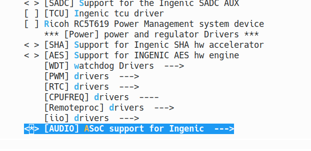
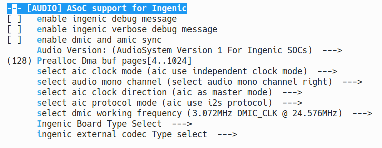

# Audio音频子系统

## 模块功能介绍

Audio Interface Controller (AIC) 支持I2S或IIS，这种由飞利浦半导体公司定义 的协议。AIC支持普通I2S和MSB调整的I2S格式。AIC由缓冲器、状态寄存器、控制 寄存器、串行器和计数器组成，用于在处理器的系统存储器（外部I2S CODEC）之间传 输数字化音频。AIC可以通过将样本存储在系统存储器中来记录数字化音频。对于数字 化音频的回放或合成音频的产生，AIC从系统存储器中检索数字化音频样本，并通过I2S 格式的串行连接将其发送到CODEC。CODEC中的内部数模转换器然后将音频样本转换为 模拟音频波形。可以通过DMA控制器或通过编程I/O将音频采样数据存储到系统存储器 中，也可以从系统存储器中检索音频采样数据。其中，普通I2S和MSB-justified-I2S 都以各种时钟速率工作，这些时钟速率可以通过用两个可编程分频器分频PLL时钟来获 得，也可以从内部时钟源获得。

PCM 接口控制以 PCM 格式序列化的数据输出或输入 PCM 并行化后的数据。PCM 协议也称为 DSP 协议或 TDM 协议。PCM 接口通常用于将音频采样数据传输到外部设备，如蓝牙音频模块。

## 驱动源码位置

audio控制器源码位置（含DMIC、PCM）：

***module_drivers/sound/soc/ingenic/as-v1/***

板级源码位置：

***module_drivers/sound/soc/ingenic/board/x2660_halley.c***

内部codec源码位置：

***module_drivers/sound/soc/ingenic/icodec/icdc_inno_v3.c***

## 设备树配置

设备树所在位置

kernel内核(version <= 5.10)dts文件路径：

***module_driver/dts/x2600.dtsi***

kernel内核(version > 5.10)dts文件路径：

***module_driver/dts/x2600/x2600.dtsi***

设备树描述：

```c
aic: aic@0x10020000 {
    compatible = "ingenic,x2600-aic";
    reg = <0x10020000 0x100>;
    interrupt-parent = <&core_intc>;
    interrupts = <IRQ_AUDIO>;
    dmas = <&pdma INGENIC_DMA_TYPE(INGENIC_DMA_REQ_AIC_TX)>,
    <&pdma INGENIC_DMA_TYPE(INGENIC_DMA_REQ_AIC_RX)>;
    dma-names = "tx", "rx";
    i2s: i2s {
        compatible = "ingenic,x2600-i2s";
        status = "ok";
    };
    i2s_tloop: i2s_tloop {
        compatible = "ingenic,i2s-tloop";
        dmas = <&pdma INGENIC_DMA_TYPE(INGENIC_DMA_REQ_AIC_LOOP_RX)>;
        dma-names = "rx";
        status = "ok";
    };

};

icodec: icodec@0x10021000 {
    compatible = "ingenic,x2600-icodec";
    reg = <0x10021000 0x140>;
    status = "okay";
};

dmic: dmic@0x134c0000 {
    compatible = "ingenic,x2600-dmic";
    reg = <0x134c0000 0xa010>;
    interrupt-parent = <&core_intc>;
    interrupts = <IRQ_DMIC>;
    ingenic,fifo-size = <4096>;
    ingenic,fth_quirk;
    status = "disable";
};

pcm: pcm@0x10071000 {
    compatible = "ingenic,x2600-pcm";
    reg = <0x10071000 0x100>;
    interrupt-parent = <&core_intc>;
    interrupts = <IRQ_PCM>;
    dmas = <&pdma INGENIC_DMA_TYPE(INGENIC_DMA_REQ_PCM_TX)>,
           <&pdma INGENIC_DMA_TYPE(INGENIC_DMA_REQ_PCM_RX)>;
    dma-names = "tx", "rx";
    status = "disable";
};
```

### 设备树默认配置

设备树默认编译会产生audio设备

kernel内核(version <= 5.10)

在**module_drivers/dts/x2600_halley_v1.0.dts** 下配置：

kernel内核(version > 5.10)

在**module_drivers/dts/x2600/halley7.dts** 下配置

```c
&aic {
    status = "okay";
};

&dmic {
    status = "disable";
    pinctrl-names = "default";
    pinctrl-0 = <&dmic_pc_2ch>;
};

// pcm的复用引脚为pc00 - pc03，在使用时注意引脚复用不要冲突，尤其是i2c0_pc和i2c1_pc
&pcm {
    status = "disable";
    ingenic,pcm-master-mode = <1>;
    pinctrl-names = "default";
    pinctrl-0 = <&pcm_pc>;
};

&icodec {
    status = "okay";
    dac2adc_enable = <0>;
};

/{

    .......

    dump_pcm_codec:dump_pcm_codec{
        compatible = "ingenic,pcm-dump-codec";
        status = "okay";
    };

    sound_x2660_cdc {
        status = "okay";
        compatible = "ingenic,x2660-halley-sound";
        ingenic,model = "x2660";
        ingenic,dai-link = "pcm", "i2s-icodec", "i2s-tloop", "dmic";
        ingenic,stream = "pcm", "i2s-icodec", "i2s-tloop", "dmic";
        ingenic,cpu-dai = <&pcm>, <&i2s>, <&i2s_tloop>, <&dmic>;
        ingenic,platform = <&pcm>, <&aic>, <&i2s_tloop>, <&dmic>;
        ingenic,codec =  <&dump_pcm_codec>, <&icodec>, <&dump_pcm_codec>, <&dmic>;
        ingenic,codec-dai = "pcm-dump", "icodec", "pcm-dump", "dmic-dump-codec";
        ingenic,audio-routing = "Speaker", "HPOUTL", "DACL", "MICBIAS" ,
                "ADCL",  "MICL",
                "ADCR",  "MICR";
        ingenic,spken-gpio = <&gpe 5 GPIO_ACTIVE_HIGH INGENIC_GPIO_NOBIAS>;
    };
};
```

### 设备树自定义配置

用户可根据实际需求关闭audio设备,或配置ingenic，spken-gpio属性。
在默认情况下，DMIC和PCM都处于关闭状态，也可根据需求进行打开，若需要打开请看本节末尾《使用注意事项》。

## 内核编译配置

内核配置**SND_ASOC_INGENIC**，配置说明如下：

```
Symbol: SND_ASOC_INGENIC [=y]
Type : tristate
Prompt: [AUDIO] ASoC support for Ingenic
Location:
-> Ingenic device-drivers Configurations
Defined at module_drivers/sound/soc/ingenic/Kconfig:1
Depends on: MACH_XBURST [=n] || MACH_XBURST2 [=y]
Selects: SND_SOC [=y] && SND [=y] && SOUND [=y]
```

选择板级文件：

```
Symbol: SND_ASOC_INGENIC_X2660_HALLEY [=y]
Type  : bool
Defined at module_drivers/sound/soc/ingenic/Kconfig:346
  Prompt: Audio support for x2660 halley_v10 board
  Depends on: <choice>
  Location:
    -> Ingenic device-drivers Configurations
      -> [AUDIO] ASoC support for Ingenic (SND_ASOC_INGENIC [=y])
        -> Ingenic Board Type Select 
(1)       -> SOC x2600/x2660 codec Type select (<choice> [=y])
Selects: SND_ASOC_PDMA [=y] && SND_ASOC_INGENIC_AIC [=y] && SND_ASOC_INGENIC_AIC_I2S [=y] && SND_ASOC_INGENIC_MONO_RIGHT [=y] && SND_ASOC_INGENIC_DMIC_V2 [=y] && SND_ASOC_INGENIC_ICDC_INNO_V3 [=y] && SND_ASOC_INGENIC_DUMP_CODEC [=y] && SND_ASOC_INGENIC_AIC_I2S_TLOOP [=y] && SND_ASOC_INGENIC_PCM [=y] && SND_ASOC_INGENIC_DUMP_CODEC [=y]
```

### 内核默认编译配置

内核默认配置audio驱动，配置界面如下：





### 内核自定义编译配置

用户可根据实际需求去掉该驱动的配置。

## 设备节点生成

驱动加载成功后生成以下节点（开启DMIC和PCM）：

```
ls /dev/snd/
controlC0  pcmC0D0p   pcmC0D1p   pcmC0D3c
pcmC0D0c   pcmC0D1c   pcmC0D2c   timer
```

## 应用程序使用说明

### asound.conf介绍

asound.conf配置文件，是alsa-lib的默认配置文件，路径在/etc/，可以用来配置alsa库的一些附加功能。这个文件不是alsa库运行时所必须的，没有它alsa库也可以正常运行。asound.conf允许对声卡或者设备进行更高级的控制，提供访问alsa-lib中的pcm插件方法，允许你做更多的复杂的控制，比如可以把声卡组合成一个或者多声卡访问多个I/O。

在ALSA中，PCM插件扩展了PCM设备的功能和特性。插件可以自动处理诸如：命名设备、采样率转换、通道间的采样复制、写入文件、为多个输入/输出连接声卡/设备（不同步采样）、使用多通道声卡/设备等工作。

* 1. **hw插件**

**此插件直接与ALSA内核驱动程序通信，它是一种没有任何转换的原始通信。**

通过此插件可以对pcm设备进行重命名操作。

例如：

```
# arecord -l
**** List of CAPTURE Hardware Devices ****
card 0: x2660 [x2660], device 0: i2s-icodec 10021000.icodec-0 []
  Subdevices: 1/1
  Subdevice #0: subdevice #0
card 0: x2660 [x2660], device 1: i2s-tloop dump_pcm_codec-1 []
  Subdevices: 1/1
  Subdevice #0: subdevice #0
card 0: x2660 [x2660], device 2: dmic 134c0000.dmic-2 []
  Subdevices: 1/1
  Subdevice #0: subdevice #0
```

在使用arecord或者aplay进行录放音时，在指定设备时一般使用“hw：0，0”这种方 法指定录放音所使用的设备，使用起来不够直观，可以通过hw插件对设备定义别名。 例如：

```
pcm.amic {
    type hw
    card 0
    device 0

}
```

此例子中将“hw：0，0”进行了重命名操作，在录放音时可以使用以下方式：

```
arecord -D amic-c 2 -f S16_LE -r 16000 -d 5 baic0_16000-32-1.wav

aplay -D amic baic0_16000-32-1.wav
```

* 2. **slave插件**

从属插件可以直接用字符串指定，也可以在一个复合配置节点内输入定义。还可以指定 一些限制（如静态速率或通道数）。

例如：

```
pcm_slave.slave_rate48000Hz {
    pcm "hw:0,0"
    rate 48000
}

pcm.rate48000Hz {
    type plug
    slave slave_rate48000Hz
}
```

或者

```
pcm.rate48000Hz {
    type plug
    slave {
        pcm "hw:0,0"
        rate 48000
    }
}
```

上述例子可以理解为：定义了一个虚拟的pcm设备命名为rate48000Hz，该设备实际使 用“hw：0,0”pcm设备且设定只支持48000Hz采样率。在使用rate48000Hz该pcm设 备录放音时，硬件上仅支持48000采样率，也可以设置固定的格式位、宽通道数等。

* 3. **rate插件**

该插件转换速率。输入和输出格式必须是线性的，常用于播放硬件不支持采样率数据位宽的音频文件。

例如：

```
pcm.rate_16000 {
    type rate
    slave {
        pcm "hw:0,0"
        rate 16000
        format S8
    }
}
```

该插件支持采样率和采样格式位宽的转换，不支持通道的转换。

* 4. **plug插件**

该插件可根据要求转换通道，速率和格式，比rate插件多了通道转换的功能。

例如：

```
pcm.rate_48000 {
    type plug
    slave {
        pcm "hw:0,0"
        rate 16000
        format S8
        channels 1
    }
} 
```

* 5. **Soft Volume**

此插件应用于软件音量的调整。

例如：

```
pcm.amic_record {
    type softvol
    slave {
        pcm "hw:0,0"
    }

    control {
        name "amic volume"
    }
    min_dB -51.0
    max_dB 30.0
}
```

在第一次使用 softvol 插件进行播放时才会生成对应的控件，即调音时需要先执行一次“arecord -D amic_record”（以上述定义为例），才可以通过amixer设置调整音量。

### 查看放音设备

```
# aplay -l
**** List of PLAYBACK Hardware Devices ****
card 0: x2660 [x2660], device 0: pcm dump_pcm_codec-0 []
  Subdevices: 1/1
  Subdevice #0: subdevice #0
card 0: x2660 [x2660], device 1: i2s-icodec 10021000.icodec-1 []
  Subdevices: 1/1
  Subdevice #0: subdevice #0
```

### 查看录音设备

```
# arecord -l
**** List of CAPTURE Hardware Devices ****
card 0: x2660 [x2660], device 0: pcm dump_pcm_codec-0 []
  Subdevices: 1/1
  Subdevice #0: subdevice #0
card 0: x2660 [x2660], device 1: i2s-icodec 10021000.icodec-1 []
  Subdevices: 1/1
  Subdevice #0: subdevice #0
card 0: x2660 [x2660], device 2: i2s-tloop dump_pcm_codec-3 []
  Subdevices: 1/1
  Subdevice #0: subdevice #0
card 0: x2660 [x2660], device 3: dmic 134c0000.dmic-2 []
  Subdevices: 1/1
  Subdevice #0: subdevice #0
```

### 查看音频调节器

```
# amixer contents
numid=2,iface=MIXER,name='Capture Volume'
  ; type=INTEGER,access=rw---R--,values=1,min=0,max=255,step=0
  : values=196
  | dBscale-min=-95.50dB,step=0.50dB,mute=0
numid=3,iface=MIXER,name='DMIC Capture Volume'
  ; type=INTEGER,access=rw---R--,values=1,min=0,max=31,step=0
  : values=4
  | dBscale-min=0.00dB,step=3.00dB,mute=0
numid=4,iface=MIXER,name='DMIC High Pass Filter1 Switch'
  ; type=BOOLEAN,access=rw------,values=1
  : values=on
numid=5,iface=MIXER,name='DMIC High Pass Filter2 Switch'
  ; type=BOOLEAN,access=rw------,values=1
  : values=on
numid=6,iface=MIXER,name='DMIC Low Pass Filter Switch'
  ; type=BOOLEAN,access=rw------,values=1
  : values=on
numid=7,iface=MIXER,name='DMIC SW_LR Switch'
  ; type=BOOLEAN,access=rw------,values=1
  : values=off
numid=1,iface=MIXER,name='Speaker Playback Volume'
  ; type=INTEGER,access=rw---R--,values=1,min=0,max=255,step=0
  : values=226
  | dBscale-min=-121.00dB,step=0.50dB,mute=0
```

### 调整icodec录放音增益

```
amixer cset name='Capture Volume' 200

amixer cset name='Speaker Playback Volume' 200
```

### 调整dmic录音增益

```
amixer cset name='DMIC Capture Volume' 20
```

### PCM录音

```
arecord -D hw:0,0 -t raw -f S8 -r 8000 -c 1 -d 10 pcm_s8_8000_1.pcm
```

### icodec录音

```
arecord -D hw:0,1 -c 1 -f S16_LE -r 16000 -d 10 icdc_16000-16-2.wav

arecord -D hw:0,1 -c 1 -f S16_LE -r 48000 -d 10 icdc_48000-16-4.wav
```

### dmic录音

```
arecord -D hw:0,3 -c 2 -f S16_LE -r 16000 -d 10 dmic_16000-16-2.wav

arecord -D hw:0,3 -c 2 -f S16_LE -r 48000 -d 10 dmic_48000-16-4.wav
```

### PCM放音

```
aplay -D hw:0,0 -t raw -f S8 -r 8000 -c 1 pcm_s8_8000_1.pcm
```

### icodec放音

```
aplay -D hw:0,1 -c 1 -f S16_LE -r 16000 -d 10 aplay.wav
```

## 使用注意事项

对于x2660 halley v1.0/v1.1 开发板，DMIC录音引脚和蓝牙串口uart1共用PC04、 PC05引脚，二者使用的GPIO function不同，所以不能同时使用。

对于x2670 halley v1.0 开发板，DMIC录音引脚与蓝牙串口uart1共用PC04、PC05引脚；与WIFI VDDIO使能引脚共用PC06引脚，三者使用的GPIO function不同，所以不能同时使用。

对于x2600e halley v1.0 开发板，DMIC录音引脚与WIFI VDDIO使能引脚共用PC06引脚，二者使用的GPIO function不同，所以不能同时使用。

X2660仅支持1、2通道dmic，X2670、X2600E支持1、2、4通道dmic。

若使用PCM，需要注意引脚复用的冲突，PCM使用的引脚为PC00 - PC03，在排查引脚冲突时首先考虑是否和I2C0、I2C1冲突。另外还需要将`INGENIC_AIC_USES_PDMA`配置成y，具体如下：
```
There is no help available for this option.
Symbol: INGENIC_AIC_USES_PDMA [=y]
Type  : bool
Defined at module_drivers/drivers/dma/ingenic/Kconfig:21
  Prompt: Ingenic AIC use pdma as dma.
  Depends on: INGENIC_PDMAC [=y]
  Location:
    -> Ingenic device-drivers Configurations
      -> [DMA] Drivers
```
