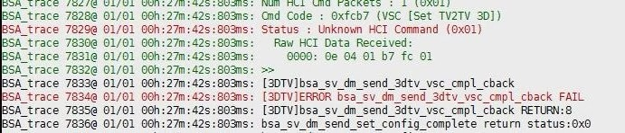

# BT蓝牙

## 模块简介

### AP6212芯片

X26XX平台使用的是AP6212芯片，AP6212是基于BCM4340A1方案的集成wifi和bluetooth的功能模块。

* bluetooth模块支持HCI UART接口、音频数据的PCM接口。
* bluetooth符合蓝牙标准规范5.0

### GPIO功能描述

bluetooth模块

|  |  |  |
| --- | --- | --- |
| **Name** | **I/O** | **Description** |
| **BT_REG_ON** | I | Powerup/downinternalregulatorsusedbyBTsection |
| **BT_WAKE** | I | HOSTwake-upBluetoothdevice |
| **BT_HOST_WAKE** | O | Bluetoothdevicetowake-upHOST |
| **UART_RTS_N** | O | BluetoothUARTinterface |
| **UART_TXD** | O | BluetoothUARTinterface |
| **UART_RXD** | I | BluetoothUARTinterface |
| **UART_CTS_N** | I | BluetoothUARTinterface |

## 驱动源码位置

驱动源码所在位置：

***kernel/module_drivers/drivers/misc/bt_power_bluesleep.c***

## 设备树配置

### 设备树默认配置

kernel内核(version <= 5.10)

在**module_drivers/dts/x2600_halley_v1.0.dts** 下配置：

kernel内核(version > 5.10)

在**module_drivers/dts/x2600/halley7.dts** 下配置

1. 为蓝牙配置uart

```c
&uart1 { 

	status = "okay";

	pinctrl-names = "default";

	pinctrl-0 = <&uart1_pc>;

};
```

2. 配置电源管理相关gpio

```c
/*
 * gpd 14 bt wakeup host
 * gpd 13 host wakeup bt 
 */

bt_power {

	compatible = "ingenic,bt_power";

	ingenic,reg-on-gpio = <&gpc 1 GPIO_ACTIVE_LOW INGENIC_GPIO_NOBIAS>;

	ingenic,wake-gpio = <&gpd 14 GPIO_ACTIVE_LOW INGENIC_GPIO_NOBIAS>;

	status = "okay";

};
```

### 设备树自定义配置

用户可根据实际需求开启相关配置。

## 内核编译配置

内核配置BCM_4345C5_RFKILL，配置说明如下：

```
Symbol: BCMDHD [=y] 

Type : tristate 

Prompt: Broadcom FullMAC wireless cards support 

 Location: 

 -> Ingenic device-drivers Configurations 

 -> SDIO-WIFI drivers 

 Defined at module_drivers/drivers/net/wireless/bcmdhd/Kconfig 
```

```
 Symbol: BCM_4345C5_RFKILL [=y]
 
 Type  : tristate

 Prompt: Bluetooth power control driver for BCM-4345C5 module
 
  Location:                                                                                           
    -> Ingenic device-drivers Configurations
	
  Defined at module_drivers/drivers/misc/Kconfig:50

  Depends on: RFKILL [=y] && (MMC_SDHCI_INGENIC [=y] || INGENIC_MMC_MMC0 [=n] || INGENIC_MMC_MMC1 [=n])
```

### 内核默认编译配置

内核默认配置打开该模块

### 内核自定义编译配置

用户可根据实际需求关闭该模块

## 内核版本差异

## 设备节点生成

驱动加载成功后生成以下节点：

1. UART节点

```
# ls dev/ttyS*

dev/ttyS0 dev/ttyS1 dev/ttyS3
```

2. 电源管理相关节点

```
# cat sys/class/rfkill/rfkill0/name

bluetooth
```

## 应用程序使用说明

### 模块供电

注意: 首次系统上电必须echo 1 sys/class/rfkill/rfkill0/state, 否则可能上电不成功

```
# echo 1 > sys/class/rfkill/rfkill0/state

[ 1402.277128] restore_pin_status is not defined
```

### 通过串口获取蓝牙模块ID

* 测试程序: bcm_test
* 确保bluetooth供电
* 确保UART接口和蓝牙模块通信正常

```
# ./pretest/bcm_test -d /dev/ttyS0

=======Read Successfully! Chip Version : BCM4340A1
```

### 蓝牙uart通路测试

搭建bsa_server

测试程序: bsa_server

步骤：

1. 进入adb shell

```
ser@user-HP-Compaq-8200:~$ adb shell
```

2. 执行bsa_server,启动服务

```
# bsa_server -r 15 -p /lib/firmware/bluetooth/BCM43430A1.hcd -u /var/run/ -d /dev/ttyS1
```

* -r指定baudrate为`３M`（UART最大支持`3M`）
* -p指定蓝牙固件路径
* -u指定生成bt节点位置
* -d设备

注: 不能在串口直接执行bsa_server,由于串口太慢，会导致bsa_server无法正常执行；测试需要通过adb shell执行bsa_server。

3. bsa_server服务成功后，会创建守护进程，产生两个bt节点

```
# ls /var/run/bt*

/var/run/bt-avk-fifo		/var/run/bt-daemon-socket
```

### 基于bsa server开发参考内容

1. bsa_server开发指南位置

external/bluetooth_demo/BSA_GATT_Guide-v03.pdf

external/bluetooth_demo/BSA_Simple_Guideline-v01.pdf

2. demo源码目录

**external/bluetooth_demo/3rdparty**

3. 快速编译app（详细参考bsa_server开发指南）
* 1. 配置交叉编译工具

```
# export PATH=prebuilts/toolchains/mips-gcc720-glibc226/bin:$PATH
```

* 2. 进入需要编译的APP的build下，以app_manager为例

```
# cd packages/example/App/bluetooth_demo

# cd 3rdparty/embedded/bsa_examples/linux/app_manager/build
```

* 3. 配置环境

```
# export MIPSGCC=mips-linux-gnu-gcc
```

* 4. 编译

```
# make CPU=mips clean

# make CPU=mips
```

* 5. build目录下生成可执行程序

```
# ls mips/

app_manager obj/
```

## FAQ

### bsa_server 不支持-lpm参数

低功耗模式不支持

### 常见正常错误打印,不会影响正常使用

3D命令不支持



检查低功耗节点不存在
