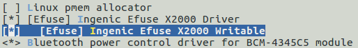

# EFUSE 接口

## 模块功能介绍

EFUSE模块提供了读写efuse各个数据段的接口。可以查看efuse中保存的cpu相关信息或者写入用户自定义的信息。

## 驱动位置

驱动源码所在位置

***module_drivers/drivers/misc/ingenic_efuse_x2000.c***

**注意：x2600和x2000的控制器寄存器一致，使用同一套驱动代码。**

## 设备树配置

设备树所在位置：

kernel内核(version <= 5.10)dts文件路径：

***module_driver/dts/x2600.dtsi***

kernel内核(version > 5.10)dts文件路径：

***module_driver/dts/x2600/x2600.dtsi***

EFUSE控制器描述：

```c
efuse: efuse@0x13480000 {

    compatible = "ingenic,x2600-efuse";

    reg = <0x13480000 0x10000>;

    status = "okay";

};
```

### 设备树默认配置

设备树默认编译不会产生EFUSE设备。

### 设备树自定义配置

用户可根据实际需求开启efuse设备。

```c
&efuse {

    status = "okay";

    ingenic,efuse-en-gpio = <&gpe 6 GPIO_ACTIVE_LOW INGENIC_GPIO_NOBIAS>;

};
```

**注意：x26xx系列开发板仅x2660 halley v1.0和v1.1具有efuse-en-gpio，其余开发板均为直接供电不需要配置efuse-en-gpio**

## 内核编译配置

内核配置INGENIC_EFUSE_X2000，配置说明如下：

**注意：x2600和x2000的控制器寄存器一致，使用同一套驱动代码。**

```
 Symbol: INGENIC_EFUSE_X2000 [=y]

 Type : boolean

 Prompt: [Efuse] Ingenic Efuse X2000 Driver 

 Location:

 -> Ingenic device-drivers Configurations

 Defined at module_drivers/drivers/misc/Kconfig:35

 Depends on: SOC_X2000 [=n] || SOC_X2100 [=n] || SOC_M300 [=n] || SOC_X2600 [=y]
```

### 内核默认编译配置

配置界面如下：



### 内核自定义编译配置

用户可根据实际需求添加该模块。该模块默认不配置。

## 设备节点生成

驱动加载成功后会在`/sys/devices/platform/ahb2/13480000.efuse/efuse_rw/`目录下生成以下文件：

```
chipid    chipkey    custid0    custid1    custid2

hideblk   nku        prt        socinfo    trim0

trim1     trim2      userkey0   userkey1
```

生成的每个文件都对应efuse的一个段，具体每个段的作用，请参考pm手册。

## 应用程序使用说明

### 读取efuse各个段的数据

```
cd /sys/devices/platform/ahb2/13480000.efuse/efuse_rw/

cat chipid

cat ......

cat socinfo
```

其中的段userkey,chidkey,nku和加密相关，不能通过该方式读。

### 写数据到efuse的各个段

写efuse时，数据要以16进制字符串的方式写入，不加0x前缀。以socinfo为例，写数据0x2080020800到efuse中。

执行指令

```
cd /sys/devices/platform/ahb2/13480000.efuse/efuse_rw/

echo 2080020800 > socinfo
```

其中的段userkey,chidkey,nku和加密相关，不能通过该方式读。

## 注意事项

 efuse只能写入一次，重复写入可能会造成芯片产生不可预知的错误，写入时需谨慎。

