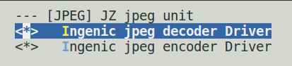

# JPEG编码处理单元

## 模块功能介绍

JPEG解码器是一个完整的符合标准的JPEG/Motion JPEG硬件解码单元。

支持解码输出格式：ARGB, NV12, NV21, YUV422

## 驱动源码

驱动源码所在位置：

**module_drivers/drivers/video/ingenic-jpeg**

```
├── jpegd_drv.c
├── jpegd_drv.h
├── jpeg_dmabuf.c
├── jpeg_dmabuf.h
├── jpegd_reg.h
├── Kconfig
└── Makefile
```
## 设备树配置

设备树所在位置：

kernel内核(version <= 5.10)dts文件路径：

***module_driver/dts/x2600.dtsi***

kernel内核(version > 5.10)dts文件路径：

***module_driver/dts/x2600/x2600.dtsi***

Jpeg编码器描述：

```
jpegd: jpegd@0x13200000 {
    
    compatible = "ingenic,x2600-jpegd";
    
    reg = <0x13200000 0x10000>;
    
    interrupt-parent = <&core_intc>;
    
    interrupts = <IRQ_JPEGD>;
    
    status = "disabled";

};
```

### 设备树默认配置

设备树默认编译会产生jpeg encoder设备：

```
&jpegd {

    status = "okay";

};
```

### 设备树自定义配置

用户可根据实际需求关闭jpeg encoder设备，将该节点设置为disable：

```
&jpegd {

    status = "disable";

};
```

## 内核编译配置

内核配置VIDEO_INGENIC_VCODEC，配置说明如下：

编译Kernelx.x.x内核配置如下：

```
There is no help available for this option. 

Symbol: JZ_JPEG [=y]

Type : boolean

Prompt: [JPEG] JZ jpeg unit

 Location:

 -> Ingenic device-drivers Configurations

 Defined at module_drivers/drivers/video/ingenic-jpeg/Kconfig:1

 Depends on: SOC_X2600 [=y]


CONFIG_INGENIC_JPEG_DEC:

Support for Ingenic jpeg-dec operations.

Symbol: INGENIC_JPEG_DEC [=y]

Type  : tristate

Prompt: Ingenic jpeg decoder Driver

 Location:

  -> Ingenic device-drivers Configurations

  -> [JPEG] JZ jpeg unit (JZ_JPEG [=y])

  Defined at module_drivers/drivers/video/ingenic-jpeg/Kconfig:6

  Depends on: JZ_JPEG [=y]
```

### 内核默认编译配置

内核默认打开jpeg decoder驱动，配置界面如下：



### 内核自定义编译配置

用户可根据实际需求关闭该驱动的配置。

## 内核版本差异

## 设备节点生成

驱动加载成功后生成以下节点：

```
/dev/jpegdec
```

jpeg decoder的设备节点

## 应用程序使用说明

使用IMPP测试demo：jpegd_example

参数说明：

```
jpegdec-example usage:
   -s or --pixel_size          The resolution size of the JPEG file. The format is WxH, for example: 1280x720.
   -i or --src_file            File name and path of the JPEG file.
   -o or --dst_file            File name and path of the NV12 file. The default is out_test.nv12.
```

执行测试命令，例如：

```
./jpege_example -s 1280x720 -i test.jpg -o output.nv12
```
