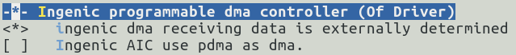
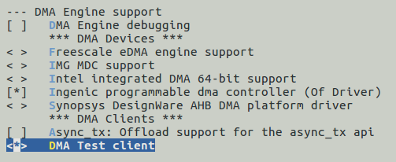

# PDMA控制器

## 模块功能介绍

x26xx系列芯片具有pdma和dma_mcu两个可编程dma控制器。

可编程DMA控制器（PDMAC）专门用于在片上外设（MSC，AIC，UART等），外部存储器和存储器映射的外部设备之间智能传输数据，支持多达32个独立的DMA通道。

可编程DMA控制器（DMA_MCU）用在片上外设（ADC,PWM等），外部存储器和存储器映射的外部设备之间智能传输数据，支持多达32个独立的DMA通道。

## 驱动位置

驱动源码所在位置：

***module_drivers/drivers/dma/ingenic/***

```
├── ingenic_dma.c
├── ingenic_dma.h
├── Kconfig
└── Makefile
```

## 设备树配置

设备树所在位置：

kernel内核(version <= 5.10)dts文件路径：

***module_driver/dts/x2600.dtsi***

kernel内核(version > 5.10)dts文件路径：

***module_driver/dts/x2600/x2600.dtsi***

PDMA控制器描述：

```c
pdma: dma@13420000 {

    compatible = "ingenic,x2600-pdma";

    reg = <0x13420000 0x10000>;

    interrupt-parent = <&core_intc>;

    interrupt-names = "pdma", "pdmad";

    interrupts = <IRQ_PDMA>, <IRQ_PDMAD>;

    ingenic,bus-ctrl = <INGENIC_DMA_CTRL_AHB2_BUS>;

    #dma-channels = <8>;

    #dma-cells = <1>;

    ingenic,reserved-chs = <0x3>;

    status ="disable"; 

};

pdma1: dma@13660000 {

    compatible = "ingenic,x2600-pdma";

    reg = <0x13660000 0x10000>;

    interrupt-parent = <&core_intc>;

    interrupt-names = "pdma", "pdmad";

    interrupts = <IRQ_MCU_PDMA>, <IRQ_MCU_PDMAD>;

    ingenic,bus-ctrl = <INGENIC_DMA_CTRL_AHB_MCU_BUS>;

    #dma-channels = <32>;

    #dma-cells = <1>;

    status ="disable";

    //ingenic,reserved-chs = <0x3>;

}; 
```

### 设备树默认配置

默认编译会产生pdma设备

```c
&pdma {

    status = "okay";

};

&pdma1 {

    status = "okay";

};
```

### 设备树自定义配置

用户可根据实际需求关闭PDMA设备，可以将该节点配置为disable。

```
&pdma {

    status = "disable";

};

&pdma1 {

    status = "disable";

};
```

## 内核编译配置

内核配置INGENIC_PDMAC，配置说明如下：

```
Symbol: INGENIC_PDMAC [=y] 

 Type : boolean

 Prompt: Ingenic programmable dma controller (Of Driver)

 Location:

 -> Device Drivers

 -> DMA Engine support (DMADEVICES [=y])

 Prompt: Ingenic programmable dma controller (Of Driver) 

 Location:

 -> Ingenic device-drivers Configurations

 -> [DMA] Drivers

 Defined at drivers/dma/Kconfig:280

 Depends on: DMADEVICES [=y] && (MACH_XBURST [=n] || MACH_XBURST2 [=y]) 

 Selects: DMA_VIRTUAL_CHANNELS [=y] && DMA_ENGINE [=y] && DMA_VIRTUAL_CHANNELS [=y] && DMA_ENGINE [=y]

 Selected by: SND_ASOC_PDMA [=y] && SND_ASOC_INGENIC [=y] && SND_ASOC_INGENIC_AS_V1 [=y]
```

### 内核默认编译配置

内核默认配置PDMA驱动， 

配置界面如下：



### 内核自定义编译配置

用户可根据实际需求，去掉该驱动的配置。

驱动测试配置，配置说明如下：

```
Symbol: DMATEST [=y] 

Type : tristate 

Prompt: DMA Test client 

Location: 

-> Device Drivers 

-> DMA Engine support (DMADEVICES [=y]) 

Defined at drivers/dma/Kconfig:561 

Depends on: DMADEVICES [=y] && DMA_ENGINE [=y]
```

配置界面如下：



## 版本差异

kernel4.4.94和kernel5.10在使用的上的差异主要是kernel5.10去除了部分api和kernel4.4.94申请dma channel的api接口不一样，用户可参考下文中驱动程序使用流程。

## 设备节点生成

### 控制器节点

驱动加载成功后生成以下控制器节点：

```
# cd /sys/devices/platform/ahb_mcu/13660000.dma/dma/

# ls

dma0chan0 dma0chan14 dma0chan2 dma0chan25 dma0chan30 dma0chan8

dma0chan1 dma0chan15 dma0chan20 dma0chan26 dma0chan31 dma0chan9

dma0chan10 dma0chan16 dma0chan21 dma0chan27 dma0chan4

dma0chan11 dma0chan17 dma0chan22 dma0chan28 dma0chan5

dma0chan12 dma0chan18 dma0chan23 dma0chan29 dma0chan6

dma0chan13 dma0chan19 dma0chan24 dma0chan3 dma0chan7
```

```
cd /sys/devices/platform/ahb2/13420000.dma/dma

# ls

dma1chan0 dma1chan14 dma1chan2 dma1chan25 dma1chan30 dma1chan8

dma1chan1 dma1chan15 dma1chan20 dma1chan26 dma1chan31 dma1chan9

dma1chan10 dma1chan16 dma1chan21 dma1chan27 dma1chan4

dma1chan11 dma1chan17 dma1chan22 dma1chan28 dma1chan5

dma1chan12 dma1chan18 dma1chan23 dma1chan29 dma1chan6

dma1chan13 dma1chan19 dma1chan24 dma1chan3 dma1chan7
```

### 测试程序节点

若配置驱动测试，生成以下测试节点：

```
# cd /sys/module/dmatest/parameters/

# ls

channel     noverify    threads_per_chan    xor_sources

device      pq_sources  timeout

iterations  run         verbose

max_channels test_buf_size  wait
```

## 应用程序使用说明

### dmatest测试程序

1. 进入到测试程序的节点

* dma_mcu测试

```
# echo dma0chan31 > /sys/module/dmatest/parameters/channel

# echo 2000 > /sys/module/dmatest/parameters/timeout

# echo 1 > /sys/module/dmatest/parameters/iterations

# echo 1 > /sys/module/dmatest/parameters/run
```

* pdma测试

```
# echo dma1chan7 > /sys/module/dmatest/parameters/channel

# echo 2000 > /sys/module/dmatest/parameters/timeout

# echo 1 > /sys/module/dmatest/parameters/iterations

# echo 1 > /sys/module/dmatest/parameters/run
```

* 测试结果

```
[ 148.309057] dmatest: Started 1 threads using dma0chan31

[ 148.309825] dmatest: dma0chan31-copy: summary 1 tests, 0 failures 1355 iops 10840 KB/s (0)

[ 366.888453] dmatest: Started 1 threads using dma1chan7

[ 366.888848] dmatest: dma1chan7-copy0: summary 1 tests, 0 failures 2777 iops 0 KB/s (0)
```

### SSI驱动程序测试

PDMA和DMA_MCU驱动遵循内核标准的dmaengine驱动框架，可作为provider为其他驱动程序提供dma传输通道，这里以SSI驱动程序为例，介绍如何配置。

#### 设备树配置

```
spi0: spi0@0x10043000 {

    compatible = "ingenic,x2600-spi";

    reg = <0x10043000 0x1000>;

    interrupt-parent = <&core_intc>;

    interrupts = <IRQ_SSI0>;

    dmas = <&pdma INGENIC_DMA_TYPE(INGENIC_DMA_REQ_SSI0_TX)>,

    <&pdma INGENIC_DMA_TYPE(INGENIC_DMA_REQ_SSI0_RX)>;

    dma-names = "tx", "rx";

    #address-cells = <1>;

    #size-cells = <0>;

    status = "disable";

};
```

其中，dmas和dma-names节点为dma相关配置

```
dmas = <&pdma INGENIC_DMA_TYPE(INGENIC_DMA_REQ_SSI0_TX)>,

<&pdma INGENIC_DMA_TYPE(INGENIC_DMA_REQ_SSI0_RX)>;

dma-names = "tx", "rx";
```

**dmas**表示使用PDMA提供的对应传输通道

**dma-names**为一个标志，用于在SSI驱动程序中申请dma传输通道

#### 驱动程序使用流程

由于使用的是内核标准的dmaengine驱动框架，所有consumer端驱动程序均使用相同的api，使用流程基本相同。

* 在kernel4.4.94中的SSI驱动程序中使用流程如下：

1. 申请dma channel

```c
ingspi->txchan = dma_request_slave_channel_reason(dev, "tx");

ingspi->rxchan = dma_request_slave_channel_reason(dev, "rx");
```

2. 配置dma channel的参数

```c
dmaengine_slave_config(txchan, &tx_config);

dmaengine_slave_config(rxchan, &rx_config);
```

3. 获取传输描述符

```c
txdesc = dmaengine_prep_slave_sg(txchan, t->tx_sg.sgl, t->tx_sg.nents, DMA_DEV_TO_MEM, DMA_PREP_INTERRUPT | DMA_CTRL_ACK);

rxdesc = dmaengine_prep_slave_sg(rxchan, t->rx_sg.sgl, t->rx_sg.nents, DMA_DEV_TO_MEM, DMA_PREP_INTERRUPT | DMA_CTRL_ACK);
```

4. 提交并启动传输

```c
dmaengine_submit(txdesc);

dmaengine_submit(rxdesc);

dma_async_issue_pending(rxchan);

dma_async_issue_pending(txchan);
```

* 在kernel5.10中的SSI驱动程序中使用流程如下：

1. 申请dma channel

```c
ingspi->txchan = dma_request_chan(dev, "tx");

ingspi->rxchan = dma_request_chan(dev, "rx");
```

2. 配置dma channel的参数

```c
dmaengine_slave_config(txchan, &tx_config);

dmaengine_slave_config(rxchan, &rx_config);
```

3. 获取传输描述符

```c
txdesc = dmaengine_prep_slave_sg(txchan, t->tx_sg.sgl, t->tx_sg.nents, DMA_DEV_TO_MEM, DMA_PREP_INTERRUPT | DMA_CTRL_ACK);

rxdesc = dmaengine_prep_slave_sg(rxchan, t->rx_sg.sgl, t->rx_sg.nents, DMA_DEV_TO_MEM, DMA_PREP_INTERRUPT | DMA_CTRL_ACK);
```

4. 提交并启动传输

```c
dmaengine_submit(txdesc);

dmaengine_submit(rxdesc);

dma_async_issue_pending(rxchan);

dma_async_issue_pending(txch
```
