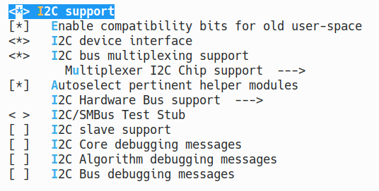
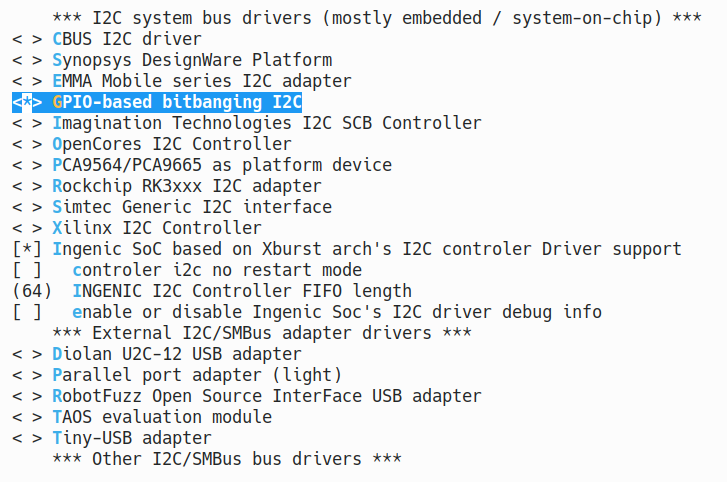

# SMB I2C接口

## 模块功能介绍

SMB总线是两线串行接口，由串行数据线（SDA）和串行时钟（SCL）组成，这些电线在连接到总线的设备之间传送信息。每个设备都有一个唯一的地址，并且可以根据设备的功能充当“发送器”或“接收器”，在执行数据传输时，设备也可以视为主机或从机。主设备是初始化/终止总线上的数据传输并生成时钟信号以允许该传输的设备。在这段时间内，任何寻址的设备都被视为从设备，SMB控制器是软件控制的，它充当主机或从机，但是，不支持同时作为主机和从机运行。

i2c 控制器为 SMB，SMB 支持的接口有 i2c,支持 100 Kb/s 和 400 Kb/s，I2C 接口可连接至 pmu, camera，通过 i2c 接口进行配置。

## 驱动位置

驱动源码位于

***module_drivers/drivers/i2c/busses/i2c-ingenic.c***

## 设备树配置

设备树所在位置：

kernel内核(version <= 5.10)dts文件路径：

***module_driver/dts/x2600.dtsi***

kernel内核(version > 5.10)dts文件路径：

***module_driver/dts/x2600/x2600.dtsi***

i2c控制器描述：

```c
i2c0: i2c@0x10050000 {

    compatible = "ingenic,x2600-i2c";

    reg = <0x10050000 0x1000>;

    interrupt-parent = <&core_intc>;

    interrupts = <IRQ_I2C0>;

    #address-cells = <1>;

    #size-cells = <0>;

    status = "disabled";

};

i2c1: i2c@0x10051000 {

    compatible = "ingenic,x2600-i2c";

    reg = <0x10051000 0x1000>;

    interrupt-parent = <&core_intc>;

    interrupts = <IRQ_I2C1>;

    #address-cells = <1>;

    #size-cells = <0>;

    status = "disabled";

};

i2c2: i2c@0x10052000 {

    compatible = "ingenic,x2600-i2c";

    reg = <0x10052000 0x1000>;

    interrupt-parent = <&core_intc>;

    interrupts = <IRQ_I2C2>;

    #address-cells = <1>;

    #size-cells = <0>;

    status = "disabled";

};

i2c3: i2c@0x10053000 {

    compatible = "ingenic,x2600-i2c";

    reg = <0x10053000 0x1000>;

    interrupt-parent = <&core_intc>;

    interrupts = <IRQ_I2C3>;

    #address-cells = <1>;

    #size-cells = <0>;

    status = "disabled";

};
```

### 设备树默认配置

x2660和x2670设备树默认编译会产生i2c-adapter2设备和i2c-adapter3设备，x2600e设备树默认编译会产生i2c-adapter0设备和i2c-adapter1设备

### 设备树自定义配置

用户可根据实际需求打开或关闭某个i2c adapter设备，并在设备树的i2c-adapter 节点下挂接相应的i2c-client设备。例如：

***module_drivers/dts/x2660_halley_lcd/X2660_HALLEY_MIPI_LCD_FW050.dtsi*** 中

kernel内核(version <= 5.10)dts文件路径：
***module_drivers/dts/x2660_halley_lcd/X2660_HALLEY_MIPI_LCD_FW050.dtsi*** 
kernel内核(version > 5.10)dts文件路径：
***module_drivers/dts/x2600/x2660_halley_lcd/X2660_HALLEY_MIPI_LCD_FW050.dtsi*** 

```c
&i2c2{

    status = "okay";

    clock-frequency = <100000>;

    pinctrl-names = "default";

    pinctrl-0 = <&i2c2_pb>;

    goodix@0x14{

        compatible = "goodix,gt9xx"; /* do not modify */

        reg = <0x14>; /* do not modify */

        interrupt-parent = <&gpc>; /* INT pin */

        interrupts = <9>;

        reset-gpios = <&gpc 17 GPIO_ACTIVE_LOW INGENIC_GPIO_NOBIAS>; /* RST pin */

        irq-gpios = <&gpc 18 IRQ_TYPE_EDGE_FALLING INGENIC_GPIO_NOBIAS>; /* INT pin */

        goodix,driver-send-cfg = <1>;

        touchscreen-size-x = <1280>;

        touchscreen-size-y = <720>;

        goodix,slide-wakeup = <0>;

        goodix,type-a-report = <1>;

        goodix,resume-in-workqueue = <0>;

        goodix,int-sync = <1>;

        goodix,swap-x2y = <0>;

        goodix,auto-update-cfg = <0>;

        goodix,power-off-sleep = <0>;

        goodix,pen-suppress-finger = <0>;

        irq-flags = <2>; /* 1 rising, 2 falling */

        pinctrl-names = "default", "int-output-high", "int-output-low", "int-input";

        pinctrl-0 = <&touchscreen_default>;

        pinctrl-1 = <&touchscreen_int_out_high>;

        pinctrl-2 = <&touchscreen_int_out_low>;

        pinctrl-3 = <&touchscreen_int_input>;

        goodix,cfg-group0 = [

        00 D0 02 00 05 0A 05 00 01 08 28

        05 50 32 03 05 00 00 00 00 00 00

        00 00 00 00 00 87 28 09 17 15 31

        0D 00 00 02 9B 03 25 00 00 00 00

        00 03 64 32 00 00 00 0F 36 94 C5

        02 07 00 00 04 9B 11 00 7B 16 00

        64 1C 00 50 25 00 42 2F 00 42 00

        00 00 00 00 00 00 00 00 00 00 00

        00 00 00 00 00 00 00 00 00 00 00

        00 00 00 00 00 00 00 00 00 00 00

        00 00 12 10 0E 0C 0A 08 06 04 02

        FF FF FF FF FF 00 00 00 00 00 00

        00 00 00 00 00 00 00 00 00 00 26

        24 22 21 20 1F 1E 1D 00 02 04 06

        08 0A 0C FF FF FF FF FF FF FF FF

        FF FF FF 00 00 00 00 00 00 00 00

        00 00 00 00 00 00 00 00 CF 01];

    };

};
```

## 内核配置

内核配置I2C_INGENIC，配置说明如下：

```
Symbol: I2C_INGENIC [=y]

Type : boolean

Prompt: Ingenic SoC based on Xburst arch's I2C controler Driver support

 Location:

 -> Device Drivers

 -> I2C support

 -> I2C support (I2C [=y])

 -> I2C Hardware Bus support

 Prompt: Ingenic SoC based on Xburst arch's I2C controler Driver support

 Location:

 -> Ingenic device-drivers Configurations

 -> [I2C] Master Drivers

 Defined at drivers/i2c/busses/Kconfig
```

### 内核默认编译配置

内核默认配置I2C控制器驱动，配置界面如下：




### 内核自定义编译配置

1.用户可根据实际需求去掉I2C控制器的驱动。

2.可将设备节点导出到用户空间的/dev下，配置I2C_CHARDEV，配置说明如下：

```
Symbol: I2C_CHARDEV [=y] 

Type : tristate 

Prompt: I2C device interface 

 Location: 

 -> Device Drivers 

 -> I2C support 

 -> I2C support (I2C [=y]) 

 Defined at module_drivers/drivers/i2c/Kconfig

 Depends on: I2C [=y]
```

配置界面如下：


## 模块内核差异

无

## GPIO模拟i2c

1. 首先需要选取两组未使用的GPIO用来模拟sda、scl
2. 设备树中自定义配置

```c
i2c@0 {

    compatible = "i2c-gpio";

    gpios = <&gpc 31 GPIO_ACTIVE_LOW INGENIC_GPIO_NOBIAS>,/* sda */

    <&gpc 30 GPIO_ACTIVE_LOW INGENIC_GPIO_NOBIAS>;/* scl */

    //i2c-gpio,sda-open-drain;

    //i2c-gpio,scl-open-drain;

    i2c-gpio,delay-us = <2>; /* ~100 kHz */

    #address-cells = <1>;

    #size-cells = <0>;

};
```

3.在内核自定义编译配置中选择



配置说明：

```
Symbol: I2C_GPIO [=y] 

Type : tristate 

Prompt: GPIO-based bitbanging I2C 

 Location: 

 -> Device Drivers 

 -> I2C support 

 -> I2C support (I2C [=y]) 

 -> I2C Hardware Bus support 

 Defined at drivers/i2c/busses/Kconfig
```

## 设备节点生成

打开I2C_CHARDEV选项后将在/dev下生成相应的节点：

```
ls /dev/i2c-*  

i2c-0 i2c-2 i2c-3
```

## 应用程序使用说明

LCD触屏功能通过I2C进行控制和数据传输

### 测试方法

执行命令

```
ts_test
```

串口打印数据

```
# ts_test
29.433205:    380    696     27
29.444827:    380    696     27
29.455421:    380    696     27
29.466231:    380    696     27
29.476970:    380    696     27
29.487586:    379    695     27
29.498317:    378    689     27
29.508938:    374    664     27
29.519684:    368    626     27
29.530380:    358    582     27
29.541101:    348    542     27
29.551899:    338    513     27
29.562535:    330    496     27
29.571951:    323    485     27
29.582599:    317    476      0
30.398091:    375    756     21
30.409589:    375    756     21
30.420289:    375    756     21
30.430923:    373    753     21
```

### 常见i2c通信内核提示：

|  |  |
| --- | --- |
| **错误提示** |  **说明** |
| I2C_TXABRT_ABRT_7B_ADDR_NOACK | 7bit寻址下，slave未回ACK |
| I2C_TXABRT_ABRT_10ADDR1_NOACK | 10bit寻址下，发送第一字节后未应答 |
| I2C_TXABRT_ABRT_10ADDR2_NOACK | 10bit寻址下，发送第二字节后未应答 |
| I2C_TXABRT_ABRT_XDATA_NOACK | 地址确定后，但后续数据slave未应答 |
| I2C_TXABRT_ABRT_GCALL_NOACK | i2c广播寻址，slave未应答 |
| I2C_TXABRT_ABRT_GCALL_READ | i2c广播寻址后，进行读操作 |
| I2C_TXABRT_ABRT_HS_ACKD | 主设备处于高速模式下并被确认 |
| I2C_TXABRT_SBYTE_ACKDET | 主设备已经发送一个字节，并且开始字节被确认 |
| I2C_TXABRT_ABRT_HS_NORSTRT | 重启不可用，但用户想要 在高速模式下发送数据 |
| I2C_TXABRT_SBYTE_NORSTRT | 重启不可用，但用户发送了一个开始字节 |
| I2C_TXABRT_ABRT_10B_RD_NORSTRT | 重启不可用，但主设备在10bit寻址下发送读命令 |
| I2C_TXABRT_ABRT_MASTER_DIS | 当前主设备不可用，用户对主设备进行操作 |
| I2C_TXABRT_ARB_LOST | 失去仲裁 |
| I2C_TXABRT_SLVFLUSH_TXFIFO | 当从设备要接收数据时，fifo里已经有一些数据了 |
| I2C_TXABRT_SLV_ARBLOST | 当发送数据时，从设备丧失总线 |
| I2C_TXABRT_SLVRD_INTX | 当主设备需要发送数据时，却进入了读数据状态 |

