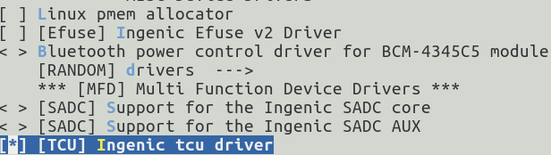

# TCU定时器单元

## 模块功能介绍

X26xx 系列芯片具有 TCU0 和 TCU1 两个 TCU 控制器。这两个控制器完全等价，一般情况下只使用一个 TCU 控制器即可满足需求。有一种场景，当同时在  Xburst2 大核 CPU 和 Risc-V 小核 CPU 均使用 TCU 的情况下，可以约定将一个 TCU 只 Xburst2 大核使用，而另一个 TCU 只 Risc-V 小核使用 ，以保证各 CPU 响应各自使用的 TCU 中断，以达到互不干扰的需求。

定时计数单元(TCU)芯片设计包含8个 TCU 通道分别是0~7标号，能分配给 TCU0 或 TCU1 使用，每个通道可以有三个时钟输入源pwm(gpio0，gpio1)，extal，可以使用其中的任意组合进行功能的使用。

按照spec描述可以分为７种功能模式分别是（[TCU7 种模式测试方法](../../notes/12_TCU7种模式的测试方法.md)）：

常规模式：计数器在时钟的上升沿或是下降沿进行计数，也可以上升下降同时采集计数。

门模式：门为０时，计数器计数。

正交模式：计数器由于正交输入而计数。 

方向模式：由输入信号决定计数器的递增还是递减。

pos模式：由于上升沿或是下降沿，计数器开始从０开始计数。

捕获模式：计数器对周期进行计数并输出高电平时间和周期时间。

过滤模式：该模式用于去除用户不希望的gpio输入（例如毛刺）。

gpio存储模式：该模式在检测到gpio的电平变化时，会存储计数值。

|  |  |  |
| --- | --- | --- |
| **TCU通道** | **GPIO0** | **GPIO1** |
| **ch0** | **input0** | **input0** |
| **ch1** | **input1** | **input1** |
| **ch2** | **input2** | **input2** |
| **ch3** | **input3** | **input3** |
| **ch4** | **input4** | **input4** |
| **ch5** | **input5** | **input5** |
| **ch6** | **input6** | **input6** |
| **ch7** | **input7** | **input7** |

## 驱动位置

驱动源码所在位置

***module_drivers/drivers/mfd/ingenic-tcu.c***

## 设备树配置

设备树所在位置：

kernel内核(version <= 5.10)dts文件路径：

***module_driver/dts/x2600.dtsi***

kernel内核(version > 5.10)dts文件路径：

***module_driver/dts/x2600/x2600.dtsi***

TCU控制器述：

```c
tcu0: tcu0@0x13630000 { 

    compatible = "ingenic,tcu"; 

    reg = <0x13630000 0x10000>; 

    interrupt-parent = <&core_intc>;

    interrupt-names = "tcu_int0"; 

    interrupts = <IRQ_TCU0>; 

    interrupt-controller; 

    clocks = <&clock CLK_GATE_TCU0>;

    clock-names = "gate_tcu0"; 

    status = "disable"; 

}; 

tcu1: tcu1@0x13640000 { 

    compatible = "ingenic,tcu"; 

    reg = <0x13640000 0x10000>; 

    interrupt-parent = <&core_intc>;

    interrupt-names = "tcu_int1"; 

    interrupts = <IRQ_TCU1>; 

    interrupt-controller; 

    clocks = <&clock CLK_GATE_TCU1>;

    clock-names = "gate_tcu1"; 

    status = "disable"; 

}; 
```

### 设备树默认配置

设备树默认编译不会产生 TCU 设备

### 设备树自定义配置

用户可根据实际需求开启 TCU 设备，将该控制器配置为 "okay" ，并根据实际使用 TCU channel 配置 pinctrl 属性 。

```
&tcu0 {
    status = "okay";
    # 此处 pinctrl-0 按照实际使用 tcu 的 channel 可配置一个或多个；
    # 如果配置多个时，可参考如下定义:
    #  	pinctrl-names = "default";
    #   pinctrl-0 = <&tcu0_pc>,<&tcu1_pc>;

    pinctrl-names = "default";
    pinctrl-0 = <&tcu0_pc>;
};

&tcu1 {
    status = "disabled";
    pinctrl-names = "default";
    pinctrl-0 = <&tcu0_pc>;
}; 
```

## 内核编译配置

内核配置MFD_INGENIC_TCU，配置说明如下：

```
Symbol: MFD_INGENIC_TCU [=y] 

Type : boolean 

Prompt: [TCU] Ingenic tcu driver 

 Location: 

(1) -> Ingenic device-drivers Configurations 

 Defined at module_drivers/drivers/mfd/Kconfig:43 

 Depends on: SOC_X2000 [=n] || SOC_M300 [=n] || SOC_X2100 [=n] || SOC_X1600 [=y] || SOC_X2600 [=y] || SOC_X2580 [=n]

 Selects: MFD_CORE [=y] && GENERIC_IRQ_CHIP [=y] 
```

### 内核默认编译配置

内核默认配置TCU驱动，配置界面如下：



### 内核自定义编译配置

用户可根据实际需求去掉该驱动的配置。

## 设备节点生成

驱动加载成功后生成以下节点：

```
/sys/devices/platform/ahb_mcu/13630000.tcu0

# ls

disable enable power

driver modalias subsystem

driver_override of_node uevent


/sys/devices/platform/ahb_mcu/13640000.tcu1/

# ls

disable enable power

driver modalias subsystem

driver_override of_node uevent
```

## 应用程序使用说明

1. 使用主要用到的是disable和enable

2. 驱动中有一个配置的函数默认为**module_drivers/drivers/mfd/ingenic-tcu.c**

```c
/*This is a simple configuration test demo*/

static void ingenic_tcu_config_attr(int id,enum tcu_mode_sel mode_sel)

{

    int i = 0;

    g_tcu_chn[id].mode_sel = mode_sel; 

    g_tcu_chn[id].irq_type = FULL_IRQ_MODE;

    ……

    for(i = 0; i < 20 ;i++)

        sws_pr_debug(&g_tcu_chn[id]);

}
```

说明：具体应用场景还没有，系统接口没有留太多，此函数的配置结合spec能够进行快速的验证功能,后续会留更多的系统配置接口。

在使用DIRECTION_MODE、POS_MODE、CAPTURE_MODE、FILTER_MODE模式之前请先配置对应tcu通道的gpio0或gpio1。

在使用QUADRATURE_MODE模式的时候请先配置对应tcu通道的gpio0和gpio1为正交信号。

3. 使用过程就是把对应的通道写入enable该通道就开始工作

```
# 

mode_sel :

0:GENERAL_MODE 1:GATE_MODE 2:DIRECTION_MODE 3:QUADRATURE_MODE

4:POS_MODE 5:CAPTURE_MODE 6:FILTER_MODE

####################example####################

## echo channel_id mode_sel > enable 

## echo channel_id > disable 

channel: 00 disable

channel: 01 disable

channel: 02 disable

channel: 03 disable

channel: 04 disable

channel: 05 disable

channel: 06 disable

channel: 07 disable

# echo 0 0 > enable 

[ 164.485676] mode_id = 0 

...

...

[ 165.896941] ----------------------------------------count N0.20----------------------------------------------------

[ 165.896941] 

[ 165.912304] -stop-----addr-b000201c-value-00000000-----------

[ 165.918236] -mask-----addr-b0002030-value-00ff80fe-----------

[ 165.924181] -enable---addr-b0002010-value-00000001-----------

[ 165.930120] -flag-----addr-b0002020-value-00010000-----------

[ 165.936048] -Control--addr-b000204c-value-00010004-----------

[ 165.941990] -full-----addr-b0002040-value-0000ffff-----------

[ 165.947925] -half- -addr-b0002044-value-00005000-----------

[ 165.953874] -TCNT-----addr-b0002048-value-0000b5bf-----------

[ 165.959811] -CAP reg_base-------value-00000000-----------

[ 165.965399] -CAP_VAL register---value-00000000-----------
```

4. 把对应的通道写入disable就停止计数工作了

```
# echo 0 > disable

# cat disable

channel: 00 disable

channel: 01 disable

channel: 02 disable

channel: 03 disable

channel: 04 disable

channel: 05 disable

channel: 06 disable

channel: 07 disable
```

说明：tcu使用的功能模式比较多，以至于没有留有太多的接口，但是内部逻辑都已经写好了，只需要按照spec中的不同模式的使用方式对ingenic_tcu_config_attr函数赋值就好了，每一类的宏也定义好了，能够方便的配置使用,不同的使用场景请修改相应的配置。
