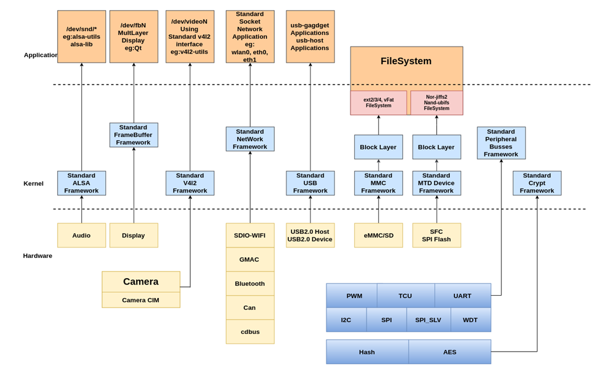
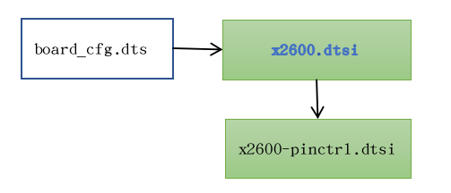
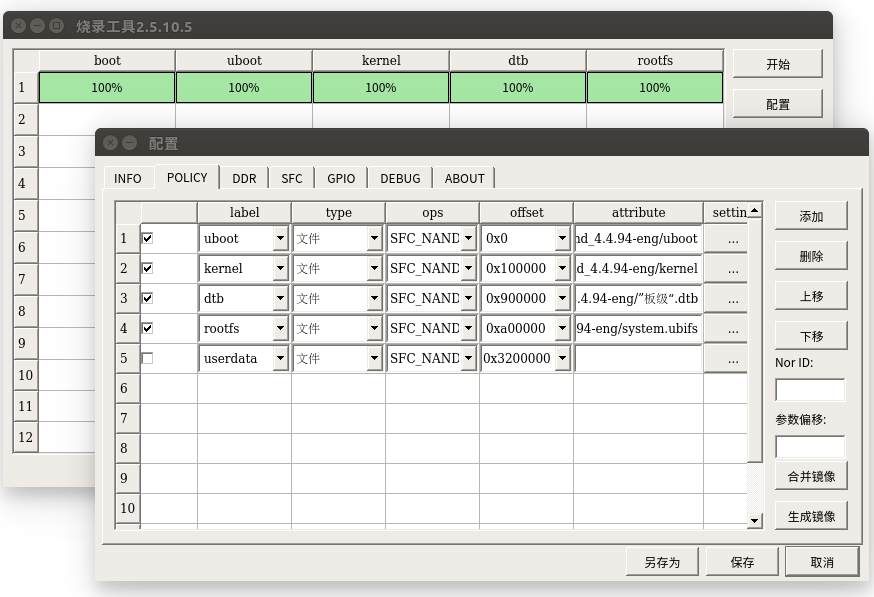

# 内核开发简介

该文档针对君正系列芯片，Kernel  x.x 标准内核平台进行研发，主要针对内核的基本结构，内核的编译，设备树和驱动的配置和裁剪进行说明。 

## 内核基本结构

君正系列芯片的控制器在Kernelx.x进行了驱动层的适配，所使用的驱动接口也都使用了内核的标准驱动接口，用户可以基于标准应用接口进行二次开发，而不用关心底层的具体实现。

内核基本适配结构图如下图:



图表 1‑1 内核驱动适配结构图

## 内核开发流程

内核的开发可以分为两种类型的开发，一种基于君正提供的SDK开发环境进行开发，另外一种类型的是基于源码目录开发流程。

### 基于君正SDK内核开发流程（推荐使用）

通常情况下，会下载完整的SDK包，首先按照进行基础开发环境的搭建，整体编译一次 **（注:这点很重要）**。此过程会对内核进行基础的配置。流程图如下:


图表 1‑2 内核开发流程图

在保证以上工作都执行完成之后，在需要重新配置内核，或者修改了内核需要重新编译的情况下，可以在**SDK顶层**执行以下命令进行配置

```c
$ make kernel-menuconfig # 配置内核

$ make kernel # 编译内核
```

以x2660 halley v1.0为例，执行该命令后，会生成文件

out/product/x2660halley.v10_nand_x.x.x-eng/obj/kernel-intermediate/arch/mips/boot/uImage， 该文件就是最终需要烧录的内核镜像。

基于君正SDK的开发流程，源码和编译生成的中间文件是分离开的，中间文件会生成在out/product/x2660halley.v10_nand_x.x.x-eng/obj/kernel-intermediate/目录下，包括内核的.config文件。

**注意事项：**

1. 使用君正SDK的开发流程，需要保证源码目录没有被污染，即不能即在源码目录下使用传统的make xxx_defconfig进行内核配置和编译，否则会报错误。此时可以在kernel源码目录下执行

```c
$ make distclean

$ make mrproper
```

2. 所有使用make kernel-xxx 的命令，实质执行的是:

```c
$ make -C out/product/productName/obj/kernel-intermediate xxx
```

在实际开发过程中，可以尝试将make kernel-xxx中xxx替换为内核支持的make命令

3. x2660halley.v10_nand_x.x.x-eng中的x.x.x是统配写法，如果使用kernel-4.4.94需修改为x2660halley.v10_nand_4.4.94-eng,如果使用kernel-5.10需修改x2660halley.v10_nand_5.10-eng

### 基于内核源码开发流程

基于内核源码的开发流程则是修改和编译的目标文件都生成在kernel目录下。该开发流程所有命令的执行都在kernel目录下。

```c
$ cd kernel

$ make board_cfg_defconfig

$ make uImage
```

当需要修改内核重新配置时，使用  

```c
$ make menuconfig

$ make uImage

$ ls arch/mips/boot/uImage 即为生成的目标文件
```

执行以上命令后会在内核源码目录下生成arch/mips/boot/uImage文件，该文件即为最终烧录的镜像。其中board_cfg 可以在arch/mips/configs/目录下找到。

## 内核默认配置

所有针对开发板的内核配置默认配置文件board_cfg都存储在arch/mips/configs/目录下。

X26XX所包含的配置文件说明如下:

kernel内核(version <= 5.10)

|  |  |
| --- | --- |
| **配置文件** | **说明** |
| **x2660_halley_v1.0_defconfig** | 用于x2660_halley_v1.0开发板，主存储为nand/nor启动的配置 |
| **x2660_halley_v1.1_defconfig** | 用于x2660_halley_v1.1开发板，主存储为nand/nor启动的配置 |
| **x2670_halley_v1.0_defconfig** | 用于x2670_halley_v1.0开发板，主存储为nand/nor启动的配置 |
| **x2600e_halley_v1.0_defconfig** | 用于x2600e_halley_v1.0开发板，主存储为nand/nor/emmc启动的配置 |

kernel内核(version > 5.10)

|                                   |                                                    |
| --------------------------------- | -------------------------------------------------- |
| **配置文件**                      | **说明**                                           |
| **x2600_halley7_linux_defconfig** | 用于x2600_halley开发板，主存储为nand/nor启动的配置 |
| **x2670_hare_v1.0_defconfig**     | 用于x2670_halley开发板，主存储为nand/nor启动的配置 |

表 1 X26XX内核配置表

## 设备树配置

devicetree用于描述芯片和开发板板级资源，主要又两种使用方式，一种方式直接和内核编译在一起，另外一种方式单独编译，单独存储，由uboot传参告知dtb存储的位置。

默认使用直接编译内核的方式，具体区别可以参考下文。

### 设备树文件介绍

关于设备树的配置文件，主要存放路径为module_drivers/dts目录, dts的组成一般是soc级定义和board级的定义。



图表 1‑3 dts结构示意图

X26XX平台涉及到的devicetree文件如下表:

kernel内核(version <= 5.10)

|  |  |
| --- | --- |
| **dts文件** | **文件说明** |
| **x2660_halley_v1.0.dts** | 针对X2660 Halley V1.0系列的开发板板级配置。自定义开发板配置时，需要修改此文件 |
| **x2660_halley_v1.1.dts** | 针对X2660 Halley V1.1系列的开发板板级配置。自定义开发板配置时，需要修改此文件 |
| **x2670_halley_v1.0.dts** | 针对X2670 Halley V1.0系列的开发板板级配置。自定义开发板配置时，需要修改此文件 |
| **x2600e_halley_v1.0.dts** | 针对X2600e Halley V1.0系列的开发板板级配置。自定义开发板配置时，需要修改此文件 |
| **x2600.dtsi** | X2600 SOC 芯片基础配置，客户一般不需要修改。 |
| **x2600-pinctrl.dtsi** | X2600 GPIO function配置，客户一般不需要修改。 |
| **X26xx_halley_lcd/X2660_HALLEY_MIPI_LCD_FW050.dtsi** | 屏幕配置文件 |
| **X26xx_halley_lcd/X2660_HALLEY_RGB_LCD_HC050IG.dtsi** | 屏幕配置文件 |

kernel内核(version > 5.10)

|                                                        |                                                              |
| ------------------------------------------------------ | ------------------------------------------------------------ |
| **dts文件**                                            | **文件说明**                                                 |
| **halley7.dts**                                        | 针对X2600X系列的开发板板级配置。自定义开发板配置时，需要修改此文件 |
| **hare.dts**                                           | 针对X2670X系列的开发板板级配置。自定义开发板配置时，需要修改此文件 |
| **x2600.dtsi**                                         | X2600 SOC 芯片基础配置，客户一般不需要修改。                 |
| **x2600-pinctrl.dtsi**                                 | X2600 GPIO function配置，客户一般不需要修改。                |
| **X26xx_halley_lcd/X2660_HALLEY_MIPI_LCD_FW050.dtsi**  | 屏幕配置文件                                                 |
| **X26xx_halley_lcd/X2660_HALLEY_RGB_LCD_HC050IG.dtsi** | 屏幕配置文件                                                 |

### 内核Builtin设备树（默认使用方式）

参考平台默认使用的方式。

### 单独编译设备树

单独编译和使用设备树需要多方面的支持

1. 修改u-boot, 使其支持加载devicetree。
2. 修改内核配置，使其支持单独编译出devicetree二进制文件。
3. 修改烧录工具，使其支持烧录devicetree二进制文件。

#### 修改uboot配置

需要修改配置文件， 如： ***u-boot/include/configs/x2660_halley.h***,

1. 添加devicetree支持

```c
/* Device Tree Configuration */

#define CONFIG_OF_LIBFDT 1

#define IMAGE_ENABLE_OF_LIBFDT 1

#define CONFIG_LMB
```

2. 修改内核启动参数和启动命令

**Nand启动:**

```c
#define CONFIG\_BOOTARGS BOOTARGS\_COMMON "ip=off init=/linuxrc ubi.mtd=3 root=ubi0:rootfs ubi.mtd=4 rootfstype=ubifs rw

#define CONFIG\_BOOTCOMMAND "set uImage 0x80600000; set dtb 0x83000000; sfcnand read 0x100000 0x400000 $(uImage); sfcnand read 0x900000 0x20000 $(dtb); bootm $(uImage) - ${dtb}"
```

**注意:** 需要根据实际分区情况进行修改

#### 修改内核配置

在SDK顶层，执行make kernel-menuconfig，去掉**INGNEIC_BUILTIN_DTB**配置。

其配置说明如下:

```c
There is no help available for this option.

 Symbol: INGENIC_BUILTIN_DTB [=n]

 Type : boolean 

 Prompt: Ingenic Device Tree build into Kernel. 

 Location:

 -> Machine selection 

 -> SOC Type Selection

 Defined at arch/mips/xburst2/Kconfig:74

 Depends on: MACH_XBURST2 [=n] 

 Selects: BUILTIN_DTB [=y]
```

去掉选项之后界面如下:


图表 1‑4 

#### 编译dtb文件

在SDK顶层执行

```c
 $make kernel-dtbs
```

会在out/product/x2660halley.v10_nand_x.x.x-eng/obj/kernel-intermediate/下生成文件

***arch/mips/boot/dts/ingenic/x2660_halley_v1.0.dtb***

该文件即为最终需要烧写devicetree二进制文件。

#### 烧录dtb文件

1. **烧录Nand DTB文件**

注意: 将dtb文件烧录到设备树预留的分区上， 要和bootcmd和bootargs配置的保持一致



图表 1‑5 Nand DTB烧录

### 通过设备树传递内核参数

内核bootargs的传递有多种方式，这里只介绍如何使用dts文件传递内核参数。

#### 修改设备树

定义chosen节点，节点中的bootargs作为向内核传递的cmdline。

例： ***arch/mips/boot/dts/ingenic/X2660_halley_v1.0.dts***

```c
/ {

	compatible = "img,x2660-halley-board-v1.0", "ingenic,x2660";

	chosen { 

	bootargs = "console=ttyS0,115200 mem=128M@0x0ip=off init=/linuxrc ubi.mtd=3

	root=ubi0:rootfs ubi.mtd=4 rootfstype=ubifs rw"; 

	};

};
```

#### 修改内核配置

内核选择 MIPS_CMDLINE_FROM_DTB 配置后，会解析dts文件中的bootargs而忽略从uboot中传递的bootargs。

注: 启动过程中， uboot解析dtb中的chosen节点， 如果没有定义， 则uboot会创建默认的chosen节点．

```c
Symbol: MIPS_CMDLINE_FROM_DTB [=y]

Type : boolean

Prompt: Dtb kernel arguments if available

Location:

-> Kernel type

-> Kernel command line type (<choice> [=y])

Defined at arch/mips/Kconfig:2858

Depends on: <choice> && USE_OF [=y]
```

选中后的图像参考下图

