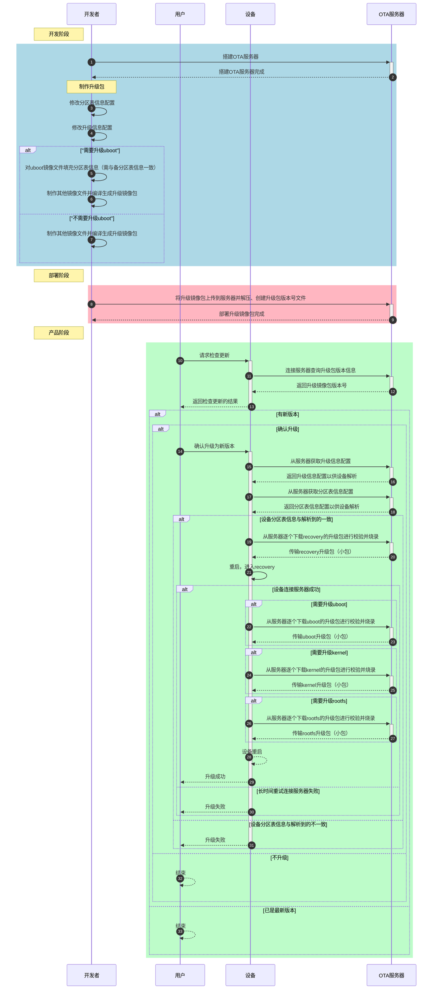
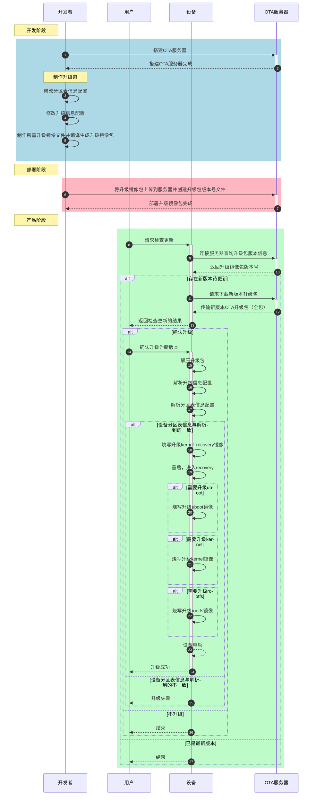
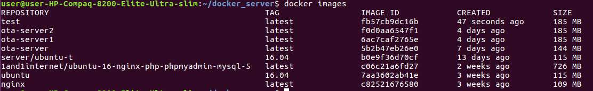
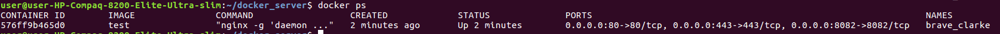

# OTA (SPI-nand Flash) 在线升级方案

# 1.OTA升级简介<a id="section1"></a>

​	OTA: 是一整套的设备在线升级方案，支持升级kernel，recovery，system分区。

## 1.1.OTA源码目录<a id="section1-1"></a>

```c
  packages/updater/
  ├── default_ota_res
  ├── docker_server
  ├── getpackage
  ├── libupdater
  ├── mkramdisk.sh
  ├── ota_package_maker
  ├── recovery
  └── rootfs-recovery
```

* libupdater目录实现了一种升级检测的本地策略，和一些升级相关的基础函数。
* recovery目录是升级程序。
* rootfs-recovery目录存放用于各板级的ramdisk文件系统内容。
* ota_package_maker目录用于制作升级包。
* mkramdisk.sh用于制作升级包。
* default_ota_res目录存放升级需要的配置文件、秘钥、提示音文件等。
* docker_server目录用于搭建服务器。

## 1.2. 升级策略<a id="section1-2"></a>

* 在服务器端升级包路径下存放VERSION文件，记录升级包的版本；设备端在`/usr/data/VERSION`文件中记录设备当前的系统版本。
* 检测升级时，设备通过`/usr/data/ota_res/recovery.conf`配置文件中的`url`得到`current_version_full.conf`。解析这个文件得到升级包路径，获取升级包版本，与当前系统版本做比较，如果升级包版本大于当前系统版本，则启动升级程序进行升级。升级成功后，更新本地`/usr/data/VERSION`文件，否则不进行升级。

## 1.3. NAND介质OTA升级时序图<a id="section1-3"></a>



## 1.4. EMMC介质OTA升级时序图<a id="section1-4"></a>



## 1.5 NAND介质与EMMC介质OTA升级的不同之处<a id="section1-5"></a>

- uboot升级镜像文件制作的不同之处：
  - NAND介质的uboot镜像文件需要拷贝到PC上使用烧录工具填充分区表信息，而EMMC介质的不需要，因为uboot中已经包含了分区表信息。
- 升级包部署的不同之处：
  - NAND介质的升级包需要存放到`full`目录下，而EMMC的不需要。
- OTA升级过程的不同之处：
  - NAND介质的OTA升级采用拆包升级的方式，就是从服务器以小包的方式逐个下载升级包进行校验并烧录，所以在进入到recovery（ramdisk）环境之后需要仍然需要网络环境
  - EMMC介质的OTA升级采样全包升级的方式，就是从服务器下载完整的OTA升级包存储到EMMC中，然后解压缩用于后续的升级操作，因为已经OTA升级包已经全部下载完成，所以在进入到recovery（ramdisk）环境之后不再需要网络环境。

# ２. 服务器搭建

## 2.1.docker方式搭建服务器

为方便测试，本方案提供了一个通过nginx+python实现的https服务器，该服务器使用docker搭建，具体使用方法如下：

* 拷贝docker相关文件到服务器（以192.168.4.111为例）

  ```c
  scp -r packages/updater/docker_server user@192.168.4.111:/home/user/
  ```

* 在运行服务器的主机上安装docker，linux下执行以下命令

  ```c
  sudo apt-get install docker
  sudo apt-get install docker.io
  ```

* 构建镜像  

  ```c
  cd /home/user/docker_server
  docker build -t test .
  ```

  其中，test是生成image的名字，执行成功后，使用docker images命令可以看到test镜像，如下图：

  

* 运行容器

  ```c
  export DOCK_SERVER_PATH=/home/user/docker_server
  docker run -d -p 8082:8082 -p 443:443 -p 80:80 -v $DOCK_SERVER_PATH/ota:/ota -v $DOCK_SERVER_PATH/nginx/conf.d:/etc/nginx/conf.d -v $DOCK_SERVER_PATH/nginx/nginx.conf:/etc/nginx/nginx.conf -v $DOCK_SERVER_PATH/nginx/ssl:/ssl -v $DOCK_SERVER_PATH/nginx/log:/var/log/nginx -t test
  ```

  其中DOCK_SERVER_PATH设置为docker_server目录存放的绝对路径，此时执行docker ps可以看到当前运行的容器，如下图：

  

* 进入运行的容器

  其中576ff9b465d0为CONTAINER ID，可通过上面docker ps命令得到。

  ```c
  docker exec -it 576ff9b465d0 /bin/bash
  ```

* 启动nginx https服务

  ```c
  service nginx start
  ```

* 此时需要输入openssl生成证书时设置的密码，如果您直接使用docker_server/ssl目录中的文件，密码为123456，您也可以自己生成证书，方法稍后讲解。

* 测试搭建的服务器

  执行成功后，其他设备就可以通过wget命令得到服务器中的文件了。此时，服务器上的docker_server/ota目录被设置为http服务器的根目录，在其他设备上通过下面命令测试服务器工作是否正常。

  ```c
  wget https://192.168.4.111/index.html --no-check-certificate
  ```

  其中，192.168.4.111是运行docker的主机IP地址，要替换为您测试的主机IP地址。

* 服务器环境搭建完成。

## 2.2.openssl生成证书

支持https，需要添加证书到服务器，生成证书步骤如下：

* 生成2048bit的RSA私钥文件server.key

  ```c
  openssl genrsa -des3 -out server.key 2048
  输入两次相同的密码
  ```

* 生成CSR证书签名请求文件server.csr

  ```c
  openssl req -new -key server.key -out server.csr
  输入之前的密码
  Country Name (2 letter code) [XX]:CN    [国籍]
  State or Province Name (full name) []:beijing [省份]
  Locality Name (eg, city) [Default City]:beijing    [城市]
  Organization Name (eg, company) [Default Company Ltd]:www.server.com [公司]
  Organizational Unit Name (eg, section) []:www.server.com [行业]
  Common Name (eg, your name or your server's hostname) []:www.server.com  [自己的域名]
  Email Address []:
  
  Please enter the following 'extra' attributes
  to be sent with your certificate request
  A challenge password []:    [这里不填]
  An optional company name []:    [这里不填]
  ```

* 写RSA秘钥

  ```c
  openssl rsa -in server.key -out server_nopwd.key
  输入之前的密码
  ```

* 获取私钥

  ```c
  openssl x509 -req -days 365 -in server.csr -signkey server_nopwd.key -out server.crt
  ```

将生成的server.crt server.csr server.key server_nopwd.key拷贝到docker_server/nginx/ssl目录下，保证docker_server/nginx/conf.d/default.conf中server_name和生成crs证书时添的域名相同即可。

## 2.3. docker服务器构建镜像失败，如果出现如下错误信息

```c
user@user-HP-Compaq-8200:~/docker_server$ sudo docker build -t test .
Sending build context to Docker daemon  112.7MB
Step 1/8 : FROM nginx
 ---> 6678c7c2e56c
Step 2/8 : COPY ./sources.list /etc/apt/sources.list
 ---> Using cache
 ---> 6237cc1e179f
Step 3/8 : RUN mkdir /ota
 ---> Using cache
 ---> a070cbfe1287
Step 4/8 : RUN mkdir /ssl
 ---> Using cache
 ---> 5f36f5user@user-HP-Compaq-8200:~/docker_server$ sudo docker build -t test .
Sending build context to Docker daemon  112.7MB
Step 1/8 : FROM nginx
 ---> 6678c7c2e56c
Step 2/8 : COPY ./sources.list /etc/apt/sources.list
 ---> Using cache
 ---> 6237cc1e179f
Step 3/8 : RUN mkdir /ota
 ---> Using cache
 ---> a070cbfe1287
Step 4user@user-HP-Compaq-8200:~/docker_server$ sudo docker build -t test .
Sending build context to Docker daemon  112.7MB
Step 1/8 : FROM nginx
 ---> 6678c7c2e56c
Step 2/8 : COPY ./sources.list /etc/apt/sources.list
 ---> Using cache
 ---> 6237cc1e179f
Step 3/8 : RUN mkdir /ota
 ---> Using cache
 ---> a070cbfe1287
Step 4/8 : RUN mkdir /ssl
 ---> Using cache
 ---> 5f36f5bb07ad
Step 5/8 : RUN apt-get update
 ---> Using cache
 ---> 598b98ce9a1f
Step 6/8 : RUN apt-get install -y net-tools
 ---> Using cache
 ---> d2b034352a9c
Step 7/8 : RUN apt-get install -y procps
 ---> Running in df33edb4990d
Reading package lists...
Building dependency tree...
Reading state information...
Some packages could not be installed. This may mean that you have
requested an impossible situation or if you are using the unstable
distribution that some required packages have not yet been created
or been moved out of Incoming.
The following information may help to resolve the situation:

The following packages have unmet dependencies:
 procps : Depends: libncurses5 (>= 6) but it is not going to be installed
          Depends: libncursesw5 (>= 6) but it is not going to be installed
          Depends: libtinfo5 (>= 6) but it is not going to be installed
          Recommends: psmisc but it is not going to be installed
E: Unable to correct problems, you have held broken packages.
The command '/bin/sh -c apt-get install -y procps' returned a non-zero code: 100
```

* 查看id,发现id是最新的,问题原因是由于nginx库版本太高导致

```c
user@user-HP-Compaq-8200:~/docker_server$ sudo docker images 
REPOSITORY          TAG                 IMAGE ID            CREATED             SIZE
<none>              <none>              d2b034352a9c        3 days ago          163MB
nginx               latest              6678c7c2e56c        5 days ago          127MB
```

* 替换为旧版本的nginx库，相关命令如下

```c
sudo docker ps -a | sudo grep "Exited" | sudo awk '{print $1 }'|sudo xargs docker stop		/*停止所有容器*/
sudo docker ps -a |sudo  grep "Exited" |sudo  awk '{print $1 }'|sudo xargs docker rm		/*删除所有容器*/
sudo docker images|sudo grep none|awk '{print $3 }'|sudo xargs docker rmi		/*删除所有none镜像*/
sudo docker rmi 6678c7c2e56c			/*删除其他image id的nginx镜像*/
sudo docker load -i  nginx-c82521676580.tar  /*导入旧版本nginx库镜像*/
sudo docker tag c82521676580 nginx:latest   /*修改新导入的镜像的标签和版本*/
```

* 替换完成后

```c
user@user-HP-Compaq-8200:~/docker_server$ sudo docker images 
REPOSITORY          TAG                 IMAGE ID            CREATED             SIZE
<none>              <none>              d2b034352a9c        3 days ago          163MB
nginx               latest              c82521676580        4 years ago         109MB
```

* 重新执行构建镜像

```c
cd /home/user/docker_server
docker build -t test .
```
