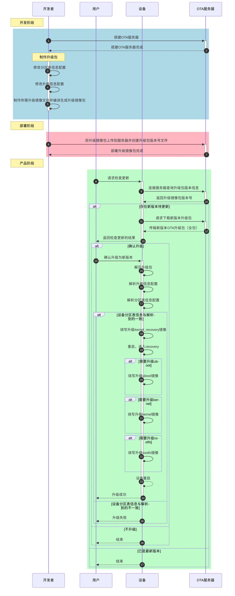

# **04-OTA (EMMC) 在线升级方案**

# 【1】说明<a id="section1"></a>

1. 本文档编辑时间：2024-12-18
2. OTA升级过程以X2600 Halley7V10 EMMC为例进行
3. SDK中的目录以X2600 Halley7V10 的SDK环境为例，其他SDK环境依据这个进行参考

# 【2】OTA升级简介<a id="section2"></a>

## 【2.1】OTA介绍<a id="section2-1"></a>

​	OTA: 是一整套的设备在线升级方案，支持升级uboot，kernel，recovery，system分区。

## 【2.2】升级策略<a id="section2-2"></a>

* 在服务器端升级包路径下存放VERSION文件，记录升级包的版本；设备端在`/usr/data/VERSION`文件中记录设备当前的系统版本。
* 检测升级时，设备通过`/usr/data/ota_res/recovery.conf`配置文件中的`url`得到`current_version_full.conf`。解析这个文件得到升级包路径，获取升级包版本，与当前系统版本做比较，如果升级包版本大于当前系统版本，则启动升级程序进行升级。升级成功后，更新本地`/usr/data/VERSION`文件，否则不进行升级。

## 【2.3】OTA升级时序图<a id="section2-3"></a>



# 【3】OTA服务器的搭建<a id="section3"></a>

​	在[《01_OTA简介与docker服务器搭建.md》](./01_OTA简介与docker服务器搭建.md)中介绍了一个通过nginx+python实现的https服务器，该服务器使用docker方式搭建，如果需要可以参考。在服务器搭建完成之后，需要在指定的OTA升级目录（以上述搭建服务器为例，该目录为`$DOCK_SERVER_PATH/ota`）下存放一个`current_version_full.conf`文件，在这个文件中保存着OTA升级包在服务器中的存放位置，可以参考`device/x2600halley7/ota-overlay/package_config/current_version.conf`文件示例进行修改，示例如下：

```
{
  "server":{
    "ip":"10.1.4.187",
    "url":"https://10.1.4.187/version3"
  }
}
```

​	其中`ip`是OTA服务器的IP地址，`url`是升级包在服务器的存放位置，上述示例中指定的OTA升级包路径为`$DOCK_SERVER_PATH/ota/versions`（以上述搭建服务器为例）。

# 【4】开发板初始环境搭建<a id="section4"></a>

​	对于下载的SDK，首先需要在SDK顶层目录下执行`source build/envsetup.sh`配置环境变量，然后在执行`lunch`，如下（以Halley7 V10开发板为例，基于EMMC介质的OTA升级为例）：

_在线升级方案.0.png)

​	修改`device/x2600halley7/ota-overlay/package_config/recovery.conf`文件来配置服务器中`current_version_full.conf`文件的存放位置，以[【3】OTA服务器的搭建](#section3)中配置的环境为例，`recovery.conf`内容如下：

```
{
  "server":{
    "ip":"10.1.4.187",
    "url":"https://10.1.4.187",
    "rpt_url":""
  }
}
```

​	其中`ip`是OTA服务器的IP地址，`url`是`current_version_full.conf`文件在服务器上的存放位置，在此处的环境配置下也就是`$DOCK_SERVER_PATH/ota/`，`rpt_url`为上报升级状态的服务器地址，如果没有，设置为空。

​	然后执行`make`命令编译镜像，编译出来的镜像如下：

```c
test@user:~/release/x2600/out/product/x2600halley7.v10_msc_6.6_ota-eng/image$ ls -l
total 95576
-rw-r--r-- 1 test sw   5988416 Nov 19 14:16 kernel
-rw-r--r-- 1 test sw   9199680 Nov 19 14:18 kernel_recovery
-rw-r--r-- 1 test sw 209715200 Nov 19 14:19 system.ext2
-rw-r--r-- 1 test sw    233528 Nov 19 14:18 uboot
```

​	执行`cat out/product/x2600halley7.v10_msc_6.6_ota-eng/system/etc/ota_res/recovery.conf`验证配置的recovery是否正确，如果正确则将编译出来的镜像拷贝到PC上，用于后续的烧录操作。

# 【5】OTA升级包制作<a id="section5"></a>

## 【5.1】修改分区表信息配置<a id="section5-1"></a>

​	修改`device/x2600halley7/ota-overlay/package_config/partition_mmc.conf`文件配置EMMC的大小和分区情况，具体的分区情况应与uboot中配置的分区表保持一致（即与EMMC的实际分区情况保持一致）。以X2600 Halley7V10为例，OTA升级时EMMC的分区表配置文件为`u-boot/board/ingenic/x2600_halley7/partitions_mmc_ota.tab`（可根据实际情况进行适当地修改），那么`partition_mmc.conf`文件中配置的分区信息就应该与此文件中的保持一致，如下图所示：

_在线升级方案.1.png)

_在线升级方案.2.png)

## 【5.2】修改升级信息配置<a id="section5-2"></a>

​	修改`device/x2600halley7/ota-overlay/package_config/customization_mmc.conf`文件配置升级信息，参考如下：

_在线升级方案.3.png)

​	上述提供的文档先升级kernel_recovery，启动kernel_recovery（ramdisk）之后再升级uboot、kernel、system，具体所需升级的文件可根据实际情况进行修改。

## 【5.3】待升级镜像文件制作<a id="section5-3"></a>

### 【5.3.1】kernel_recovery升级镜像文件制作<a id="section5-3-1"></a>

#### 【5.3.1.1】ramdisk的制作<a id="section5-3-1-1"></a>

​	因为编译生成kernel_recovery时需要ramdisk，ramdisk的制作是根据`ramdisk_mmc.conf`文件（以EMMC为例，文件位置为：`device/x2600halley7/ota-overlay/ramdisk_config/ramdisk_mmc.conf`）中列出的文件列表信息从`out/product/x2600halley7.v10_msc_6.6_ota-eng/obj/buildroot-intermediate/target/`目录（即`target`目录）下进行抽取的。如果需要修改ramdisk中的文件，则可以通过修改`ramdisk_mmc.conf`文件进行添加和删除。

​	下面看一下`ramdisk_mmc.conf`文件的内容：

_在线升级方案.11.png)

​	每一行的内容都是文件在`target`目录下的相对路径，以`./lib/firmware`和`./etc/init.d/S21data`为例（参见下图），因为`./lib/firmware`是一个目录，其在制作ramdisk的时候会将这个目录抽取出来，而`./etc/init.d/S21data`是一个文件，则只会抽取这一个文件，若当前行以`#`开头，则不进行抽取。

_在线升级方案.4.png)

​	如果想要验证抽取的ramdisk是否是自己所需要的，可以在编译完kernel_recovery之后到`out/product/x2600halley7.v10_msc_6.6_ota-eng/obj/kernel_recovery-intermediate/ramdisk`目录（根据实际情况修改路径）下进行查看，如下图：

_在线升级方案.5.png)

#### 【5.3.1.2】kernel_recovery的defconfig配置<a id="section5-3-1-2"></a>

​	以X2600 Halley7 V10 EMMC OTA升级为例，其所需要的默认配置文件是`x2600_halley7_v1.0_mmc_recovery_defconfig`文件，具体开发板所对应的是哪个配置可参见`device/x2600halley7/kernel-recovery.mk`文件（以Halley7V10开发板为例），如下图所示：

_在线升级方案.6.png)

​	如果需要修改kernel_recovery的配置，可以在SDK顶层目录下执行`make kernel_recovery-menuconfig`命令，需要注意必须配置`CONFIG_BLK_DEV_INITRD`并且将`CONFIG_INITRAMFS_SOURCE`配置为`ramdisk.cpio.gz`，如下图所示（必须配置）：

_在线升级方案.15.png)

#### 【5.3.1.3】kernel_recovery文件的编译生成<a id="section5-3-1-3"></a>

​	在SDK顶层目录下执行`make kernel_recovery`命令单独编译kernel_recovery，执行`make`命令时进行整体编译的过程中会编译kernel_recovery，生成的镜像文件存储在`out/product/x2600halley7.v10_msc_6.6_ota-eng/image/`目录下。

​	如果生成的kernel_recovery不能启动到ramdisk环境，请转到[【8】OTA升级测试常见问题](#section8)。

### 【5.3.2】uboot升级镜像文件制作<a id="section5-3-2"></a>

​	和uboot编译相关的文件可参考`device/x2600halley7/uboot.mk`，对于Halley7 V10 EMMC（msc0）介质的开发板其对应的config为`x2600_halley7_xImage_msc0_ota`，如下图所示：

_在线升级方案.7.png)

​	需要注意`x2600_halley7_uImage_msc0`和`x2600_halley7_xImage_msc0_ota`的主要区别是`x2600_halley7_xImage_msc0_ota`增加了`SPL_OS_BOOT`、`GPT_TAB_BUILT_IN`和`OTA_VERSION30`选项（Option），新增加的这几个选项会从`board/ingenic/x2600_halley7/partitions_mmc_ota.tab`中解析EMMC的分区信息，所以不再需要将生成的uboot镜像文件拷贝到本地PC上用烧录工具填充分区表信息，这是EMMC介质OTA升级和Nand介质OTA升级在升级uboot时的最主要区别。

​	在SDK顶层目录下执行`make uboot`可单独编译uboot，生成的文件在`out/product/x2600halley7.v10_msc_6.6_ota-eng/image/`目录下。

### 【5.3.3】kernel升级镜像文件制作<a id="section5-3-3"></a>

​	和产品的kernel制作方法一致，生成的镜像文件在`out/product/x2600halley7.v10_msc_6.6_ota-eng/image/`目录下。

### 【5.3.4】rootfs升级镜像文件制作<a id="section5-3-4"></a>

#### 【5.3.4.1】buildroot的defconfig配置<a id="section5-3-4-1"></a>

​	X2600 Halley7 OTA升级时buildroot的默认配置文件是`x26xx_linux_defconfig`，具体开发板对应的是哪个配置可参见`device/x2600halley7/device.mk`文件（以Halley7V10开发板为例），如下图所示：

_在线升级方案.8.png)

​	如果需要修改，必须配置`BR2_PACKAGE_CJSON`（编译recovery等依赖的库）和`BR2_PACKAGE_HOST_PYTHON3`（制作升级镜像包时使用）。

#### 【5.3.4.2】rootfs-overlay的使用<a id="section5-3-4-2"></a>

​	在`device/x2600halley7`目录下的`rootfs-overlay`用于存储最基本的一些文件供开发板使用，对于EMMC OTA升级时所需要的文件则存储在`device/x2600halley7/ota-overlay/rootfs_mmc_overlay`目录下，比如挂载usrdate分区、挂载storage分区（用于存储下载的OTA升级包）、拷贝`/etc/ota_res/`到`/usr/data/`目录下等相关的脚本文件等，例如：

_在线升级方案.9.png)

​	在上述在EMMC OTA升级时所需的最基本文件中，`etc/init.d/S12storage`启动脚本文件用于在系统启动时通过解析`/etc/ota_res/partition_mmc.conf`文件来实现自动挂载storage分区到`/storage`目录，`etc/init.d/S21data`启动脚本文件则用于在系统启动时通过解析`/etc/ota_res/partition_mmc.conf`文件来实现自动挂载usrdate分区到`/usr/data`目录，需要注意这两个启动脚本文件都是通过调用`mount_mmc_partition.sh`脚本实现的挂载操作，在`mount_mmc_partition.sh`脚本主要就是通过`mount`命令来实现挂载操作。

## 【5.4】编译生成升级镜像包<a id="section5-4"></a>

​	上述镜像文件制作完成之后都在`out/product/x2600halley7.v10_msc_6.6_ota-eng/image`目录下，如下：

```
test@user:~/release/x2600/out/product/x2600halley7.v10_msc_6.6_ota-eng/image$ ls -l
total 95576
-rw-r--r-- 1 test sw   5988416 Nov 19 14:16 kernel
-rw-r--r-- 1 test sw   9199680 Nov 19 14:18 kernel_recovery
-rw-r--r-- 1 test sw 209715200 Nov 19 14:19 system.ext2
-rw-r--r-- 1 test sw    233528 Nov 19 14:18 uboot
```

​	然后在SDK顶层目录下执行`make ota_mkpackage`命令来制作OTA升级镜像包，其结果如下图所示：

_在线升级方案.10.png)

_在线升级方案.11.png)

# 【6】升级包部署<a id="section6"></a>

​	在[【3】OTA服务器的搭建](#section3)中提到的`current_version_full.conf`文件中保存着OTA升级包在服务器中的存放位置，以上述配置为例，我们则需要将OTA升级包上传到服务器的`$DOCK_SERVER_PATH/ota/versions`目录下，上传完之后`$DOCK_SERVER_PATH/ota/versions`目录内容如下所示：

```
user@user-HP-Compaq-8200-Elite-USDT-PC:~/ota/docker_server/ota/version3$ tree
.
├── mmc
│   └── update.zip
├── ota-package.7z
└── sha1Tab

1 directory, 3 files
```

​	需要注意，此处上传OTA升级包到服务器之后不再需要解压升级包并将解压的升级包存储到`full`目录下，这是与NAND OTA升级在升级包部署过程中一个最大的不同之处。

​	然后在服务器升级包路径下创建VERSION文件并写入版本号，例如`echo 16 > VERSION`。

# 【7】OTA升级测试<a id="section7"></a>

​	将制作OTA升级包时升级的zero文件拷贝到PC上和[【4】开发板初始环境搭建](#section4)中生成的镜像文件一起烧录到开发板上，烧录工具配置参考下图：

_在线升级方案.12.png)

​	启动到system后需要配置网络连接服务器，下面分别介绍WIFI和以太网的网络配置方法：

​	**WIFI网络配置方法：**

​		方法一   ——   在编译builroot时直接将其打包在根文件系统中的：

​			修改`buildroot/package/wpa_supplicant/wpa_supplicant.conf`文件来配置要连接的WIFI或者在`device/x2600halley7/rootfs-overlay/etc`目录下添加`wpa_supplicant.conf`文件

​		方法二   ——   开发板启动后动态配置：

​			在开发板启动之后可以使用`wpa_passphrase`命令动态配置要连接的WIFI，比如`wpa_passphrase "ssid" "passphrase" | tee -a /etc/wpa_supplicant.conf`。也可以手动修改`/etc/wpa_supplicant.conf`文件进行配置。

​		配置完`wpa_supplicant.conf`文件后执行`wifi_download_fw_and_up.sh`启动WIFI。

​	**以太网网络配置方法：**

​		对于通过以太网升级的目前还没有提供配置IP地址的脚本，如果需要可自行添加。

​	配置好网络后，使用`ping`命令来确认是否与服务器成功连接。`ping`通之后执行`ota_update_script.sh`检验是否有更新待升级，如果需要进行升级，输入y，如下图所示：

_在线升级方案.13.png)

​	输入y之后开始进行OTA升级，系统先升级recovery，然后启动ramdisk升级uboot、kernel和system（具体的根据上面配置的升级信息），最后再次启动，本地VERSION被更新。（详细的升级流程参见[【2.3】OTA升级时序图](#section2-3)）

# 【8】OTA升级测试常见问题<a id="section8"></a>

## 【8.1】升级包制作失败，出现如下错误信息<a id="section8-1"></a>

```
Could not find the main class: com.android.signapk.SignApk. Program will exit.  
 adding: update008/ (stored 0%)  
 adding: update008/xImage_003 (deflated 0%)  
Exception in thread "main" java.lang.UnsupportedClassVersionError: com/android/signapk/SignApk : Unsupported major.minor version 51.0  
 at java.lang.ClassLoader.defineClass1(Native Method)  
 at java.lang.ClassLoader.defineClassCond(ClassLoader.java:631)  
 at java.lang.ClassLoader.defineClass(ClassLoader.java:615)  
 at java.security.SecureClassLoader.defineClass(SecureClassLoader.java:141)
```

​	由于升级包制作程序中有提前编译好的jar包，编译jar包时的java版本和您当前制作升级包的服务器java版本不匹配导致。解决办法，执行如下命令：

```
/*　以halley5为例　*/  
cd packages/updater/ota_package_maker/otapackage/depmod/signature/signapk  
rm -f signapk.jar  
./build.sh  
cd -  
rm out/product/halley5/obj/ota/ -rf  
rm out/product/halley5/image/ota/ -rf  
make ota_mkpackage
```

## 【8.2】升级开始解析sha1Tab出错<a id="section8-2"></a>

​	每次制作升级包前需要删除之前升级包的sha1Tab

```
rm out/product/"板级"/image/ota/ -rf  
make ota_mkpackage
```

## 【8.3】无法启动recovery，Uncompressing Linux...后无打印<a id="section8-3"></a>

​	可能由于recovery镜像太大（通常为10M左右），内核自解压覆盖了自解压程序，可以通过配置`CONFIG_XIMAGE_LDADDR`（比如将`0x80F00000`改为`0x81000000`）或者裁剪ramdisk或recovery内核来解决。

## 【8.4】recovery启动失败：Failed to execute /linuxrc (error -2)<a id="section8-4"></a>

​	错误信息如下：

_在线升级方案.16.png)

​	可能的原因是缺少了busybox所需的库，首先通过`readelf -d busybox`确定busybox所依赖的库，如下：

_在线升级方案.17.png)

​	如果ramdisk中缺少库，则将其补上，重新编译测试。如果还不能启动ramdisk，则看是否缺少必要的C库。
