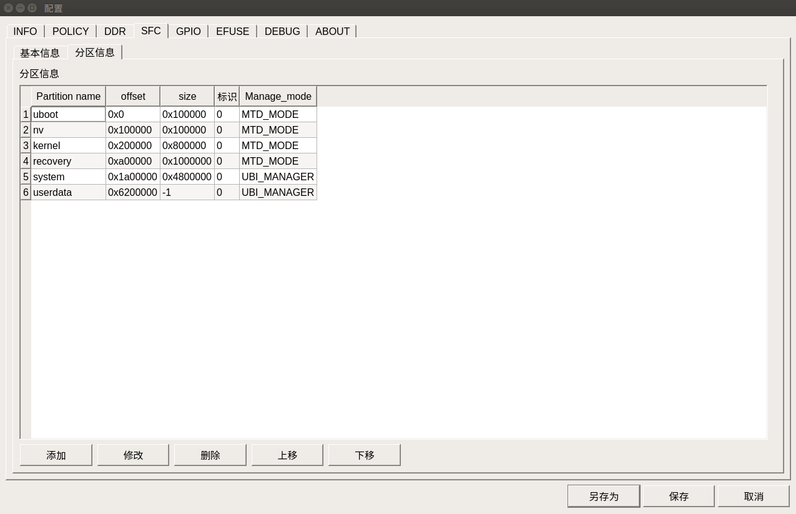
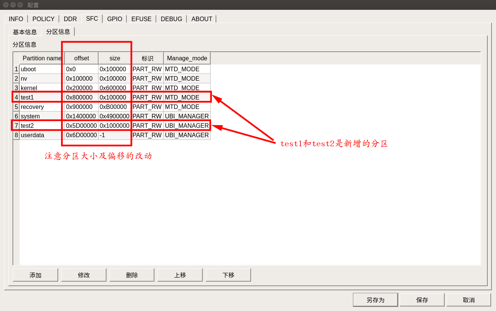
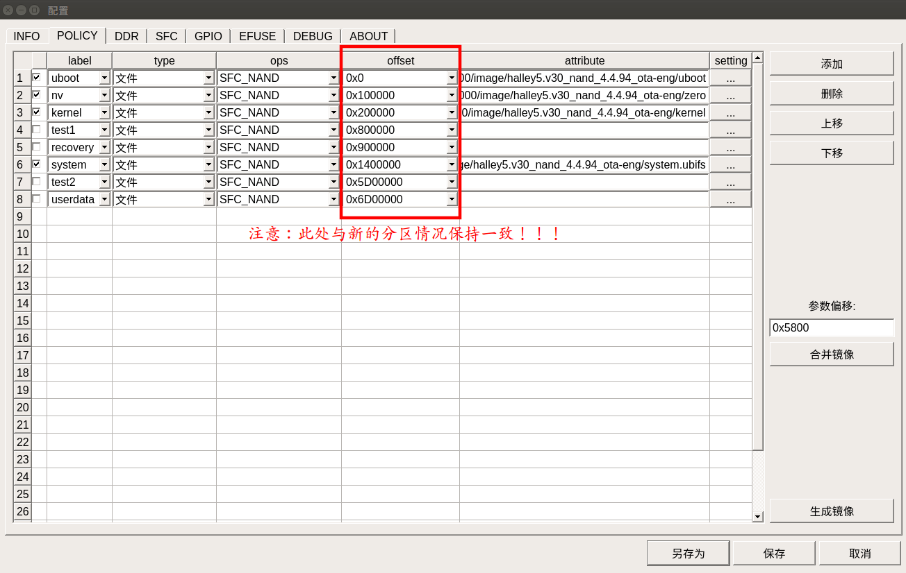
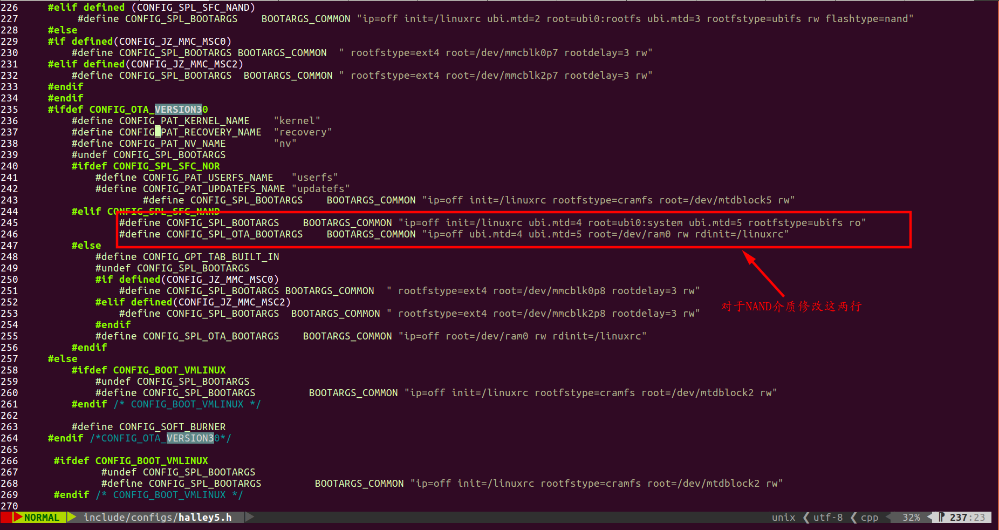
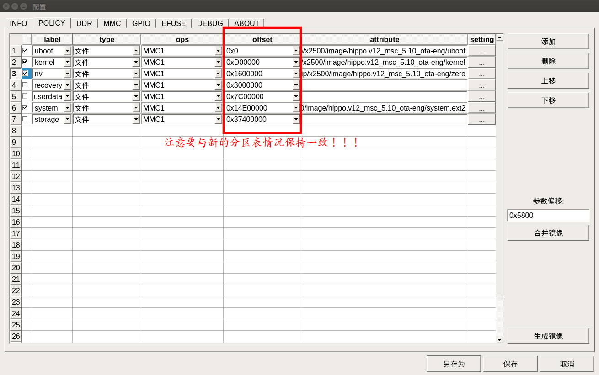
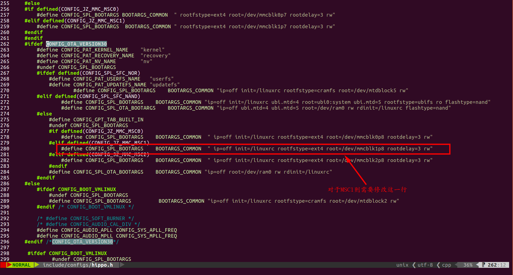

# 05_OTA自定义分区说明.md

# 【1】说明

1. 本文档编辑时间：2024-12-18
2. 对于NAND介质的自定义分区以X2000 Halley5 NAND为例，对于EMMC介质的自定义分区以X2500 HippoV12 EMMC为例
3. 本文档仅介绍自定义分区需要修改哪些文件，关于NAND介质和EMMC介质的OTA升级详细操作请参见[03-OTA_(SPI-nand_Flash)_在线升级方案.md](./03-OTA_(SPI-nand_Flash)_在线升级方案.md)和[04-OTA_(EMMC)_在线升级方案.md](./04-OTA_(EMMC)_在线升级方案.md)
4. 目前仅支持对uboot、kernel、recovery、system分区进行升级，暂不支持对新增自定义分区进行升级。

# 【2】NAND介质的自定义分区

## 【2.1】分区作用说明

​	以X2000 Halley5 V30开发板上的128MB NAND默认配置的分区为例进行介绍，其默认分区如下图所示：



​	各分区作用用下：

|  分区名  |                           分区作用                           |
| :------: | :----------------------------------------------------------: |
|  uboot   |                      用于存放uboot镜像                       |
|    nv    | 主要作用是判断加载哪个分区（kernel分区还是recovery分区）的内核镜像进行启动 |
|  kernel  |                    用于存放Linux内核镜像                     |
| recovery | 用于存放kernel_recovery镜像，kernel_recovery的主要作用是启动到ramdisk环境进行升级rootfs |
|  system  |      用于 Linux 内核启动后挂载的文件系统（rootfs镜像）       |
| userdata |        用于存放用户的应用程序和数据，包括自定义数据等        |

## 【2.2】自定义分区

​	根据上面的自定义分区，现在根据需求自定义分区，一个自定义分区例子如下（调整之后的分区情况）：

|  分区名  | 分区大小  |
| :------: | :-------: |
|  uboot   | 0x100000  |
|    nv    | 0x100000  |
|  kernel  | 0x600000  |
|  test1   | 0x100000  |
| recovery | 0xB00000  |
|  system  | 0x4900000 |
|  test2   | 0x1000000 |
| userdata | 0x1300000 |



​	自定义完分区后，修改烧录文件的对应的偏移地址用于后续烧录镜像文件，上述分区表对应的配置如下图所示：



​	在烧录镜像文件之前，还需要修改`u-boot/include/configs/halley5.h`文件来配置根文件系统的挂载位置等，修改位置如下图所示：



​	修改之后的内容如下：

```diff
(python2.7) cwang@user:~/work/x2000-kernel-5.10/u-boot$ git diff include/configs/halley5.h
diff --git a/include/configs/halley5.h b/include/configs/halley5.h
index 968abae96..2c5e6eadd 100644
--- a/include/configs/halley5.h
+++ b/include/configs/halley5.h
@@ -242,8 +242,8 @@
                        #define CONFIG_PAT_UPDATEFS_NAME "updatefs"
                        #define CONFIG_SPL_BOOTARGS    BOOTARGS_COMMON "ip=off init=/linuxrc rootfstype=cramfs root=/dev/mtdblock5 rw"
                #elif CONFIG_SPL_SFC_NAND
-                       #define CONFIG_SPL_BOOTARGS    BOOTARGS_COMMON "ip=off init=/linuxrc ubi.mtd=4 root=ubi0:system ubi.mtd=5 rootfstype=ubifs ro"
-                       #define CONFIG_SPL_OTA_BOOTARGS    BOOTARGS_COMMON "ip=off ubi.mtd=4 ubi.mtd=5 root=/dev/ram0 rw rdinit=/linuxrc"
+                       #define CONFIG_SPL_BOOTARGS    BOOTARGS_COMMON "ip=off init=/linuxrc ubi.mtd=5 root=ubi0:system ubi.mtd=7 rootfstype=ubifs ro"
+                       #define CONFIG_SPL_OTA_BOOTARGS    BOOTARGS_COMMON "ip=off ubi.mtd=5 ubi.mtd=7 root=/dev/ram0 rw rdinit=/linuxrc"
                #else
                        #define CONFIG_GPT_TAB_BUILT_IN
                        #undef CONFIG_SPL_BOOTARGS
```

​	然后将新编译的uboot拷贝到PC上通过烧录工具烧录到开发板中，然后正常启动到根文件系统之后开始重新制作OTA升级包进行OTA升级操作，制作升级包重点需要修改的文件有`device/halley5/ota-overlay/package_config/partition_nand.conf`文件（NAND介质的分区表信息配置）和`device/halley5/ota-overlay/package_config/customization_nand.conf`文件（NAND介质的升级信息配置），修改后的文件内容分别如下所示：

- `device/halley5/ota-overlay/package_config/partition_nand.conf`文件的修改：

  原内容如下：

  ```c
  (python2.7) cwang@user:~/work/x2000-kernel-4.4/device/halley5/ota-overlay/package_config$ cat partition_nand.conf
  [storageinfo]
  mediumtype=nand
  capacity=128MB
  [partition]
  item1=uboot,0x0,0x100000,mtdblock0
  item2=nv,0x100000,0x100000,mtdblock1
  item3=kernel,0x200000,0x800000,mtdblock2
  item4=recovery,0xa00000,0x1000000,mtdblock3
  item5=system,0x1a00000,0x4800000,mtdblock4
  item6=userdata,0x6200000,0x1e00000,mtdblock5
  ```

  修改部分如下：

  ```c
  (python2.7) cwang@user:~/work/x2000-kernel-4.4/device/halley5/ota-overlay/package_config$ git diff partition_nand.conf 
  diff --git a/ota-overlay/package_config/partition_nand.conf b/ota-overlay/package_config/partition_nand.conf
  index 87e8410..2c8f816 100644
  --- a/ota-overlay/package_config/partition_nand.conf
  +++ b/ota-overlay/package_config/partition_nand.conf
  @@ -4,7 +4,9 @@ capacity=128MB
   [partition]
   item1=uboot,0x0,0x100000,mtdblock0
   item2=nv,0x100000,0x100000,mtdblock1
  -item3=kernel,0x200000,0x800000,mtdblock2
  -item4=recovery,0xa00000,0x1000000,mtdblock3
  -item5=system,0x1a00000,0x4800000,mtdblock4
  -item6=userdata,0x6200000,0x1e00000,mtdblock5
  +item3=kernel,0x200000,0x600000,mtdblock2
  +item4=test1,0x800000,0x100000,mtdblock3
  +item5=recovery,0x900000,0xB00000,mtdblock4
  +item6=system,0x1400000,0x4900000,mtdblock5
  +item7=test2,0x5D00000,0x1000000,mtdblock6
  +item8=userdata,0x6D00000,0x1300000,mtdblock7
  ```

- `device/halley5/ota-overlay/package_config/customization_nand.conf`文件：

  原内容如下：

  ```
  (python2.7) cwang@user:~/work/x2000-kernel-4.4/device/halley5/ota-overlay/package_config$ cat customization_nand.conf 
  [update]
  mediumtype=nand
  imgcnt=4
  [image1]
  name=kernel_recovery
  type=normal
  offset=0xa00000
  bootmode=normal
  updatemode=slice
  [image2]
  name=uboot
  type=normal
  offset=0x0
  bootmode=recovery
  updatemode=slice
  [image3]
  name=kernel
  type=normal
  offset=0x200000
  bootmode=recovery
  updatemode=slice
  [image4]
  name=system.ubifs
  type=ubifs
  offset=0x1a00000
  bootmode=recovery
  updatemode=slice
  ```

  修改部分如下：

  ```diff
  (python2.7) cwang@user:~/work/x2000-kernel-4.4/device/halley5/ota-overlay/package_config$ git diff customization_nand.conf
  diff --git a/ota-overlay/package_config/customization_nand.conf b/ota-overlay/package_config/customization_nand.conf
  index e1f54f7..f84c579 100644
  --- a/ota-overlay/package_config/customization_nand.conf
  +++ b/ota-overlay/package_config/customization_nand.conf
  @@ -1,10 +1,10 @@
   [update]
   mediumtype=nand
  -imgcnt=4
  +imgcnt=5
   [image1]
   name=kernel_recovery
   type=normal
  -offset=0xa00000
  +offset=0x900000
   bootmode=normal
   updatemode=slice
   [image2]
  @@ -22,6 +22,12 @@ updatemode=slice
   [image4]
   name=system.ubifs
   type=ubifs
  -offset=0x1a00000
  +offset=0x1400000
  +bootmode=recovery
  +updatemode=slice
  +[image5]
  +name=test2.ubifs
  +type=ubifs
  +offset=0x5D00000
   bootmode=recovery
   updatemode=slice
  ```

​	然后就可以按照NAND介质的OTA升级进行操作了。

## 【2.3】注意事项

1. NV分区目前必须放在第二个分区（mtd1），也就是说uboot分区和NV分区在自定义分区时不能修改。
2. 目前NAND分区最多支持10个，也就是mtd0 ~ mtd9

# 【3】EMMC介质的自定义分区

## 【3.1】分区作用说明

​	以X2500 Hippo V12开发板上的4GB EMMC默认配置的分区为例进行介绍，其默认分区如下所示：

```bash
(python2.7) cwang@user:~/work/x2500-kernel-5.10/u-boot$ cat board/ingenic/hippo/partitions_mmc_ota.tab
property:
    disk_size = 4096m
    gpt_header_lba = 512
    custom_signature = 0

partition:
	#name     =  start,   size, fstype
	uboot     =     0m,     3m, EMPTY
	kernel	  =     3m,     9m, EMPTY
	recovery  =    12m,    16m, EMPTY
	nv	  =    28m,    16m, EMPTY
	reserved1 =    44m,     4m, EMPTY
	reserved2 =    48m,    64m, EMPTY
	resource  =   112m,  200m, LINUX_FS
	userdata  =   312m,   100m, LINUX_FS
	system    =   412m,   500m, LINUX_FS
	storage   =   912m,	 2048m, LINUX_FS

#fstype could be: LINUX_FS, FAT_FS, EMPTY
```

​	各分区作用用下：

|  分区名   |                           分区作用                           |
| :-------: | :----------------------------------------------------------: |
|   uboot   |                      用于存放uboot镜像                       |
|  kernel   |                    用于存放Linux内核镜像                     |
| recovery  | 用于存放kernel_recovery镜像，kernel_recovery的主要作用是启动到ramdisk环境进行升级rootfs |
|    nv     | 主要作用是判断加载哪个分区（kernel分区还是recovery分区）的内核镜像进行启动 |
| reserved1 |                       没用处，可以删除                       |
| reserved2 |                       没用处，可以删除                       |
| resource  |                       没用处，可以删除                       |
| userdata  |        用于存放用户的应用程序和数据，包括自定义数据等        |
|  system   |      用于 Linux 内核启动后挂载的文件系统（rootfs镜像）       |
|  storage  |               用于存放从服务器下载的OTA升级包                |

## 【3.2】自定义分区

​	根据上面的自定义分区，现在根据需求自定义分区，一个自定义分区例子如下（调整之后的分区情况）：

```
(python2.7) cwang@user:~/work/x2500-kernel-5.10/u-boot$ cat board/ingenic/hippo/partitions_mmc_ota.tab
property:
    disk_size = 4096m
    gpt_header_lba = 512
    custom_signature = 0

partition:
	#name     =  start,   size, fstype
	uboot     =     0m,     3m, EMPTY
	test1     =     3m,     10m, EMPTY
	kernel	  =     13m,    9m, EMPTY
	nv        =     22m,    16m, EMPTY
	test2     =     38m,    10m, EMPTY
	recovery  =     48m,    16m, EMPTY
	test3     =     64m,    20m, EMPTY
	test4     =     84m,    40m, EMPTY
	userdata  =     124m,   200m, LINUX_FS
	test5     =     324m,   10m,  LINUX_FS
	system    =     334m,   500m, LINUX_FS
	test6     =     834m,   50m,  EMPTY
	storage   =     884m,	2048m, LINUX_FS
	test7     =     2932m,  1164m, LINUX_FS

#fstype could be: LINUX_FS, FAT_FS, EMPTY
```

​	自定义完分区后，修改烧录文件的对应的偏移地址用于后续烧录镜像文件，上述分区表对应的配置如下图所示：



​	因为上述自定义分区中system所在的分区发生了变化，所以还需要`u-boot/include/configs/hippo.h`文件来配置根文件系统的挂载位置等，修改位置如下图所示：



​	修改之后的内容如下（system现在处于mmcblk1p10分区）：

```diff
(python2.7) cwang@user:~/work/x2500-kernel-5.10/u-boot$ git diff include/configs/hippo.h
diff --git a/include/configs/hippo.h b/include/configs/hippo.h
index 860a80597..6f1446749 100644
--- a/include/configs/hippo.h
+++ b/include/configs/hippo.h
@@ -277,7 +277,7 @@
                        #if defined(CONFIG_JZ_MMC_MSC0)
                                #define CONFIG_SPL_BOOTARGS    BOOTARGS_COMMON  " ip=off init=/linuxrc rootfstype=ext4 root=/dev/mmcblk0p8 rootdelay=3 rw"
                        #elif defined(CONFIG_JZ_MMC_MSC1)
-                               #define CONFIG_SPL_BOOTARGS    BOOTARGS_COMMON  " ip=off init=/linuxrc rootfstype=ext4 root=/dev/mmcblk1p8 rootdelay=3 rw"
+                               #define CONFIG_SPL_BOOTARGS    BOOTARGS_COMMON  " ip=off init=/linuxrc rootfstype=ext4 root=/dev/mmcblk1p10 rootdelay=3 rw"
                        #elif defined(CONFIG_JZ_MMC_MSC2)
                                #define CONFIG_SPL_BOOTARGS    BOOTARGS_COMMON  " ip=off init=/linuxrc rootfstype=ext4 root=/dev/mmcblk2p8 rootdelay=3 rw"
                        #endif
```

​	因为分区表信息有改动，所以我们还需要修改`device/hippo/ota-overlay/package_config/partition_mmc.conf`文件（EMMC介质的分区表信息配置），该文件是实现动态挂载EMMC分区的基础，其修改内容如下：

​	原文件内容：

```
(python2.7) cwang@user:~/work/x2500-kernel-5.10/device/hippo/ota-overlay$ cat package_config/partition_mmc.conf 
[storageinfo]
mediumtype=mmc
capacity=4096MB
[partition]
item1=uboot,0x0,0x300000,mmcblk1
item2=kernel,0x300000,0x900000,mmcblk1p1
item3=recovery,0xc00000,0x1000000,mmcblk1p2
item4=nv,0x1c00000,0x1000000,mmcblk1p3
item5=reserved1,0x2c00000,0x400000,mmcblk1p4
item6=reserved2,0x3000000,0x4000000,mmcblk1p5
item7=resource,0x7000000,0xc800000,mmcblk1p6
item8=userdata,0x13800000,0x6400000,mmcblk1p7
item9=system,0x19c00000,0x1f400000,mmcblk1p8
item10=storage,0x39000000,0x80000000,mmcblk1p9
```

​	修改内容如下：

```diff
(python2.7) cwang@user:~/work/x2500-kernel-5.10/device/hippo/ota-overlay$ git diff package_config/partition_mmc.conf
diff --git a/ota-overlay/package_config/partition_mmc.conf b/ota-overlay/package_config/partition_mmc.conf
index 9436e73..f80513e 100644
--- a/ota-overlay/package_config/partition_mmc.conf
+++ b/ota-overlay/package_config/partition_mmc.conf
@@ -3,12 +3,16 @@ mediumtype=mmc
 capacity=4096MB
 [partition]
 item1=uboot,0x0,0x300000,mmcblk1
-item2=kernel,0x300000,0x900000,mmcblk1p1
-item3=recovery,0xc00000,0x1000000,mmcblk1p2
-item4=nv,0x1c00000,0x1000000,mmcblk1p3
-item5=reserved1,0x2c00000,0x400000,mmcblk1p4
-item6=reserved2,0x3000000,0x4000000,mmcblk1p5
-item7=resource,0x7000000,0xc800000,mmcblk1p6
-item8=userdata,0x13800000,0x6400000,mmcblk1p7
-item9=system,0x19c00000,0x1f400000,mmcblk1p8
-item10=storage,0x39000000,0x80000000,mmcblk1p9
+item2=test1,0x300000,0xA00000,mmcblk1p1
+item3=kernel,0xD00000,0x900000,mmcblk1p2
+item4=nv,0x1600000,0x1000000,mmcblk1p3
+item5=test2,0x2600000,0xA00000,mmcblk1p4
+item6=recovery,0x3000000,0x1000000,mmcblk1p5
+item7=test3,0x4000000,0x1400000,mmcblk1p5
+item8=test4,0x5400000,0x2800000,mmcblk1p7
+item9=userdata,0x7C00000,0xC800000,mmcblk1p8
+item10=test5,0x14400000,0xA00000,mmcblk1p9
+item11=system,0x14E00000,0x1F400000,mmcblk1p10
+item12=test6,0x34200000,0x3200000,mmcblk1p11
+item13=storage,0x37400000,0x80000000,mmcblk1p12
+item14=test7,0xB7400000,0x48C00000,mmcblk1p13
```

​	上述文件修改完之后，重新编译系统镜像（uboot、kernel_recovery、根文件系统等），并将生成的uboot镜像文件和根文件系统镜像烧录到开发板中，若根文件系统正常挂载，且`storage`分区与`userdata`分区挂载无误，则开始重新制作OTA升级包，制作OTA升级包所需重点需要修改的文件有`device/hippo/ota-overlay/package_config/partition_mmc.conf`文件（EMMC介质的分区表信息配置）和`device/hippo/ota-overlay/package_config/customization_mmc.conf`文件（EMMC介质的升级信息配置），因为在上述已经修改过了`partition_mmc.conf`文件，所以现在只需要再修改`customization_mmc.conf`文件，修改内容如下：

​	原文件内容：

```
(python2.7) cwang@user:~/work/x2500-kernel-5.10/device/hippo/ota-overlay$ cat package_config/customization_mmc.conf
[update]
mediumtype=mmc
imgcnt=4
[image1]
name=kernel_recovery
type=normal
offset=0xc00000
bootmode=normal
updatemode=slice
[image2]
name=uboot
type=normal
offset=0x0
bootmode=recovery
updatemode=slice
[image3]
name=kernel
type=normal
offset=0x300000
bootmode=recovery
updatemode=slice
[image4]
name=system.ext2
type=normal
offset=0x19c00000
bootmode=recovery
updatemode=slice
```

​	修改内容如下：

```diff
(python2.7) cwang@user:~/work/x2500-kernel-5.10/device/hippo/ota-overlay$ git diff package_config/customization_mmc.conf
diff --git a/ota-overlay/package_config/customization_mmc.conf b/ota-overlay/package_config/customization_mmc.conf
index 017668c..42e7ace 100644
--- a/ota-overlay/package_config/customization_mmc.conf
+++ b/ota-overlay/package_config/customization_mmc.conf
@@ -4,7 +4,7 @@ imgcnt=4
 [image1]
 name=kernel_recovery
 type=normal
-offset=0xc00000
+offset=0x3000000
 bootmode=normal
 updatemode=slice
 [image2]
@@ -16,12 +16,12 @@ updatemode=slice
 [image3]
 name=kernel
 type=normal
-offset=0x300000
+offset=0xD00000
 bootmode=recovery
 updatemode=slice
 [image4]
 name=system.ext2
 type=normal
-offset=0x19c00000
+offset=0x14E00000
 bootmode=recovery
 updatemode=slice
```

​	然后就可以按照EMMC介质的OTA升级进行操作了。

## 【3.3】注意实现

1. EMMC NV分区必须是p3分区吗，即`/dev/mmcblkxp3`。

