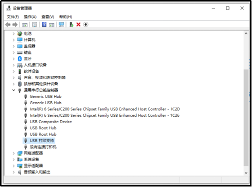
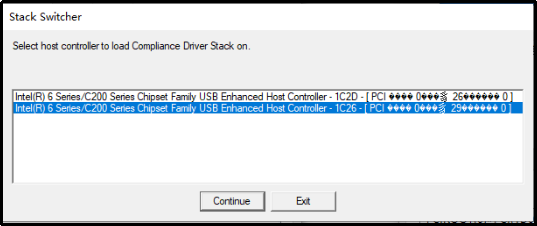
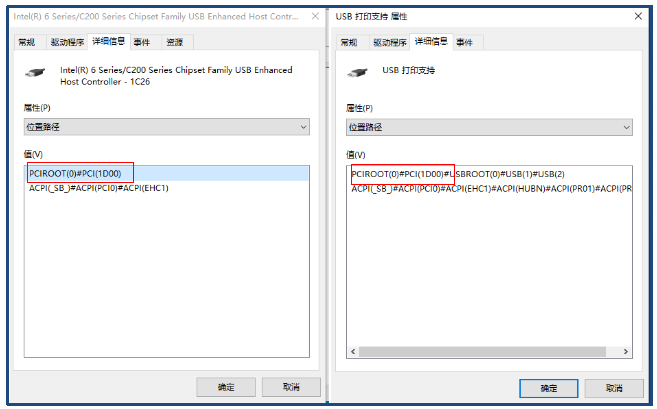
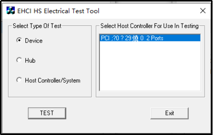
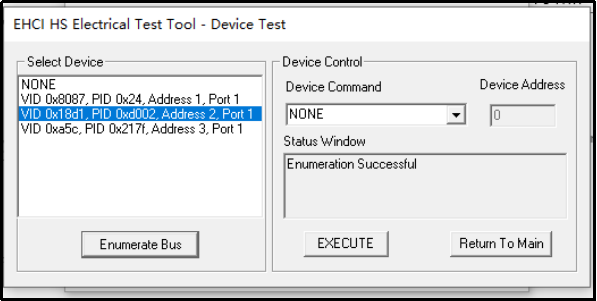
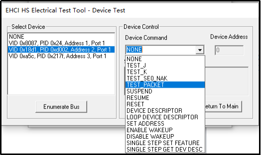
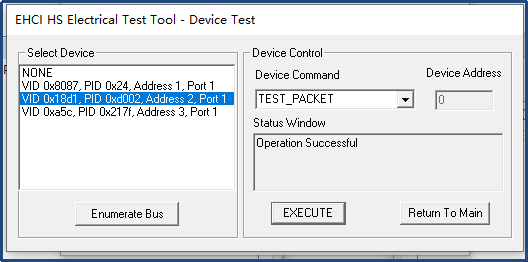
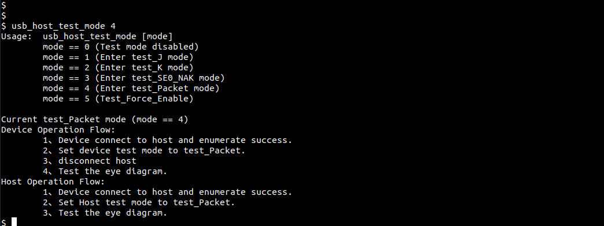
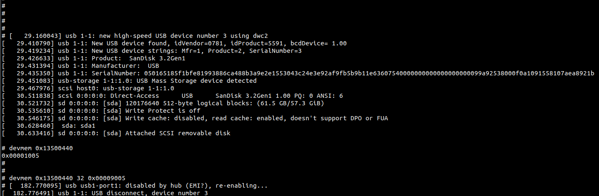

# 君正USB高速信号质量测试

## 测试原理

USB 2.0 SQ 的测试原理是，设置 USB 控制器的寄存器，使 USB 控制器进入 Test Packet Mode，USB 控制器就会持续产生并发送周期性的 Test Pattern。示波器通过检测 Test Pattern 的波形
来分析 USB 的信号完整性。
对于 ingenic 平台的 USB 2.0 Device 和 USB 2.0 Host 接口，设置 USB 控制器进入 Test Packet Mode 的方法有所不同：
* USB 2.0 Device，使用测试工具HSETT设置 USB 控制器进入 Test Packet Mode。
* USB 2.0 Host，使用测试命令设置 USB 控制器进入 Test Packet Mode。

***注：HSETT 是 USB 官方组织发布的一个发包工具（官网下载），安装前查看电脑 USB 接口类型,如果支持 3.0 标准则安装 xHCI HSETT，如果仅支持 2.0 标准则安装 EHCI HSETT***

## 测试模式进入方法

### USB Device 测试模式进入方法如下:

使用USB数据线将待测板上的USB 口与电脑连接。如果USB设备运行正常,会在主机端识别到设备，这里我们将待测设备配置为打印机类设备，可在电脑的设备管理器中查看，如下图。

打开 HS Electrical Test Tool，出现主控制器选择界面,如下图。界面中内容及出现情况与电脑有关，如果电脑仅包含一个主控制器，不会出现选择界面。注意EHCI HSETT 工具用于USB2.0，如果电脑只有 USB3.0 主控制器,会出现无法找到 USB2.0 主控制器的提示,并且不能使用。

从设备管理器进入，查看主控制器属性中的位置路径。查找与 USB 打印支持设备的位置路径关联的主控制器，如下图（主控制器的总线类型、设备和功能号信息，在下图界面的“常规”标签中）。

根据上图中信息确定选择 “Intel(R) 6 Series/C200 Series Chipset Family USB Enhanced Host Controller - 1C26”，点击 Continue 按键后出现选择测试类型的界面，如下图。

选择“Device”单击“TEST”，进入测试模式的界面，界面中列出了挂载在主控制器上的 USB 设备硬件 ID，选择待测设备，这里待测板是VID 0x18d1 PID 0xd002(freertos与linux USB所使用设备ID有所不同,图中展示为linux平台 USB 设备ID)。

点击“Enumerate Bus”重新与设备建立枚举,枚举成功出现如下提示。

HSETT 提供了多种设备命令，如下图。为了实现眼图测试,选择“TEST_PACKET ”单击“EXECUTE”，向 USB 设备发送设置 Test_Packet 模式的命令。

发送成功，并被 USB 设备正确响应后，出现如下提示,表示USB 待测设备已成功接收命令并进入了测试模式，通过 USB 接口连续循环地向外输出测试需要的信号。

### USB Host 测试模式进入方法如下:

君正 freertos 平台与 linux 平台的 USB host 进入测试方法略有不同。

#### freertos平台
暂未提供 USB host 驱动库，需要用户自行添加，能够实现枚举到设备并正常通信后，使用 usb_host_test_mode 命令使控制器进入相应测试模式，如下图:

#### linux平台
将USB切换至 host 模式后，USB 接口连接一个USB设备，枚举成功设备后，使用devmem命令写0x440寄存器的[16:13]bit位，0100代表Test_Packet模式，如下图:

## 小结

　　本文简略的描述了在 USB 高速信号质量测试中,涉及到的软件与命令使用。对于具体的测试及分析，不在本文介绍范围内，可以通过官网 ( 获取 Universal Serial Bus Implementers Electrical Test Procedure 相关文档更加全面的了解信号质量测试的步骤及实现。
