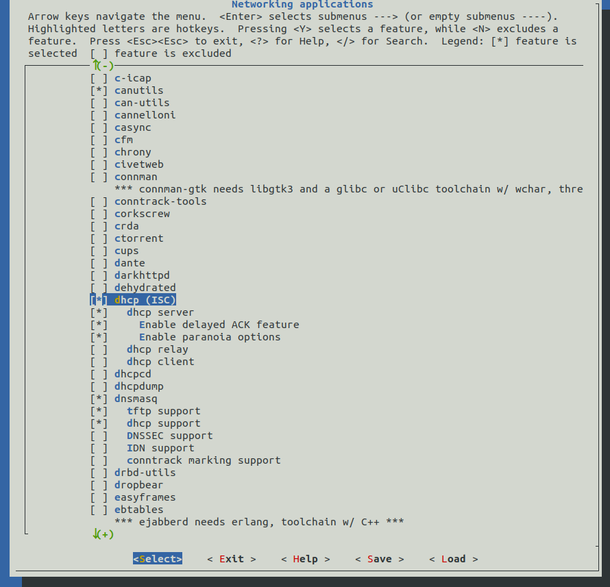
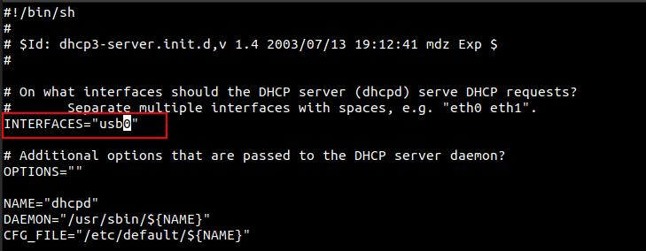
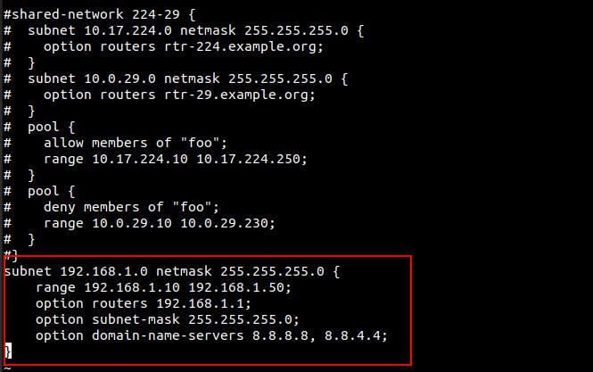
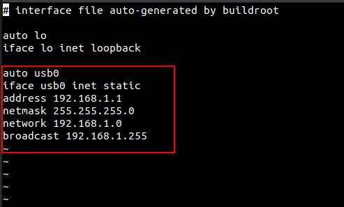
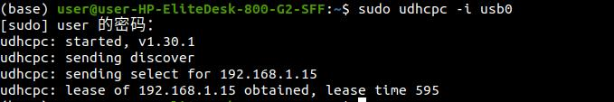
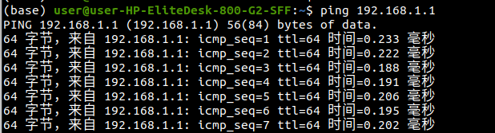

# 基于RNDIS的DHCP服务器搭建方法

## 需求

usb作为RNDIS网卡设备时,PC主机能够使用udhcpc给usb RNDIS网卡设备自动分配IP地址。

## 解决方案

usb RNDIS网卡设备上搭建DHCP服务端,PC主机便可使用udhcpc获取IP地址。

## 步骤

1. buildroot选择'BR2_PACKAGE_DHCP'配置并编译

2. 修改/etc/dhcp/dhcpd.conf文件中INTERFACES字段

3. /etc/dhcp/dhcpd.conf中为已加入DHCP管理的网卡添加自动分配的IP段地址，子网掩码、默认网关等信息。设置如下：

1.  /etc/network/interfaces中将usb0的IP地址设备成静态ip。设置如下：

5. 保存修改后重启设备,出现有如下打印说明服务启动成功:

6. PC主机端使用udhcpc命令获取usb0网卡 IP地址

7. PC主机ping usb RNDIS网卡设备IP

