# USB CDC通讯设备类实现

## 什么是USB CDC类

       USB CDC类是USB通信设备类 (Communication Device Class)的简称。CDC类是USB组织定义的一类专门给各种通信设备(电信通信设备和中速网络通信设备)使用的USB子类。根据CDC类所针对通信设备的不同，CDC类又被分成以下不同的模型：USB传统纯电话业务(POTS)模型，USB ISDN模型和USB网络模型。其中，USB传统纯电话业务模型，有可分为直接线控制模型(Direct Line Control Model)、抽象控制模型(Abstract Control Model)和USB电话模型(USB Telephone Model)，本次所实现的虚拟串口功能就属于USB传统纯电话业务模型下的抽象控制模型。

       通常一个CDC类又是由两个接口子类组成通信接口类(Communication Interface Class)和数据接口类(Data Interface Class)。主要通过通信接口类对设备进行管理和控制，而通过数据接口类传送数据。这两个接口子类占有不同数量和类型的端点(Endpoints)，对于前面所述的不同CDC类模型，其所对应的接口的终端点需求也是不同的。如所需要讨论的抽象控制模型对终端点的需求，通信接口类需要一个控制端点(Control)和一个可选的中断(Interrupt)端点，数据接口子类需要一个方向为输入(IN)的批量传输端点(Bulk)和一个方向为输出(OUT)的批量传输端点(Bulk)。其中控制终端点主要用于USB设备的枚举和虚拟串口的波特率和数据类型(数据位数、停止位和起始位)设置的通信。输出方向的非同步端点用于主机(Host)向从设备(Slave)发送数据，相当于传统物理串口中的TXD线，输入方向的非同步终端点用于从设备向主机发送数据，相当于传统物理串口中的RXD线。

## 构建USB描述符

### 设备描述符

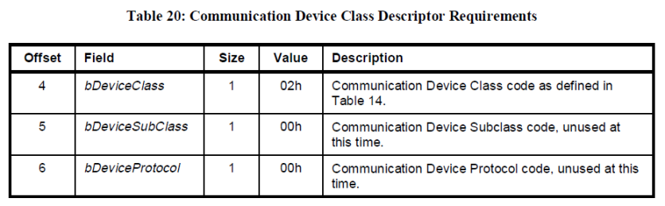

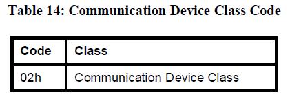

### 配置描述符

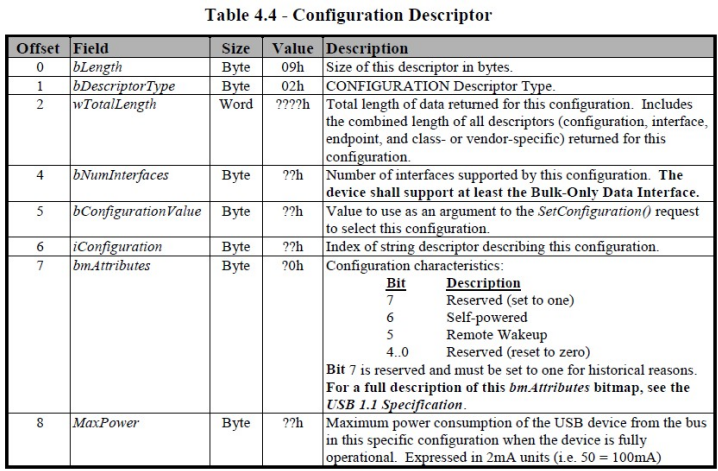

### 接口描述符

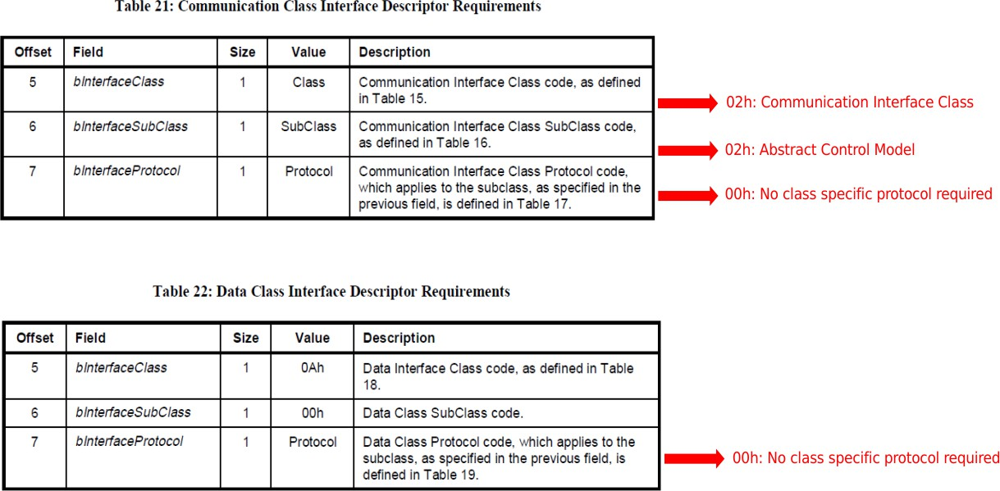

### 特定类描述符

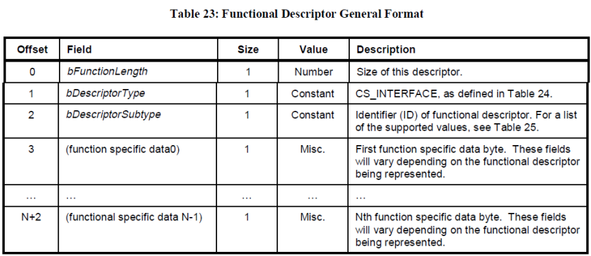

### 端点描述符

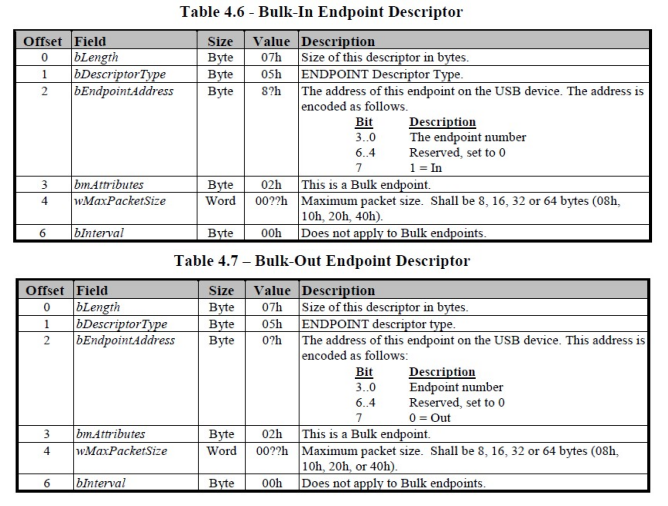

## 类请求

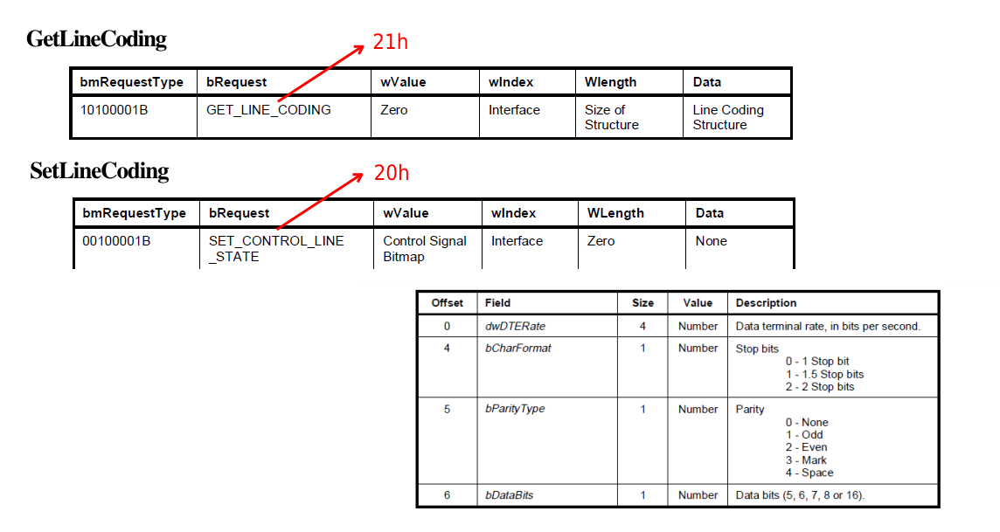

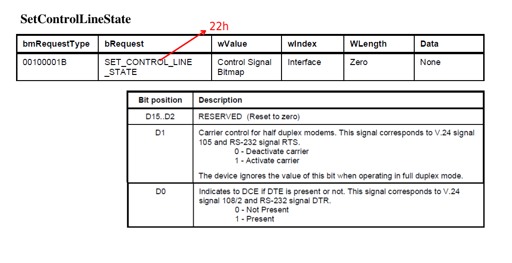

## 软件框架

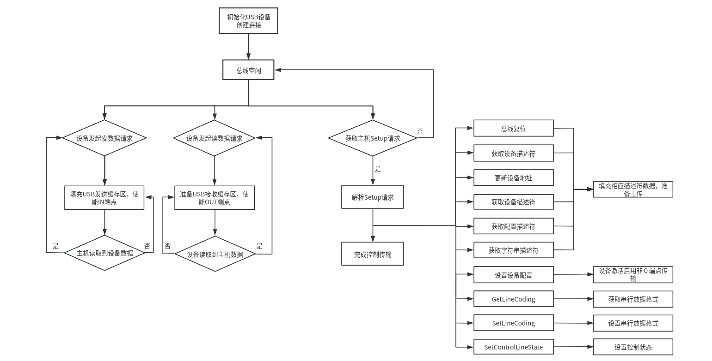

## API接口介绍

```c
 /**
 * @brief usb_gadget_handle_interrupts
 *        USB中断处理函数
 */
 int usb_gadget_handle_interrupts(void);

/**
 * @brief usb_gser_register
 *        创建注册USB模拟串口设备，并开始USB连接
 * @param
 * @return int == 0 成功，否则失败
 */
 int usb_gser_register(void);

 /**
 * @brief usb_gser_unregister
 *        注销USB模拟串口设备，并断开USB连接
 */
 void usb_gser_unregister(void);

 /**
 * @brief acm_read
 *        USB ACM串口设备读数据接口
 * @param buffer 用于存放接收数据的buffer
 * @param　len 请求接收的数据长度（byte）
 * @return int 实际成功接收的数据长度（byte）
 */
 int acm_read(uint8_t *buffer, uint32_t len);

 /**
 * @brief acm_write
 *        USB ACM串口设备写数据接口
 * @param buffer 用于存放发送数据的buffer
 * @param　len 请求发送的数据长度（byte）
 * @return int 实际成功发送的数据长度（byte）
 */
 int acm_write(uint8_t *buffer, uint32_t len);
```

## 测试使用方法

### USB设备连接识别

1. 在u-boot/include/configs/boards.h中添加如下宏定义后编译与烧录：

```c
#define CONFIG_USB_GADGET
#ifdef CONFIG_USB_GADGET
#define CONFIG_USB_GADGET_DUALSPEED
#define CONFIG_USB_JZ_DWC2_UDC_V1_1
#define CONFIG_CMD_USBSERIAL
#define CONFIG_USBSERIAL_FUNCTION
#define CONFIG_USB_GADGET_VBUS_DRAW 500
#endif
```

2. 启动系统进入uboot shell界面，输入 'gser connect' 命令初始化并开始枚举usb串口设备：

　　看到 "usb acm configed." 打印代表host已成功识别usb模拟串口设备。

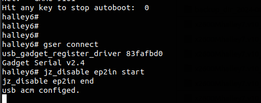

主机端设备管理器中能看到，识别到了一个usb串口设备：

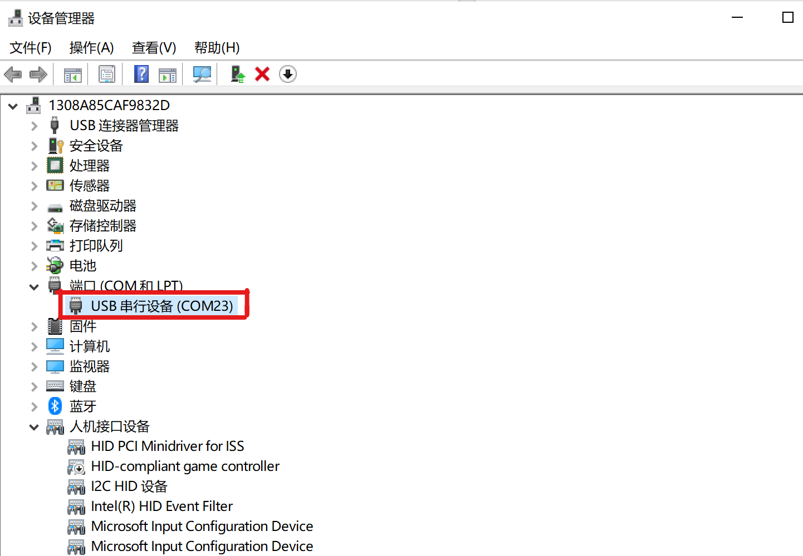


### 读写测试

#### 读测试

1. 主机端使用串口工具,选择识别到的usb串口设备后点击打开：

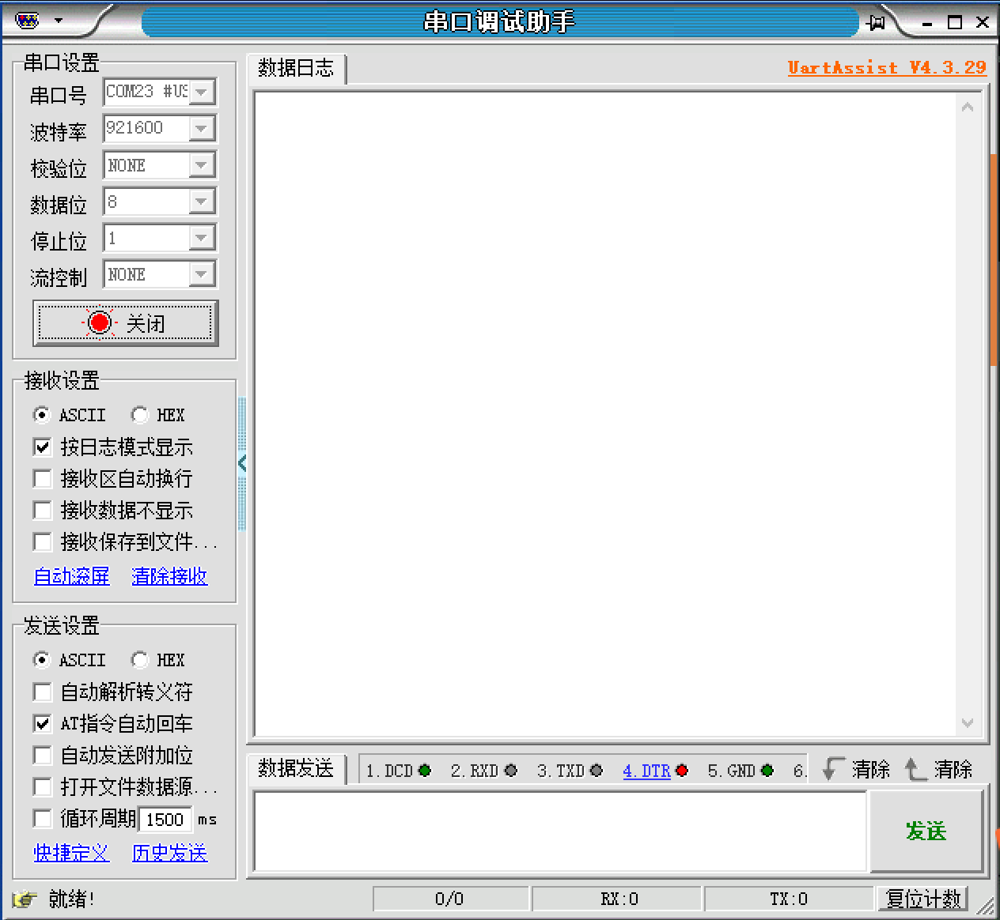

2. 设备端输⼊ ʼgser readʼ 命令进⼊usb模拟串⼝轮寻读数据状态。

3. 串口工具选择测试数据源文件后点击发送。

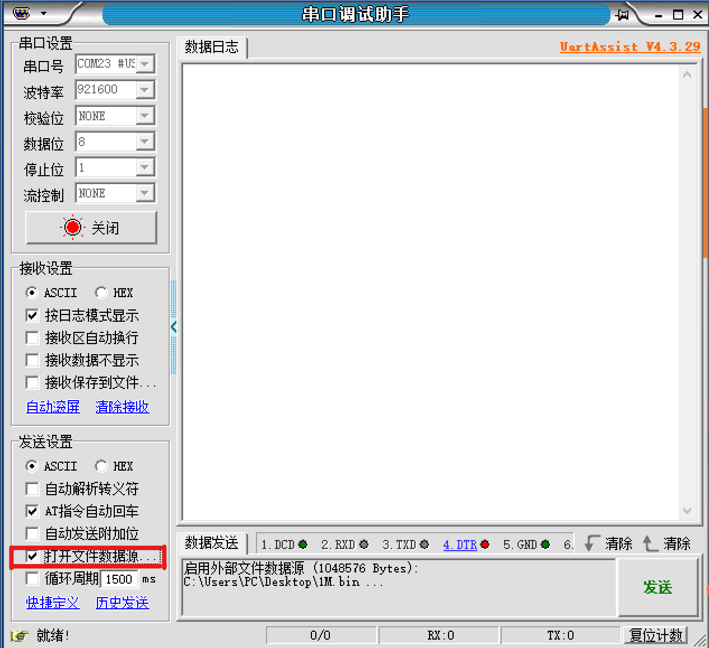

4. 此时可以看到device端，收到主机发送的数据并打印收到的数据字节数。

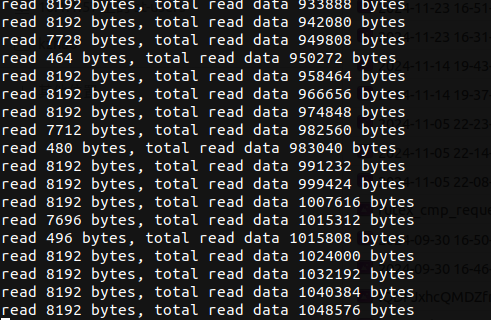

#### 写测试

1. 输⼊ ʼgser writeʼ 命令进⼊usb模拟串⼝轮寻写数据状态，设备循环发送 "Test
message!\r\n" 字符串到 host 端。

2. 通过串口工具查看设备端发送的测试数据。

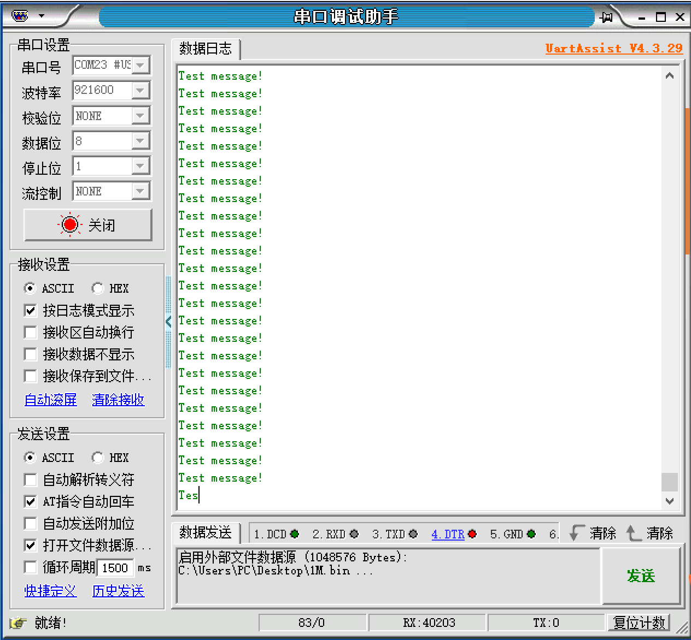
