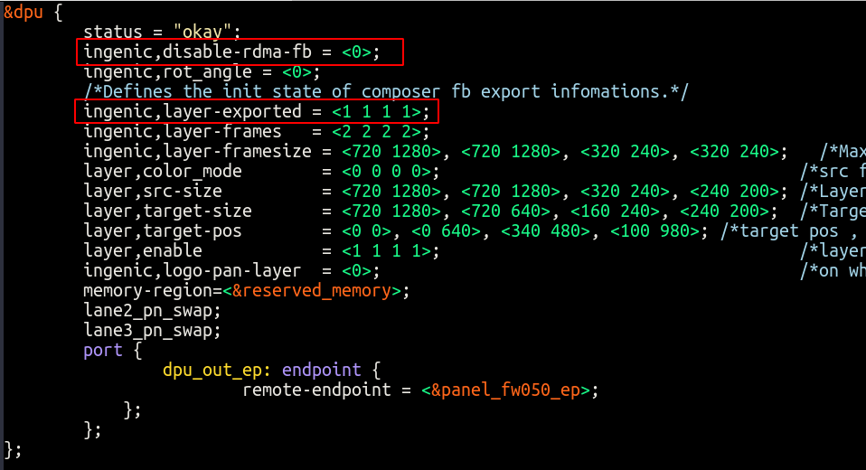
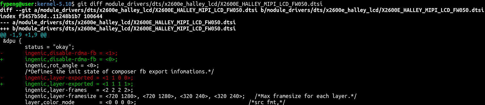
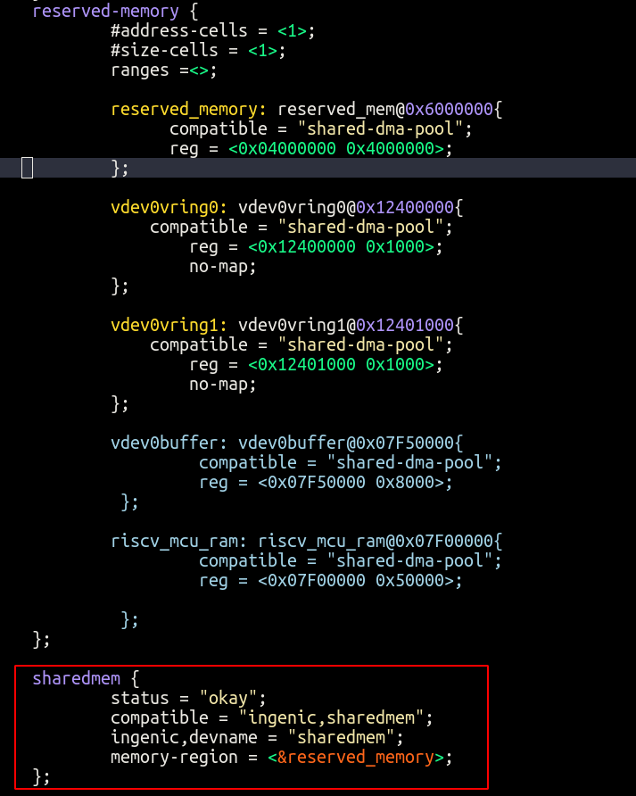
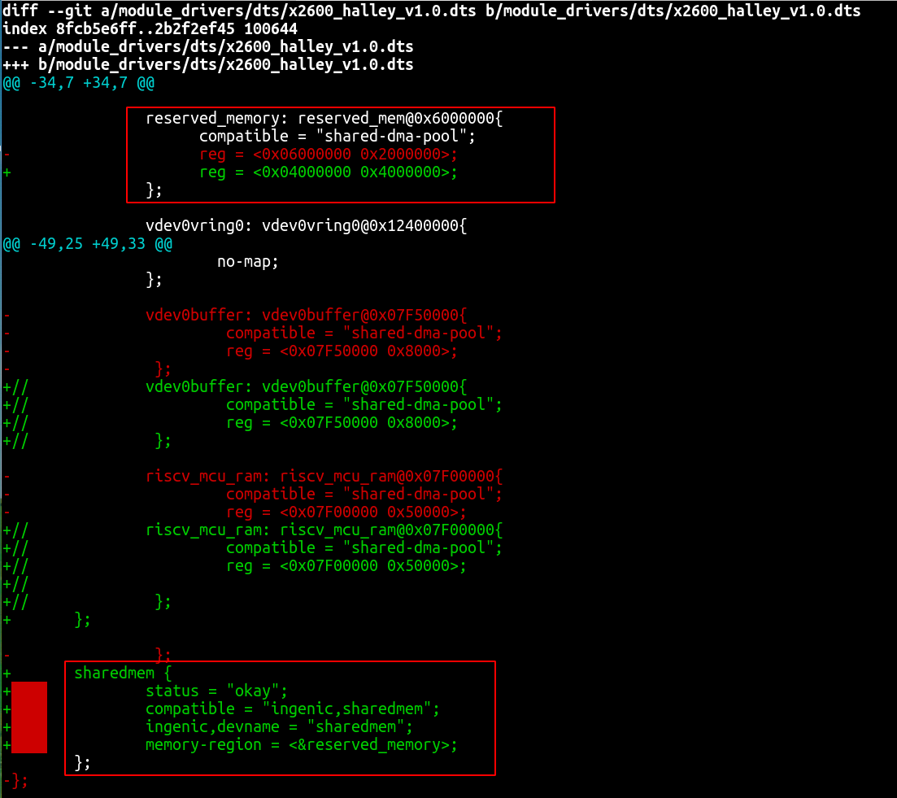
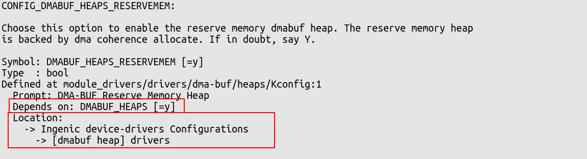
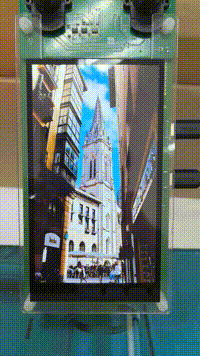
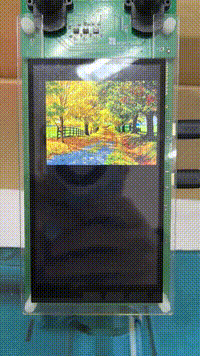

# 简介

osd服务即示服务，该服务用于显示客户端指定的内容，通过该服务，可以便捷的将需要的内容显示到显示屏上，可以减少开发者学习成本，开发者只需要设置好参数，在需要刷新屏上数据时通过ISS_Flush接口即可完成上屏显示。

# 接口介绍

```c
/**
 * @brief   创建客户端句柄，并注册到server端
 * @param   需要创建的客户端类型
 * @retval  创建成功返回客户端句柄地址，失败返回NULL，并打印失败原因。
 */
struct OsdClient *ISS_CreateOsdClt(ClientType_t type);

/**
 * @brief   销毁客户端句柄，并向服务端发送销毁命令
 * @param   客户端句柄
 * @retval  成功返回0，失败返回负值，并打印失败原因。
 */
int32_t ISS_DestoryOsdClt(struct OsdClient *clt);

/**
 * @brief   申请ipc内存，跨进程传输显示数据的buffer
 * @param   客户端句柄
 * @param   申请的内存大小，一般为图像数据大小，如果宽为720 高为1280 格式为rgb565，大小应为 720 * 1280 * 4 = 3686400
 * @param   申请的内存块数量
 * @retval  成功返回0，失败返回负值，并打印失败原因。
 */
int32_t ISS_AllocDispMem(struct OsdClient *clt, int32_t size, int32_t nmemb);

/**
 * @brief   释放ipc内存
 * @param   客户端句柄
 * @retval  成功返回0，失败返回负值，并打印失败原因。
 */
int32_t ISS_FreeDispMem(struct OsdClient *clt);

/**
 * @brief   设置源图像参数
 * @param   客户端句柄
 * @param   图像参数
 * @retval  成功返回0，失败返回负值，并打印失败原因。
 */
int32_t ISS_SetImageAttr(struct OsdClient *clt, struct ImageAttr attr);

/**
 * @brief   设置显示参数
 * @param   客户端句柄
 * @param   显示参数
 * @retval  成功返回0，失败返回负值，并打印失败原因。
 */
int32_t ISS_SetDisplayAttr(struct OsdClient *clt, struct DisplayAttr attr);

/**
 * @brief   设置帧率，最大不超过60帧
 * @param   客户端句柄
 * @param   帧率
 * @retval  成功返回0，失败返回负值，并打印失败原因。
 */
int32_t ISS_SetFrameRate(struct OsdClient *clt, int32_t frame_rate);

/**
 * @brief   重新刷新图像
 * @param   客户端句柄
 * @param   源图像数据地址
 * @param   图像大小
 * @retval  成功返回0，失败返回负值，并打印失败原因。
 */
int32_t ISS_Flush(struct OsdClient *clt, void *addr, int32_t size);
```

# 注意事项

> 1. 本服务基于dpu的rdma + composer模式开发，在使用时需要在设备树使能rdma功能
> 2. 支持的客户端数量取决于fd节点的导出个数，建议开发者将所有fb节点进行导出
> 3. ipc内存为预留内存，需要在config和设备树中进行配置

## dpu设备树配置参考
dpu节点配置：

开发者需确定使用的屏型号，完成对应修改


## 预留内存配置参考


```c
sharedmem {
        status = "okay";
        compatible = "ingenic,sharedmem";
        ingenic,devname = "sharedmem";
        memory-region = <&reserved_memory>;
};
```

由于显示和其他模块可能需要大量的用到reserve内存，导致ipc申请内存失败，开发者需要适量的修改reserve内存的大小，以保证系统的稳定正常运行。

设备树修改配置：


内核编译配置：

为导出reserve节点，需要在menuconfig配置中选择以上驱动。


# 示例

## 示例1

通过循环读取图片数据，刷新上屏，可以达到轮播图的效果。

```c
#include <stdio.h>
#include <unistd.h>
#include <sys/types.h>
#include <sys/stat.h>
#include <fcntl.h>

#include "iss_osd.h"

int main()
{
    int ret = 0;
    int fd = 0;
    int read_size = 0;
    char pic_name[20] = {0};
    char frame[720 * 1280 * 4] = { 0 };
    struct ImageAttr image_attr;
    struct OsdClient *clt = NULL;
   
    clt = ISS_CreateOsdClt(OTHER);

    image_attr.imageFmt = PIX_FMT_BGRA_8888;
    image_attr.imageWidth = 720;
    image_attr.imageHeight = 1280;
    ret = ISS_SetImageAttr(clt, image_attr);

    ret = ISS_AllocDispMem(clt, 720 * 1280 * 4, 3);

    int index = 0;
    while (1)
    {
        index %= 7;
        if (index == 0)
            index = 1;
        sprintf(pic_name, "/720x1280_%d.rgb", index);
        fd = open(pic_name, O_RDWR);

        read_size = read(fd, &frame, 720 * 1280 * 4);

        ISS_Flush(clt, &frame, read_size);

        index++;
        close(fd);
        sleep(3);
    }

    ret = ISS_FreeDispMem(clt);

    ret = ISS_DestoryOsdClt(clt);

    return 0;
}
```
效果如下图所示：



## 示例2

通过动态修改图像在屏幕上的显示位置或者缩放，可以达到在屏幕上碰撞后回弹效果（偏移缩放后的图片不能超过显示边界）。

```c
#include <stdio.h>
#include <unistd.h>
#include <sys/types.h>
#include <sys/stat.h>
#include <fcntl.h>

#include "iss_osd.h"

int main(int argc, char * argv[])
{
    int ret = 0;
    int fd = 0;
    int read_size = 0;
    char pic_name[20] = {0};
    char frame[720 * 1280 * 4] = { 0 };
    struct ImageAttr image_attr;
    struct OsdClient *clt = NULL;
   
    clt = ISS_CreateOsdClt(OTHER);

    image_attr.imageFmt = PIX_FMT_BGRA_8888;
    image_attr.imageWidth = 640;
    image_attr.imageHeight = 480;
    ret = ISS_SetImageAttr(clt, image_attr);

    ret = ISS_AllocDispMem(clt, 640 * 480 * 4, 3);

    ret = ISS_SetFrameRate(clt, 60);

    int index = 0;
    int  i = 0;
    while (count)
    {
        struct DisplayAttr attr;
        int posx = 0;
        int step = 10;
        index %= 3;
        if (index == 0)
            index = 1;
        sprintf(pic_name, "/640x480_%d.rgb", index);
        fd = open(pic_name, O_RDWR);

        memset(&attr, 0, sizeof(struct DisplayAttr));
        attr.alpha = 255;

        read_size = read(fd, &frame, 640 * 480 * 4);

        for (i = 0; i <= 800; i++)
        {
            if (posx == 80)
            {
                step = -1;
            }
            else if (posx == 0)
            {
                step = 1;
            }
            posx += step;
            attr.posX = posx;
            attr.posY = i;
            ISS_SetDisplayAttr(clt, attr);

            ISS_Flush(clt, &frame, read_size);
        }

        index++;
        close(fd);
    }

    ret = ISS_FreeDispMem(clt);

    ret = ISS_DestoryOsdClt(clt);

    return 0;
}
```
效果如下图所示：




