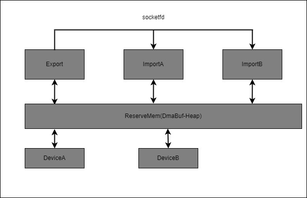

# ReserveHeap

## 简介

ReserveHeap是共享内存内存的一种方法，可以用于多进程之间的内存访问，通常用于程序的多进程间通信。也可以用于用户层程序和内核的设备之间共享内存。是基于内核dmabuf的机制，提供的dma-heap管理内存的一种方法。



## Kernel 内核配置

Linux Kernel5.10 对SharedMem支持提供Heap-Helper机制，提供内存分配是按页填表实现，就是使用多少填多少，提供了内存使用越界的保护，并提供两种Heap（SystemHeap，CMAHeap）。方便用户使用，我们提供一种以ReserveMemory的方式，利用Heap-Helper机制提供的SharedMem方法。

* SystemHeap
  物理内存是按页分配，物理内存是不连续的，释放后内存可以被复用。缺点：物理地址不连续
* CMAHeap
  物理内存是连续的但内存位置不是固定的，需要打开CMA功能。缺点：CMA功能在内存不足时表现很差，需要日后完善
* ReserveHeap
  物理地址由DTS中ReserveMemory指定，并可以定义多份驱动，配合ReserveMemory。内存分配是从ReserveMemory中分配的。并提供获取物理地址的方法。缺点：ReserveMemory的内存地址是用户根据使用情况安排的，除了在固定的设备和进程间共享，不可以被其他进程或设备使用。

### ReserveHeap Driver

1. 程序位置：module_drivers/drivers/dma-buf/heaps
   驱动是miscdriver架构，接收dts传过来的reservememory和设备节点的名称，并添加dma-heap，注册dma-heap节点，名称也和这个节点的名称一致，接收dma-heap的回调，并使用dma_coherence_alloc申请内存传给dma-heap。

2. 设备树(DTS)
   包括两个部分，reserved-memory和sharedmem.

   ```shell
    # 实例化reserve-memory，描述起始地址和长度
       reserved-memory {
           ranges = <>;
           sharedmem_memory: sharedmem_mem@0x5C00000 {
               compatible = "shared-dma-pool";
               reg = <0x05C00000 0x0400000>;
           };
       };

    # 实例化设备驱动，描述设备节点名称与所使用的的reserve-memory空间
       sharedmem {
           status = "okay";
           compatible = "ingenic,sharedmem";
           ingenic,devname = "sharedmem";
           memory-region = <&sharedmem_memory>;
       };

   ```

### ReserveHeap User

#### 虚拟地址分配

1. 打开/dev/dma-heap/sharedmem分配dmabuf的文件句柄(fd)

```c
    /**
    * @brief dmabuf_alloc_fd
    * @details 根据申请内存的大小分配DMABUF的句柄
    * @param[in] size 要分配的大小，需要页对齐
    * @return 分配的文件句柄
    */
    int dmabuf_alloc_fd(int size);
```

2. 使用分配的句柄映射虚拟地址空间

```c
    /**
    * @brief dmabuf_mmap
    * @details 根据文件句柄和内存大小映射虚拟内存地址
    * @param[in] fd 文件句柄
    * @param[in] size 内存大小
    * @return 虚拟内存指针
    */
    void *dmabuf_mmap(int fd,int size)
```

#### 虚拟地址释放

1. 虚拟地址反映射

```c
    /**
    * @brief dmabuf_munmap
    * @details 虚拟地址反映射
    * @param[inout] p 虚拟内存，是dmabuf_mmap映射出来的地址
    * @param[in] size 虚拟内存大小
    */
    void dmabuf_munmap(void *p,int size)
```

2. 关闭文件句柄

```c
    /**
    * @brief dmabuf_close
    * @details 关闭由dmabuf_alloc分配的句柄
    * @param[in] fd 文件句柄
    */

    void dmabuf_close(int fd)
```

#### 刷Cache操作

1. 在从其他设备中读取数据的时候，读取前需要做flag = (DMA_BUF_SYNC_START | DMA_BUF_SYNC_READ）
2. 在把数据传给其他设备时，写数据后flag = (DMA_BUF_SYNC_END | DMA_BUF_SYNC_WRITE)

```c
    /**
    * @brief dmabuf_sync
    * @details 刷cache函数，在地址需要给其他设备使用的时候需要刷cache，保证cache与DDR数据一致
    *          在从其他设备接收到的内存需要读写内存前刷cache
    *          把写好的内存发给其他设备，需要写好内存后，刷内存。
    * @param[in] fd 文件句柄，有dmabuf_alloc分配出来。
    * @param[in] flags 刷Cache的标识，
    *           当从设备读取的数据时候,需使用 (DMA_BUF_SYNC_READ|DMA_BUF_SYNC_START)
    *           当把数据写给设备的时候,需使用 (DMA_BUF_SYNC_WRITE|DMA_BUF_SYNC_END)
    */

    void dmabuf_sync(int fd,int flags);
```

#### 获取物理地址

根据alloc的文件句柄获取物理地址,获取物理地址是通过/dev/sharedmem节点完成的。
获取物理地址通过dmabuf attach，而进行deattach，这样dmabuf的引用计数就会加一，以便应用层可以调用刷cache函数。

1. 调用open函数打开节点/dev/sharedmem
2. 调用ioctl进行attach操作
3. 使用物理地址，也可以刷cache
4. 调用ioctl进行deattach操作
5. 关闭文件句柄

``` c
/**
 * @brief reserveheap_open
 * @details 打开sharedmem heap的节点
 * @return 返回文件句柄
 */
int reserveheap_open(void);

/**
 * @brief reservehep_close
 * @details 关闭sharedmem文件句柄
 * @param[in] heapfd 文件句柄
 */
void reserveheap_close(int heapfd);

/**
 * @brief reservehead_attach_phyaddr
 * @details 根据文件句柄从sharedmem heap上获取物理地址，并保持不管闭
 * @param[in] heapfd sharedmem heap文件句柄
 * @param[in] dmabuf fd 文件句柄
 * @return 物理地址
 */
int reserveheap_attach_phyaddr(int heapfd,int dmabuf_fd);

/**
 * @brief reserveheap_deattach
 * @details 把从sharedmem heap 中的物理地址deattach，
 * @param[in] heapfd sharedmem heap的文件句柄
 * @param[in] fd dmabuf的文件句柄
 * @return 0: OK, -1 失败
 */
int reserveheap_deattach(int heapfd,int fd);
```

#### reserveheap API

提供了方便使用的3个函数进行数据空间申请和释放

1. reserveheap_alloc 用于服务端共享内存的分配
2. reserveheap_import 用于客户端导入服务端传过来的句柄和内存大小
3. reserveheap_free 用于服务端和客户端共享内存释放
4. reserveheap_get_available 用于获取还能申请的空间
5. reserveheap_get_size 用于整个reserve memory的空间

```c
    struct reserveheap
    {
        unsigned int paddr;  // 物理地址
        unsigned int size;   // 虚拟地址
        int fd;              // dma-buf fd
        void *vaddr;
    };
    /**
    * @brief reserveheap_alloc
    * @details 共享内存分配，使用dmabuf分配内存，是dmabuf的二次封装
    * @param[in] size 需要分配的内存大小，要小于内核reserve的大小。
    * @param[out] mem 内存申请返回的结构体，参考struct reserveheap
    * @return Description
    */

    int reserveheap_alloc(int size,struct reserveheap* mem);

    /**
     * @brief reserveheap_import
     * @details 导入内存，存在fd，和映射的size时，映射内存的操作
     * @param[inout] mem 传入的mem结构，注意fd，size必须赋值，
                        paddr如果小于等于0表示需要获取，否则不需要获取
    * @return 0: OK, -1: FAIL
    */

    int reserveheap_import(struct reserveheap* mem);

    /**
    * @brief reserveheap_free
    * @details 释放由reserveheap_alloc分配来的内存，并关闭文件句柄
    * @param[inout] mem reserveheap结构体
    */

    void reserveheap_free(struct reserveheap* mem);

    /**
     * @brief reserveheap_get_available
     * @details 获取reserve memory的剩余空间
     * @return  可以获取的空间大小
     */
    int reserveheap_get_available(void);

    /**
     * @brief reserveheap_get_size
     * @details 获取reserve memory的g总共空间
     * @return  可以获取的空间大小
     */
    int reserveheap_get_size(void);

```

## 进程间共享

提供一组把文件句柄在不同进程间传输的方法，用于进程共享内存的方法

```c
    struct socket_info {
        int sockfd;
        int datafd;
        unsigned long size;
        unsigned int paddr;
    };

    int opensocket(int *sockfd, const char *name, int connecttype);
    int closesocket(int sockfd, char *name);
    int socket_receive_fd(struct socket_info *info);
    int socket_send_fd(struct socket_info *info);
```

## reserveheap 测试

### reserveheap 内存申请和释放

文件: reserveheap-test.c
建立几个固定尺寸的内存大小数组，在随机挑选其中大小，然后申请内存，并使用，当申请10块内存后，把这些内存统一释放

### reserveheap 共享内存测试

文件:
export-test.c  服务器进程
import-test.c  客户端进程

export-test 利用reserveheap申请内存，通过socket发送给接收方。
import-test 从export中接收到进程FD，然后利用reserveheap把内存映射出来.
