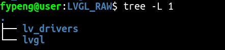
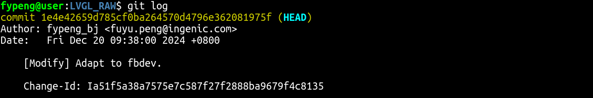
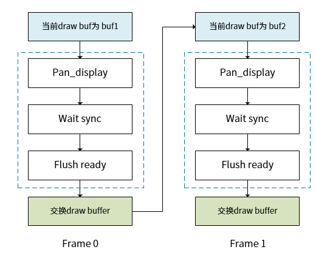
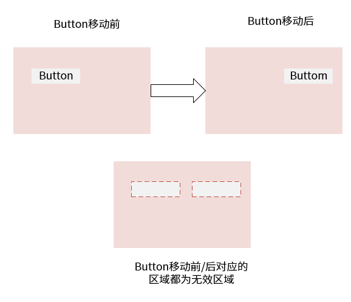
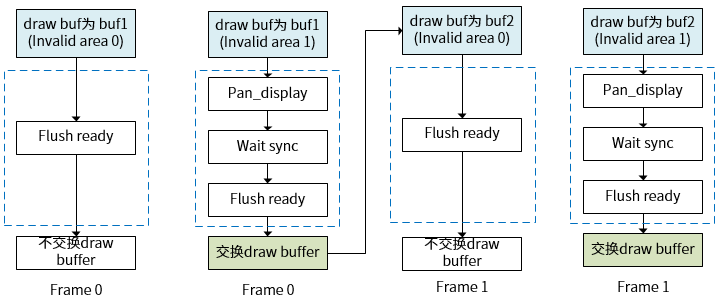

# 简介

本文章主要介绍lvgl的fbdev优化后，开发者应该如何进行进一步的开发，以及一些lvgl的内容。

# fbdev适配

在最新工程的“external/lvgl/LVGL_RAW/”路径存放着lvgl官方的源代码，目录结构如下：



其中lv_drivers目录存放了lvgl显示相关的驱动代码，lvgl目录存放的为官方源码。

自“1e4e42659d785cf0ba264570d4796e362081975f”提交后，适配了fbdev驱动，更改了fbdev_flush的刷新规则，改为全屏刷新，由于修改了刷新规则，对应的在使用上也需要遵循一定的规则。



# lvgl开发

## lvgl缓冲区介绍

lvgl在创建显示界面时需要显示缓冲区。

关于缓冲区大小，有 3 种可能的配置：

1. 一个缓冲区LVGL 将屏幕内容绘制到一个缓冲区中并将其发送到显示器。缓冲区可以小于屏幕。在这种情况下，较大的区域将在多个部分中重新绘制。如果只有小区域发生变化（例如按下按钮），则只会刷新这些区域。

2. 具有两个缓冲区的两个非屏幕大小的缓冲区LVGL 可以将其绘制到一个缓冲区中，而将另一个缓冲区的内容发送到后台显示。应该使用DMA或其他硬件将数据传输到显示器，让CPU同时绘制。这样，显示的渲染和刷新变得并行。与One buffer类似，如果缓冲区小于要刷新的区域，LVGL 将分块绘制显示内容。

3. 两个屏幕大小的缓冲区。与两个非屏幕大小的缓冲区相比，LVGL 将始终提供整个屏幕的内容，而不仅仅是块。通过这种方式，驱动程序可以简单地将帧缓冲区的地址更改为从 LVGL 接收到的缓冲区。

使用`lv_disp_buf_init`接口完成显示缓冲区的初始化，函数定义如下：

```c
void lv_disp_buf_init( lv_disp_buf_t * disp_buf , void * buf1 , void * buf2 , uint32_t size_in_px_cnt )

初始化显示缓冲区

参数

    1. disp_buf --lv_disp_buf_t要初始化的指针变量

    2. buf1 -- LVGL 用来绘制图像的缓冲区。始终必须指定且不能为 NULL。可以是用户分配的数组。例如或外部 SRAM 中的存储器地址static lv_color_t disp_buf1[1024 * 10]

    3. buf2 -- 可选地指定第二个缓冲区，以使图像渲染和图像刷新（发送到显示器）并行。在这种情况下，disp_drv->flush您应该使用 DMA 或类似的硬件将图像发送到后台的显示器。它允许 LVGL 在发送前一帧时将下一帧渲染到另一个缓冲区中。NULL如果未使用，请设置为。

    4. size_in_px_cnt -尺寸buf1和buf2像素数。

```

基于目前的flush刷新方法，开发者应使用两个屏幕大小的缓冲区，操作如下：

```c
#define DISP_BUF_SIZE (720 * 1280)
int main()
{
    static lv_color_t buf1[DISP_BUF_SIZE], buf2[DISP_BUF_SIZE];

    static lv_disp_draw_buf_t disp_buf;
    lv_disp_draw_buf_init(&disp_buf, buf2, buf1, DISP_BUF_SIZE);

}
```

## lvgl刷新模式

下方以双缓冲为例说明 flush_cb 回调函数的处理流程。绘制模式有 refresh 和 direct_mode 两种：

* 全刷新模式，每一帧都刷新整个显示屏
  
  在虚线框中为 cb 中处理部分，在全刷新的流程中，直接通过 pan_display 接口送当前绘制 buffer 到显示，然后等待 vsync 中断， 等到中断后，当前的绘制 buffer 就真正的在显示屏中显示出来，然后调用 ready 通知 LVGL 框架已经 flush 结束， 最后在 LVGL 框架中会进行绘制 buffer 的交换。

* 局部刷新，每一帧只刷新需要更新的无效区域（可以有多个无效区域）
  
  

上图中的示例，为了方便描述每一帧都有两个无效区域（invalid area0 和 area1），LVGL 可以支持更多的无效区域，到了最后一个无效区域，说明当前帧的数据已经处理完，才把绘制 buffer 送显示，然后进行 buffer 交换。

# 总结

结合fbdev的适配情况，开发者的缓冲区和刷新方法应采用双全缓冲和全刷新的方式，操作步骤如下：
```c
// fbp为framebuffer首地址，直接将framebuffer的地址空间作为缓冲区，减少内存拷贝操作，增加效率。
extern char *fbp = 0;
int main()
{
    static lv_color_t *buf1, *buf2;
    if (fbp != NULL)
    {
        buf1 = fbp;
        buf2 = fbp + (720 * 1280 * 4);
    }

    static lv_disp_draw_buf_t disp_buf;
    lv_disp_draw_buf_init(&disp_buf, buf2, buf1, 720 * 1280);

    static lv_disp_drv_t disp_drv;
    lv_disp_drv_init(&disp_drv);
    disp_drv.draw_buf   = &disp_buf;
    disp_drv.flush_cb   = fbdev_flush;
    disp_drv.wait_cb   = fbdev_wait;
    disp_drv.hor_res    = 720;
    disp_drv.ver_res    = 1280;
	disp_drv.rotated = 1;
	//以下为关键两步
    disp_drv.direct_mode = 0;
    disp_drv.full_refresh = 1;

	lv_disp_drv_register(&disp_drv);
}
```
